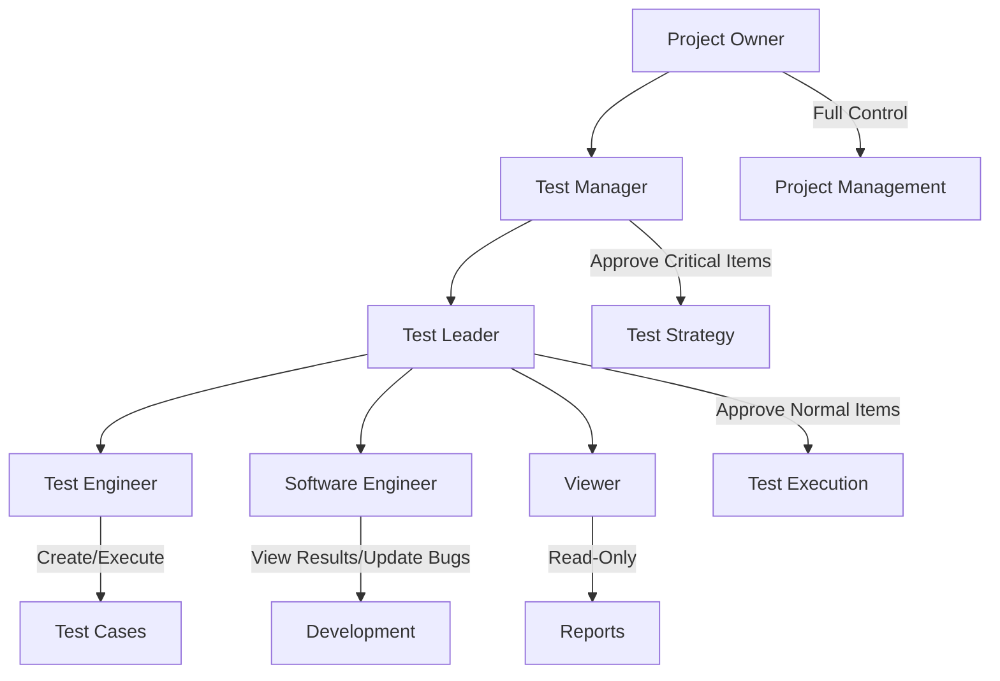
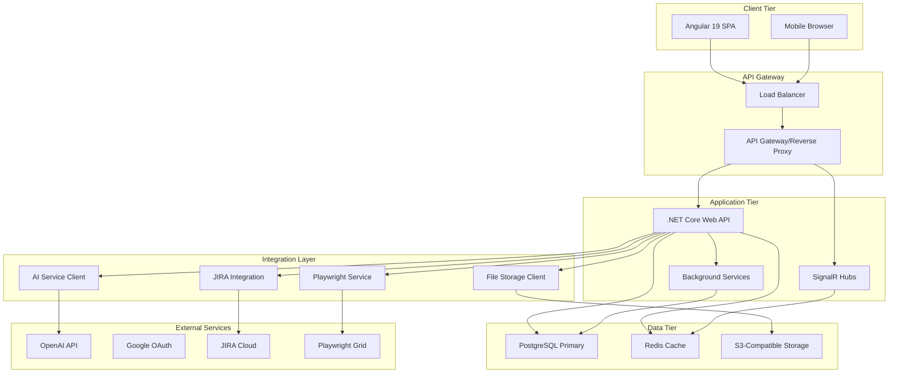
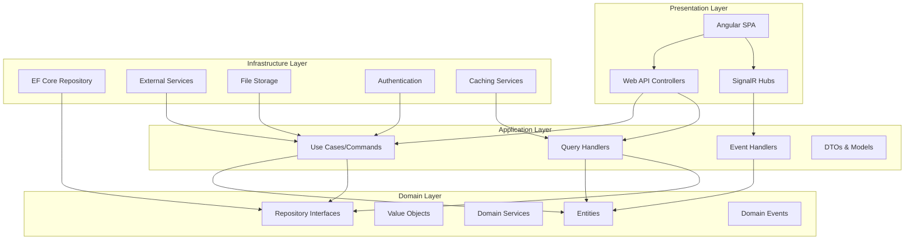
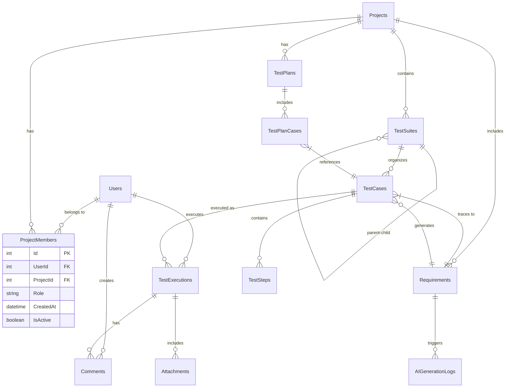
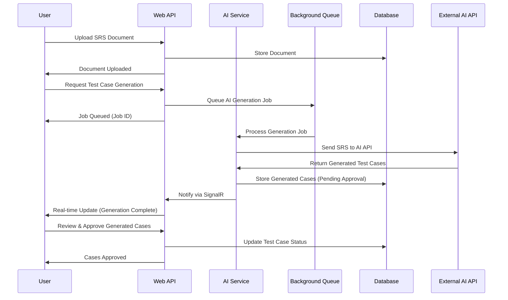

# DanHQ - Product Requirements Document & Software Requirements Specification

## Table of Contents
1. [Executive Summary](#executive-summary)
2. [Product Overview](#product-overview)
3. [Market Analysis](#market-analysis)
4. [User Personas & Roles](#user-personas--roles)
5. [Functional Requirements](#functional-requirements)
6. [Non-Functional Requirements](#non-functional-requirements)
7. [Technical Architecture](#technical-architecture)
8. [System Design](#system-design)
9. [User Interface Requirements](#user-interface-requirements)
10. [Integration Requirements](#integration-requirements)
11. [Security Requirements](#security-requirements)
12. [Project Timeline & Roadmap](#project-timeline--roadmap)
13. [Success Metrics](#success-metrics)

---

## 1. Executive Summary

### 1.1 Product Vision
DanHQ is a modern, AI-powered test case management system designed to revolutionize how software teams manage their testing workflows. Built as an open-source alternative to TestLink, DanHQ focuses on delivering a superior user experience while integrating cutting-edge AI capabilities and modern development tools.

### 1.2 Mission Statement
To provide software development teams with an intuitive, powerful, and AI-enhanced test management platform that streamlines testing processes, improves collaboration, and ensures product quality in agile development environments.

### 1.3 Key Value Propositions
- **AI-Powered Test Generation**: Automatically generate test cases from Software Requirements Specifications (SRS)
- **Modern User Experience**: Clean, intuitive interface built with modern web technologies
- **Seamless Integrations**: Native integration with popular tools like Playwright, JIRA, and CI/CD pipelines
- **Agile-Friendly**: Built-in support for Scrum, Kanban, and agile methodologies
- **Open Source Foundation**: Community-driven development with enterprise SaaS evolution path

---

## 2. Product Overview

### 2.1 Problem Statement
Current test management tools like TestLink suffer from:
- Outdated user interfaces that hinder productivity
- Limited integration capabilities with modern development tools
- Lack of AI-powered features for test automation
- Poor mobile experience and real-time collaboration
- Complex setup and maintenance requirements

### 2.2 Solution Overview
DanHQ addresses these challenges by providing:
- Modern, responsive web application with clean UI/UX
- AI-powered test case generation from requirements documents
- Native integration with automation frameworks (Playwright focus)
- Real-time collaboration and notification systems
- Container-based deployment for easy setup and scaling

### 2.3 Target Market
- **Primary**: Software development teams in tech companies and startups (10-500 employees)
- **Secondary**: QA consulting firms and freelance testers
- **Industries**: Technology, Fintech, Healthcare, E-commerce, Gaming

---

## 3. Market Analysis

### 3.1 Competitive Landscape

| Tool | Strengths | Weaknesses | DanHQ Advantage |
|------|-----------|------------|-----------------|
| TestLink | Open source, Feature complete | Outdated UI, Poor integrations | Modern UI + AI features |
| TestRail | Good UX, Strong reporting | Expensive, Not open source | Open source + Cost effective |
| Zephyr | JIRA integration | Complex, Expensive | Simpler + AI-powered |
| qTest | Enterprise features | Costly, Overhead | Lightweight + Modern tech |

### 3.2 Market Opportunity
- Test management tools market: $1.2B+ globally
- Growing demand for AI-integrated development tools
- Shift towards open-source solutions in development teams
- Increasing adoption of test automation frameworks

---

## 4. User Personas & Roles

### 4.1 Role Hierarchy (High to Low Authority)



### 4.2 Detailed Role Definitions

#### 4.2.1 Project Owner
- **Responsibilities**: Overall project control, user management, system configuration
- **Permissions**: All system functions, user invitation, project settings, billing management
- **Use Cases**: Setup projects, manage team access, configure integrations

#### 4.2.2 Test Manager  
- **Responsibilities**: Test strategy oversight, critical approvals, resource planning
- **Permissions**: All Test Leader permissions + approve critical items (test plans, SRS uploads)
- **Use Cases**: Strategic test planning, team performance monitoring, stakeholder reporting

#### 4.2.3 Test Leader
- **Responsibilities**: Day-to-day test management, team coordination, workflow approval
- **Permissions**: Approve test cases, assign executions, manage test suites, view all reports
- **Use Cases**: Sprint planning, test execution coordination, progress tracking

#### 4.2.4 Test Engineer
- **Responsibilities**: Test case creation, test execution, bug reporting
- **Permissions**: Create/edit test cases, execute tests, update results, comment on issues
- **Use Cases**: Daily testing activities, automation script linking, defect documentation

#### 4.2.5 Software Engineer  
- **Responsibilities**: Bug resolution, integration testing support
- **Permissions**: View test results, update bug status, access relevant test documentation
- **Use Cases**: Bug fixing workflow, integration testing collaboration

#### 4.2.6 Viewer
- **Responsibilities**: Monitoring and reporting consumption
- **Permissions**: Read-only access to reports, dashboards, and test results
- **Use Cases**: Executive reporting, stakeholder updates, audit trail review

---

## 5. Functional Requirements

### 5.1 Core Features for MVP

#### 5.1.1 User Management & Authentication
- **REQ-001**: User registration and login with email/password
- **REQ-002**: Google SSO integration for regular users
- **REQ-003**: Admin/system accounts with traditional authentication
- **REQ-004**: JWT-based session management
- **REQ-005**: Role-based access control with cross-project permissions
- **REQ-006**: User invitation system with email notifications

#### 5.1.2 Project Management
- **REQ-007**: Create and configure test projects
- **REQ-008**: Multi-project support for users
- **REQ-009**: Project-specific role assignments
- **REQ-010**: Project settings and configuration management
- **REQ-011**: Project dashboard with key metrics

#### 5.1.3 Test Case Management
- **REQ-012**: Create, edit, and delete test cases
- **REQ-013**: Test case categorization with tags and labels
- **REQ-014**: Test suite organization with folder hierarchy
- **REQ-015**: Test case versioning and history tracking
- **REQ-016**: Bulk operations for test case management
- **REQ-017**: Test case templates and reusability
- **REQ-018**: Test case import/export functionality

#### 5.1.4 Requirements Management (SRS)
- **REQ-019**: Upload and manage SRS documents
- **REQ-020**: Document versioning and change tracking
- **REQ-021**: Link test cases to requirements for traceability
- **REQ-022**: Requirements approval workflow
- **REQ-023**: Document preview and annotation capabilities

#### 5.1.5 AI-Powered Test Generation
- **REQ-024**: AI integration with OpenAI-compatible APIs
- **REQ-025**: Automatic test case generation from SRS documents
- **REQ-026**: AI-generated test case review and approval workflow
- **REQ-027**: Customizable AI prompts and templates
- **REQ-028**: AI usage tracking and limitations

#### 5.1.6 Test Plan Management
- **REQ-029**: Create and manage test plans
- **REQ-030**: Test plan templates and cloning
- **REQ-031**: Test case assignment to test plans
- **REQ-032**: Test plan scheduling and milestones
- **REQ-033**: Test plan approval workflow

#### 5.1.7 Test Execution
- **REQ-034**: Test execution workflows and status tracking
- **REQ-035**: Test result recording (Pass/Fail/Blocked/Skip)
- **REQ-036**: Test execution comments and evidence attachment
- **REQ-037**: Bulk test execution updates
- **REQ-038**: Test execution assignment and delegation
- **REQ-039**: Execution type marking (Manual/Automation)

### 5.2 Advanced Features (Post-MVP)

#### 5.2.1 Automation Integration
- **REQ-040**: Playwright test framework integration
- **REQ-041**: Test execution report linking
- **REQ-042**: Automation script repository management
- **REQ-043**: CI/CD pipeline integration triggers

#### 5.2.2 Reporting & Analytics
- **REQ-044**: Real-time dashboards and KPI tracking
- **REQ-045**: Customizable reports and charts
- **REQ-046**: Test coverage analysis
- **REQ-047**: Progress tracking and milestone reporting
- **REQ-048**: Export capabilities (PDF, Excel, CSV)

#### 5.2.3 Collaboration Features
- **REQ-049**: Real-time notifications via SignalR
- **REQ-050**: Comment system and @mentions
- **REQ-051**: Activity feeds and audit logs
- **REQ-052**: Team collaboration workspaces

#### 5.2.4 External Integrations
- **REQ-053**: JIRA integration for issue tracking
- **REQ-054**: Slack/Teams notifications
- **REQ-055**: GitHub/GitLab integration
- **REQ-056**: CI/CD pipeline integrations

---

## 6. Non-Functional Requirements

### 6.1 Performance Requirements
- **NFR-001**: Page load time < 2 seconds for core functions
- **NFR-002**: Support 100+ concurrent users per instance
- **NFR-003**: API response time < 500ms for standard operations
- **NFR-004**: Database query optimization for large datasets
- **NFR-005**: Real-time updates delivery < 1 second

### 6.2 Scalability Requirements
- **NFR-006**: Horizontal scaling via container orchestration
- **NFR-007**: Database connection pooling and optimization
- **NFR-008**: Caching strategy with Redis implementation
- **NFR-009**: CDN support for static assets
- **NFR-010**: Load balancing capabilities

### 6.3 Availability Requirements
- **NFR-011**: 99.5% uptime for self-hosted instances
- **NFR-012**: Graceful degradation for non-critical features
- **NFR-013**: Database backup and recovery procedures
- **NFR-014**: System monitoring and alerting

### 6.4 Security Requirements
- **NFR-015**: Data encryption in transit (HTTPS/TLS 1.3)
- **NFR-016**: Data encryption at rest for sensitive information
- **NFR-017**: Input validation and sanitization
- **NFR-018**: SQL injection prevention
- **NFR-019**: Cross-site scripting (XSS) protection
- **NFR-020**: CSRF protection implementation

### 6.5 Usability Requirements
- **NFR-021**: Mobile-responsive design (320px - 1920px+ viewports)
- **NFR-022**: Accessibility compliance (WCAG 2.1 AA)
- **NFR-023**: Intuitive navigation with < 3 clicks to core functions
- **NFR-024**: Consistent UI patterns and design system
- **NFR-025**: Drag-and-drop interface for test organization

### 6.6 Compatibility Requirements
- **NFR-026**: Modern browser support (Chrome 90+, Firefox 88+, Safari 14+, Edge 90+)
- **NFR-027**: Docker container deployment
- **NFR-028**: Kubernetes orchestration support
- **NFR-029**: PostgreSQL 12+ database compatibility
- **NFR-030**: S3-compatible storage systems

---

## 7. Technical Architecture

### 7.1 System Architecture Overview



### 7.2 Technology Stack

#### 7.2.1 Backend Technologies
- **Framework**: .NET 8.0 Core with Clean Architecture
- **API**: RESTful APIs with OpenAPI/Swagger documentation
- **Authentication**: JWT tokens with refresh token mechanism
- **Real-time**: SignalR for WebSocket communications
- **Database**: PostgreSQL 15+ with Entity Framework Core
- **Caching**: Redis for session and application caching
- **Background Jobs**: Hangfire for scheduled tasks
- **File Storage**: S3-compatible storage with MinIO support

#### 7.2.2 Frontend Technologies
- **Framework**: Angular 19 with TypeScript 5.0+
- **State Management**: NgRx for application state
- **UI Framework**: Angular Material + Tailwind CSS
- **Build Tool**: Angular CLI with Webpack/Vite optimization
- **Testing**: Jasmine + Karma for unit tests, Cypress for E2E
- **PWA**: Service Worker for offline capabilities

#### 7.2.3 DevOps & Deployment
- **Containerization**: Docker with multi-stage builds
- **Orchestration**: Kubernetes with Helm charts
- **CI/CD**: GitHub Actions for automated testing and deployment
- **Monitoring**: Application Insights / Prometheus + Grafana
- **Logging**: Structured logging with Serilog

### 7.3 Clean Architecture Implementation



---

## 8. System Design

### 8.1 Database Schema Design



### 8.2 API Design Patterns

#### 8.2.1 RESTful API Structure
```
GET    /api/v1/projects
POST   /api/v1/projects
GET    /api/v1/projects/{id}
PUT    /api/v1/projects/{id}
DELETE /api/v1/projects/{id}

GET    /api/v1/projects/{projectId}/testcases
POST   /api/v1/projects/{projectId}/testcases
GET    /api/v1/testcases/{id}
PUT    /api/v1/testcases/{id}
DELETE /api/v1/testcases/{id}

POST   /api/v1/ai/generate-testcases
GET    /api/v1/ai/generation-status/{jobId}
```

#### 8.2.2 Response Format Standardization
```json
{
  "success": true,
  "data": {
    "items": [...],
    "pagination": {
      "page": 1,
      "pageSize": 20,
      "totalItems": 150,
      "totalPages": 8
    }
  },
  "errors": [],
  "timestamp": "2024-01-15T10:30:00Z"
}
```

### 8.3 AI Integration Architecture



---

## 9. User Interface Requirements

### 9.1 Design System Specifications

#### 9.1.1 Layout Structure
- **Header**: Logo, user menu, notifications, global search (60px height)
- **Sidebar**: Navigation menu with collapsible sections (280px width, collapsible to 60px)
- **Main Content**: Dynamic content area with breadcrumbs
- **Footer**: Minimal with version info and links (40px height)

#### 9.1.2 Color Palette
```css
:root {
  --primary: #3B82F6;      /* Blue-500 */
  --primary-light: #DBEAFE; /* Blue-100 */
  --secondary: #6B7280;    /* Gray-500 */
  --success: #10B981;      /* Emerald-500 */
  --warning: #F59E0B;      /* Amber-500 */
  --error: #EF4444;        /* Red-500 */
  --background: #F9FAFB;   /* Gray-50 */
  --surface: #FFFFFF;      /* White */
  --text-primary: #111827; /* Gray-900 */
  --text-secondary: #6B7280; /* Gray-500 */
}
```

#### 9.1.3 Typography
- **Primary Font**: Inter (system font fallback)
- **Headings**: 
  - H1: 32px/40px, font-weight: 700
  - H2: 24px/32px, font-weight: 600
  - H3: 20px/28px, font-weight: 600
  - H4: 18px/24px, font-weight: 500
- **Body Text**: 16px/24px, font-weight: 400
- **Small Text**: 14px/20px, font-weight: 400

### 9.2 Responsive Breakpoints
- **Mobile**: 320px - 768px
- **Tablet**: 768px - 1024px
- **Desktop**: 1024px - 1440px
- **Large Desktop**: 1440px+

### 9.3 Key UI Components

#### 9.3.1 Dashboard Widgets
- Project overview cards with key metrics
- Recent activity timeline
- Test execution progress charts
- Quick action buttons

#### 9.3.2 Test Case Management Interface
- Tree view for test suite navigation
- Tabbed interface for test case details
- Inline editing capabilities
- Bulk action toolbar

#### 9.3.3 Test Execution Interface
- Step-by-step execution wizard
- Evidence upload with drag-and-drop
- Real-time status updates
- Progress tracking indicators

### 9.4 Accessibility Requirements
- **Keyboard Navigation**: Full keyboard accessibility with proper tab order
- **Screen Reader Support**: ARIA labels and semantic HTML
- **Color Contrast**: WCAG 2.1 AA compliance (4.5:1 ratio)
- **Focus Indicators**: Visible focus states for all interactive elements
- **Alternative Text**: Descriptive alt text for all images and icons

---

## 10. Integration Requirements

### 10.1 AI Integration Specifications

#### 10.1.1 OpenAI API Integration
- **Endpoint**: Compatible with OpenAI GPT-4 API format
- **Authentication**: API key-based authentication
- **Rate Limiting**: Configurable rate limits per project
- **Error Handling**: Graceful fallback for API failures
- **Cost Tracking**: Token usage monitoring and reporting

#### 10.1.2 AI Test Generation Workflow
1. **Document Processing**: Extract text from SRS documents (PDF, Word, Markdown)
2. **Content Analysis**: Parse requirements and user stories
3. **Test Case Generation**: Generate comprehensive test scenarios
4. **Review Interface**: Present generated cases for human review
5. **Approval Process**: Test Leader/Manager approval workflow

### 10.2 Playwright Integration

#### 10.2.1 Automation Framework Support
- **Test Type Marking**: Manual vs Automation classification
- **Script Linking**: Associate test cases with Playwright scripts
- **Execution Triggers**: Manual and automated test execution
- **Result Synchronization**: Import automation results

#### 10.2.2 Test Report Integration
```javascript
// Example Playwright integration
const testResults = {
  testCaseId: "TC-001",
  executionType: "automation",
  status: "passed",
  duration: 5420,
  evidence: {
    screenshots: ["screenshot1.png", "screenshot2.png"],
    videos: ["execution.mp4"],
    logs: ["console.log", "network.har"]
  },
  environment: "staging",
  timestamp: "2024-01-15T10:30:00Z"
};
```

### 10.3 JIRA Integration

#### 10.3.1 Issue Synchronization
- **Bidirectional Sync**: Test results ↔ JIRA issues
- **Bug Creation**: Auto-create JIRA tickets for failed tests
- **Status Updates**: Update issue status based on test results
- **Requirement Linking**: Link test cases to JIRA stories/epics

#### 10.3.2 JIRA API Integration
```json
{
  "jiraConfig": {
    "baseUrl": "https://company.atlassian.net",
    "authentication": {
      "type": "api_token",
      "username": "user@company.com",
      "apiToken": "encrypted_token"
    },
    "projects": ["PROJ", "TEST"],
    "issueTypes": ["Bug", "Story", "Epic"],
    "customFields": {
      "testCaseId": "customfield_10001",
      "testResult": "customfield_10002"
    }
  }
}
```

### 10.4 Third-Party Tool Integrations

#### 10.4.1 Notification Services
- **Slack Integration**: Test execution notifications, milestone alerts
- **Microsoft Teams**: Similar notification capabilities
- **Email Notifications**: Configurable email alerts for key events

#### 10.4.2 Version Control Integration
- **GitHub/GitLab**: Link test cases to code commits
- **Branch-based Testing**: Associate test plans with release branches
- **Pull Request Integration**: Trigger test executions on PR creation

---

## 11. Security Requirements

### 11.1 Authentication & Authorization

#### 11.1.1 Multi-Authentication Strategy
- **System/Admin Users**: Traditional username/password with strong password policies
- **Regular Users**: Google OAuth 2.0 SSO integration
- **Session Management**: JWT tokens with refresh token mechanism
- **Token Expiration**: Configurable token lifetime (default: 24 hours access, 30 days refresh)

#### 11.1.2 Role-Based Access Control (RBAC)
```json
{
  "rolePermissions": {
    "ProjectOwner": ["*"],
    "TestManager": ["project.read", "project.write", "test.approve", "user.manage"],
    "TestLeader": ["test.read", "test.write", "test.approve", "execution.assign"],
    "TestEngineer": ["test.read", "test.write", "execution.perform"],
    "SoftwareEngineer": ["test.read", "execution.view", "bug.update"],
    "Viewer": ["test.read", "report.view"]
  }
}
```

### 11.2 Data Protection

#### 11.2.1 Encryption Standards
- **In Transit**: TLS 1.3 for all communications
- **At Rest**: AES-256 encryption for sensitive data
- **Database**: Transparent Data Encryption (TDE) for PostgreSQL
- **File Storage**: Server-side encryption for S3-compatible storage

#### 11.2.2 Data Privacy
- **GDPR Compliance**: Data portability and right to deletion
- **Data Retention**: Configurable retention policies
- **Audit Logging**: Comprehensive audit trail for all user actions
- **Data Anonymization**: Option to anonymize user data

### 11.3 Security Controls

#### 11.3.1 Input Validation
- **SQL Injection Prevention**: Parameterized queries and ORM usage
- **XSS Protection**: Input sanitization and output encoding
- **CSRF Protection**: Anti-forgery tokens for state-changing operations
- **File Upload Security**: Type validation and virus scanning

#### 11.3.2 API Security
- **Rate Limiting**: Configurable rate limits per endpoint
- **API Authentication**: Bearer token validation
- **CORS Configuration**: Strict cross-origin resource sharing policies
- **Request Logging**: Comprehensive API request logging

### 11.4 Infrastructure Security

#### 11.4.1 Container Security
- **Base Image Scanning**: Vulnerability scanning for Docker images
- **Minimal Images**: Use of minimal base images (Alpine Linux)
- **Non-Root Execution**: Run containers with non-privileged users
- **Secret Management**: Kubernetes secrets for sensitive configuration

#### 11.4.2 Network Security
- **Network Policies**: Kubernetes network policies for pod communication
- **Ingress Security**: TLS termination and request filtering
- **Service Mesh**: Optional Istio integration for advanced security policies

---

## 12. Project Timeline & Roadmap

### 12.1 MVP Development Plan (4 Weeks)

#### Week 1: Foundation & Core Infrastructure
**Backend Setup:**
- .NET Core 8 project structure with Clean Architecture
- PostgreSQL database design and Entity Framework setup
- JWT authentication implementation
- Basic CRUD operations for Users, Projects, TestCases

**Frontend Setup:**
- Angular 19 project initialization with Tailwind CSS
- NgRx store configuration
- Routing and basic layout implementation
- Authentication guards and interceptors

**DevOps:**
- Docker containerization setup
- Basic CI/CD pipeline with GitHub Actions
- Local development environment configuration

#### Week 2: Core Features Implementation
**User & Project Management:**
- User registration and Google SSO integration
- Project creation and member invitation system
- Role-based access control implementation
- Project dashboard with basic metrics

**Test Case Management:**
- Test case CRUD operations with rich text editor
- Test suite hierarchy and organization
- Test case categorization and tagging
- Basic search and filtering capabilities

#### Week 3: Advanced Features
**Requirements & AI Integration:**
- SRS document upload and management
- OpenAI API integration for test case generation
- AI-generated test case review workflow
- Requirements traceability matrix

**Test Execution:**
- Test execution workflow implementation
- Test result recording and evidence upload
- Execution assignment and delegation
- Basic progress tracking

#### Week 4: Polish & Deployment
**Testing & Quality Assurance:**
- Unit test implementation (80%+ coverage)
- Integration testing for critical workflows
- UI/UX refinements and responsive design testing
- Performance optimization

**Deployment Preparation:**
- Production-ready Docker images
- Kubernetes deployment manifests
- Documentation and setup guides
- Beta user onboarding materials

### 12.2 Release Strategy

#### 12.2.1 Bi-weekly Release Cycle
- **Sprint 1 (Weeks 1-2)**: Core foundation and basic features
- **Sprint 2 (Weeks 3-4)**: Advanced features and AI integration
- **Sprint 3 (Weeks 5-6)**: Integrations and reporting
- **Sprint 4 (Weeks 7-8)**: Mobile optimization and performance

#### 12.2.2 Beta Testing Program
- **Internal Alpha**: Week 3-4 with development team
- **Closed Beta**: Week 5-6 with 5-10 selected companies
- **Open Beta**: Week 7-8 with community registration
- **Production Release**: Week 9+ based on feedback

### 12.3 Post-MVP Roadmap

#### Phase 2: Integrations & Automation (Months 2-3)
- Playwright framework deep integration
- CI/CD pipeline integrations (GitHub Actions, GitLab CI)
- Advanced reporting and analytics dashboard
- Real-time collaboration features

#### Phase 3: Enterprise Features (Months 4-6)
- Advanced workflow customization
- API rate limiting and usage analytics
- Multi-organization support preparation
- Enterprise SSO options (SAML, LDAP)

#### Phase 4: AI Enhancement & SaaS Transition (Months 6-12)
- Advanced AI features (test optimization, predictive analytics)
- SaaS infrastructure development
- Multi-tenancy architecture
- Commercial licensing and billing system

---

## 13. Success Metrics

### 13.1 Development Success Metrics

#### 13.1.1 Technical Metrics
- **Code Quality**: Minimum 80% test coverage, SonarQube quality gate pass
- **Performance**: Page load times < 2 seconds, API response times < 500ms
- **Reliability**: 99.5% uptime during beta testing period
- **Security**: Zero critical security vulnerabilities in production

#### 13.1.2 Delivery Metrics
- **Timeline Adherence**: MVP delivery within 4-week target
- **Release Frequency**: Successful bi-weekly releases
- **Bug Resolution**: Average bug fix time < 24 hours for critical issues
- **Documentation**: 100% API documentation coverage

### 13.2 User Adoption Metrics

#### 13.2.1 Beta Program Success
- **User Acquisition**: 50+ active beta users within 2 weeks of launch
- **User Retention**: 70%+ monthly active user retention rate
- **Feature Usage**: 80%+ of users actively using core features
- **User Satisfaction**: Average rating > 4.0/5.0 in feedback surveys

#### 13.2.2 Community Engagement
- **GitHub Metrics**: 100+ stars, 50+ forks within 3 months
- **Documentation Views**: 1000+ weekly documentation page views
- **Community Support**: Active community forum with 80%+ response rate

### 13.3 Business Success Metrics

#### 13.3.1 Market Validation
- **User Feedback**: Positive feedback from 80%+ of beta users
- **Feature Requests**: Consistent feature request pipeline indicating user engagement
- **Competitive Analysis**: Feature parity with top 3 competitors in core areas
- **Market Interest**: 500+ email subscriptions for product updates

#### 13.3.2 Long-term Viability
- **Development Sustainability**: Maintainable codebase with clear contribution guidelines
- **Community Growth**: Month-over-month user growth > 20%
- **Revenue Potential**: Clear path to SaaS monetization with enterprise interest
- **Technology Relevance**: Modern tech stack with active community support

### 13.4 Quality Assurance Metrics

#### 13.4.1 User Experience
- **Task Completion Rate**: 95%+ success rate for core user workflows
- **Time to Value**: New users complete first test case within 10 minutes
- **Error Rate**: < 1% user-reported errors during normal usage
- **Accessibility Compliance**: WCAG 2.1 AA compliance score > 95%

#### 13.4.2 System Performance
- **Load Testing**: Support for 100+ concurrent users without degradation
- **Database Performance**: Query response times < 100ms for 95% of operations
- **File Upload**: Support for documents up to 50MB with < 10 second processing
- **Real-time Features**: SignalR message delivery < 1 second latency

---

## Conclusion

DanHQ represents a significant advancement in test management tooling, combining modern web technologies with AI-powered capabilities to address the shortcomings of existing solutions like TestLink. The aggressive 4-week MVP timeline, while challenging, is achievable through focused feature prioritization and effective use of AI assistance in development.

The product's success will be measured not just by technical achievements, but by its ability to genuinely improve the testing workflow for software development teams. The combination of open-source accessibility and planned SaaS evolution provides a sustainable path for long-term growth and community building.

Key success factors include:
1. **Execution Excellence**: Delivering a polished MVP within the target timeline
2. **User-Centric Design**: Focusing on actual user pain points rather than feature complexity
3. **Community Building**: Establishing an active community around the open-source project
4. **Technology Leadership**: Maintaining a modern, performant, and secure platform
5. **Market Timing**: Capitalizing on the growing demand for AI-integrated development tools

The roadmap provides clear progression from MVP to enterprise-ready SaaS solution, with multiple validation points and feedback loops to ensure market fit and sustainable growth.

---

*Document Version: 1.0*  
*Last Updated: December 2024*  
*Author: DanHQ Development Team*