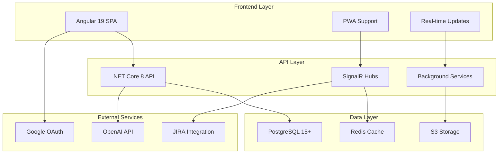

# DanHQ Technical Solution Document

## 📋 Document Overview

This comprehensive technical solution document provides detailed implementation guidance for DanHQ - a modern, AI-powered test case management system designed as an open-source alternative to TestLink.

## 📚 Document Structure

### **Core Architecture & Design**
- **[01. Architecture Overview](01_architecture_overview.md)**
  - System architecture overview
  - Technology stack selection
  - Architectural patterns & principles
  - Component interaction diagrams

- **[02. Database Design](02_database_design.md)**
  - Comprehensive database schema
  - Entity relationship models
  - Performance optimization strategies
  - Migration & seeding approaches

- **[03. API Design](03_api_design.md)**
  - RESTful API specifications
  - Authentication & authorization
  - API documentation standards
  - Error handling & response formats

### **Frontend & User Experience**
- **[04. Frontend Architecture](04_frontend_architecture.md)**
  - Angular application structure
  - State management with NgRx
  - Component design patterns
  - UI/UX implementation guidelines

### **Security & Integrations**
- **[05. Security Implementation](05_security_implementation.md)**
  - Multi-layer security approach
  - Authentication mechanisms
  - Data protection & encryption
  - Audit logging & compliance

- **[06. AI Integration](06_ai_integration.md)**
  - AI service architecture
  - OpenAI API integration
  - Test case generation workflows
  - Cost tracking & optimization

- **[07. External Integrations](07_external_integrations.md)**
  - JIRA integration implementation
  - Playwright automation framework
  - CI/CD platform integrations
  - Third-party tool connectivity

### **Operations & Quality Assurance**
- **[08. DevOps & Deployment](08_devops_deployment.md)**
  - Containerization with Docker
  - Kubernetes orchestration
  - CI/CD pipeline implementation
  - Environment management

- **[09. Testing Strategy](09_testing_strategy.md)**
  - Testing pyramid implementation
  - Unit, integration & E2E testing
  - Performance testing approaches
  - Quality assurance processes

- **[10. Performance Monitoring](10_performance_monitoring.md)**
  - Comprehensive monitoring setup
  - Real-time alerting systems
  - Performance optimization
  - Incident response procedures

## 🎯 Key Features Covered

### **Core Functionality**
- ✅ Multi-project test case management
- ✅ Role-based access control (6 roles)
- ✅ Test execution tracking & reporting
- ✅ Requirements management & traceability
- ✅ Real-time collaboration features

### **AI-Powered Features**
- ✅ Automatic test case generation from SRS
- ✅ OpenAI API integration with cost tracking
- ✅ AI-generated content review workflows
- ✅ Usage monitoring & optimization

### **Enterprise Integration**
- ✅ JIRA bidirectional synchronization
- ✅ Playwright test automation
- ✅ GitHub Actions CI/CD integration
- ✅ Slack/Teams notifications
- ✅ SSO with Google OAuth

### **DevOps & Scalability**
- ✅ Docker containerization
- ✅ Kubernetes deployment
- ✅ Horizontal auto-scaling
- ✅ Load balancing & high availability
- ✅ Comprehensive monitoring & alerting

## 🏗️ Architecture Highlights

## 📖 How to Use This Document

### **For Development Teams**
1. Start with [Architecture Overview](01_architecture_overview.md) for system understanding
2. Review [Database Design](02_database_design.md) for data modeling
3. Follow [API Design](03_api_design.md) for backend implementation
4. Use [Frontend Architecture](04_frontend_architecture.md) for UI development

### **For DevOps Engineers**
1. Study [DevOps & Deployment](08_devops_deployment.md) for infrastructure setup
2. Implement [Security](05_security_implementation.md) measures
3. Configure [Performance Monitoring](10_performance_monitoring.md)
4. Set up [Testing Strategy](09_testing_strategy.md) automation

### **For Technical Leads**
1. Review all sections for complete technical understanding
2. Use as reference for technical decision making
3. Guide team implementation based on documented patterns
4. Ensure compliance with security and performance standards

## 🚀 Implementation Phases

### **Phase 1: MVP (4 Weeks)**
- Core test case management
- Basic authentication & authorization
- Simple project structure
- Essential CRUD operations

### **Phase 2: AI Integration (2-3 Weeks)**
- OpenAI API integration
- Test case generation workflows
- Review & approval processes
- Cost tracking implementation

### **Phase 3: External Integrations (3-4 Weeks)**
- JIRA synchronization
- Playwright automation
- CI/CD integrations
- Notification systems

### **Phase 4: Production Readiness (2-3 Weeks)**
- Comprehensive monitoring
- Performance optimization
- Security hardening
- Documentation completion

## 🔧 Technology Stack Summary

| Layer | Primary Technology | Alternative Options |
|-------|-------------------|-------------------|
| **Frontend** | Angular 19 + NgRx | React, Vue.js |
| **Backend** | .NET Core 8 | Node.js, Java Spring |
| **Database** | PostgreSQL 15+ | MySQL, SQL Server |
| **Cache** | Redis 7+ | Memcached, In-memory |
| **Storage** | MinIO (S3-compatible) | AWS S3, Azure Blob |
| **Monitoring** | Prometheus + Grafana | Datadog, New Relic |
| **Deployment** | Kubernetes + Docker | Docker Swarm, AWS ECS |

## 📞 Support & Maintenance

### **Documentation Standards**
- All code examples are production-ready
- Configuration files include security best practices
- Performance considerations are documented
- Error handling patterns are provided

### **Version Compatibility**
- .NET Core 8.0+
- Angular 19+
- PostgreSQL 15+
- Kubernetes 1.28+
- Docker 24+

### **Update Schedule**
- Technical documentation: Quarterly reviews
- Security patches: As needed
- Performance optimizations: Bi-annual
- New feature documentation: With each release

---

**Document Version:** 1.0  
**Last Updated:** December 2024  
**Maintained By:** DanHQ Technical Team  
**Total Pages:** 10 comprehensive sections  
**Implementation Scope:** Full-stack production system