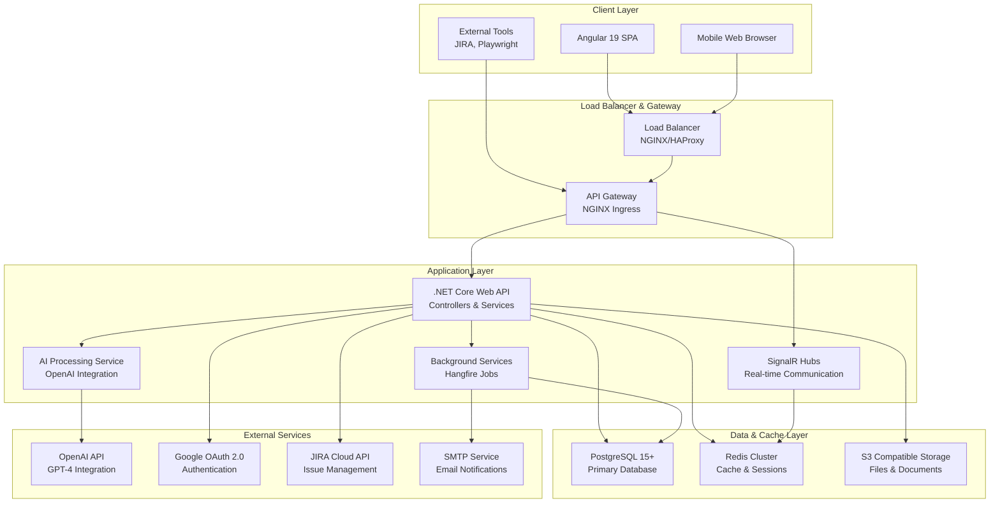
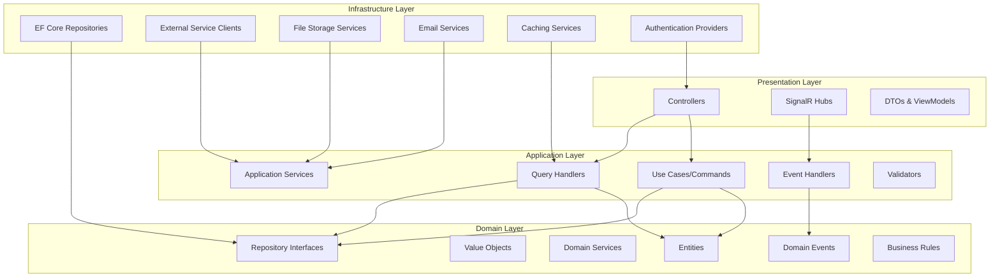
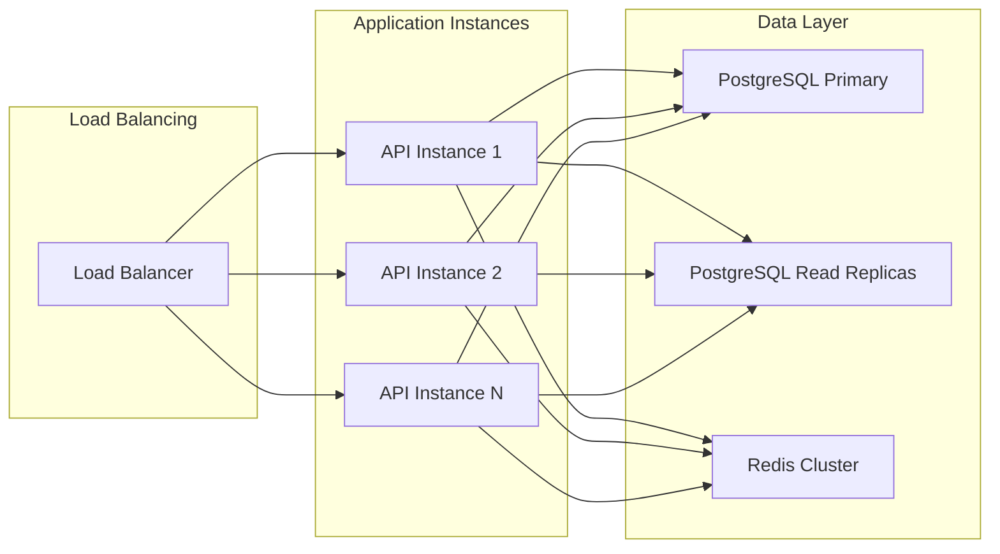
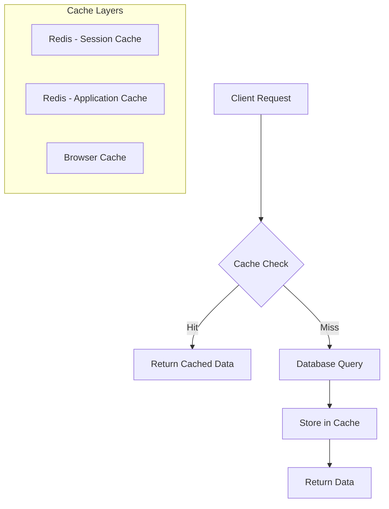
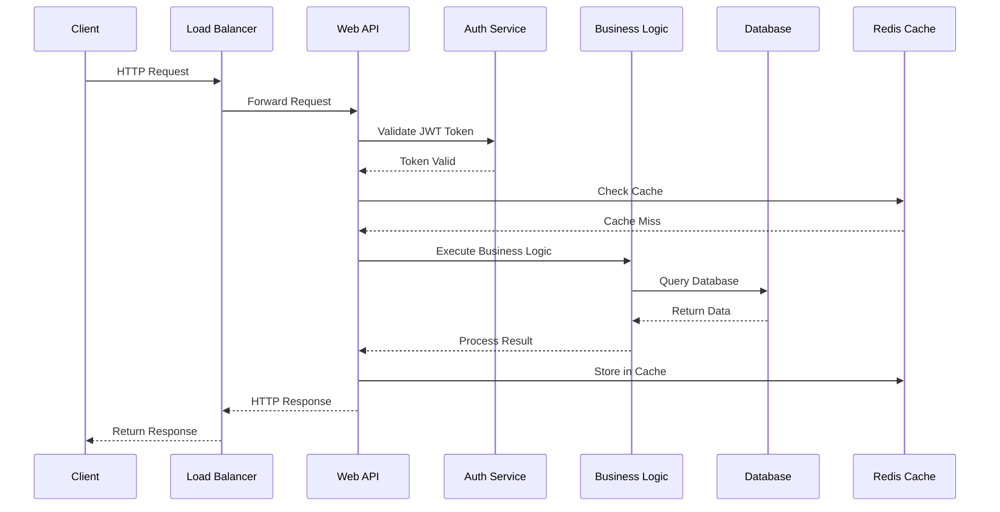
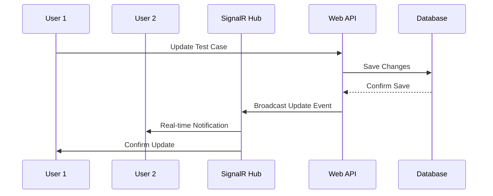
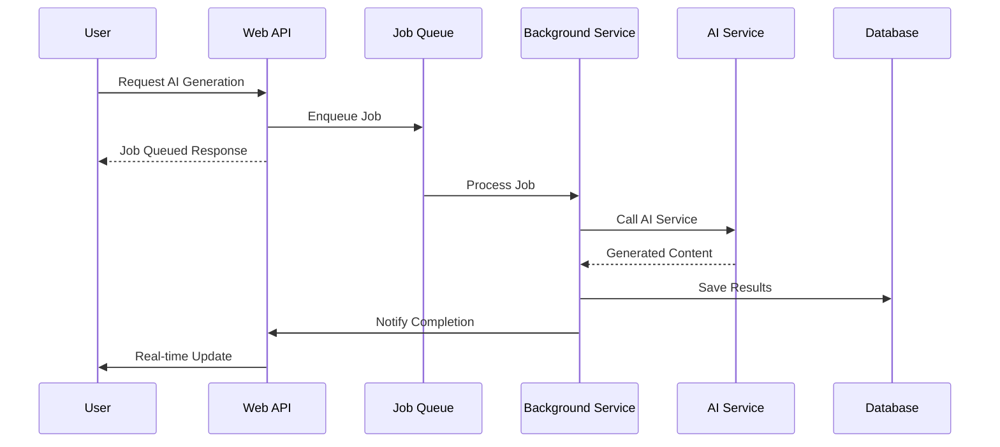
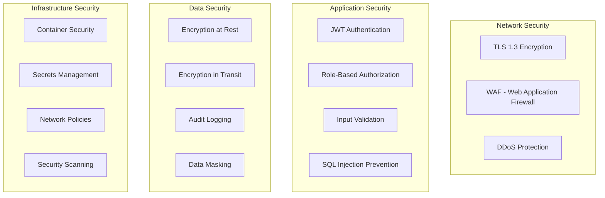
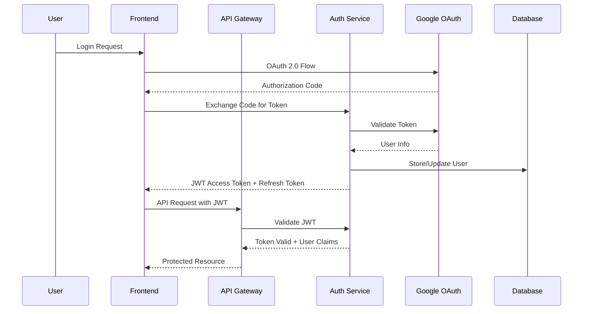

# 01. Architecture Overview

## 1.1 System Architecture Overview

DanHQ follows a modern, cloud-native architecture designed for scalability, maintainability, and high performance. The system is built using Clean Architecture principles with clear separation of concerns.

### 1.1.1 High-Level Architecture

### 1.1.2 Architectural Patterns

#### Clean Architecture Implementation

## 1.2 Technology Stack Selection

### 1.2.1 Backend Technology Stack

| Component | Technology | Version | Justification |
|-----------|------------|---------|---------------|
| **Framework** | .NET Core | 8.0 | Cross-platform, high performance, modern async/await patterns |
| **Language** | C# | 12.0 | Strong typing, excellent tooling, extensive ecosystem |
| **Database** | PostgreSQL | 15+ | ACID compliance, JSON support, excellent performance |
| **ORM** | Entity Framework Core | 8.0 | Code-first migrations, LINQ support, change tracking |
| **Caching** | Redis | 7.0+ | High performance, pub/sub support, session storage |
| **Background Jobs** | Hangfire | 1.8+ | Reliable job processing, dashboard, retry mechanisms |
| **Real-time** | SignalR | 8.0 | WebSocket support, automatic fallback, scaling support |
| **Authentication** | JWT + OAuth 2.0 | - | Stateless, secure, industry standard |
| **API Documentation** | Swagger/OpenAPI | 3.0 | Interactive documentation, code generation |

### 1.2.2 Frontend Technology Stack

| Component | Technology | Version | Justification |
|-----------|------------|---------|---------------|
| **Framework** | Angular | 19 | Enterprise-ready, TypeScript support, comprehensive ecosystem |
| **Language** | TypeScript | 5.0+ | Type safety, better IDE support, scalable codebase |
| **State Management** | NgRx | 18+ | Predictable state management, time-travel debugging |
| **UI Framework** | Angular Material + Tailwind | Latest | Pre-built components + utility-first CSS |
| **Build Tool** | Angular CLI + Vite | Latest | Optimized builds, hot reload, tree shaking |
| **Testing** | Jasmine + Karma + Cypress | Latest | Unit testing + E2E testing coverage |
| **PWA** | Angular Service Worker | Latest | Offline capabilities, push notifications |

### 1.2.3 DevOps & Infrastructure

| Component | Technology | Version | Justification |
|-----------|------------|---------|---------------|
| **Containerization** | Docker | 24+ | Consistent environments, easy deployment |
| **Orchestration** | Kubernetes | 1.28+ | Auto-scaling, service discovery, rolling updates |
| **CI/CD** | GitHub Actions | Latest | Integrated with repository, flexible workflows |
| **Monitoring** | Prometheus + Grafana | Latest | Metrics collection, visualization, alerting |
| **Logging** | ELK Stack | Latest | Centralized logging, search, analysis |
| **Secrets Management** | Kubernetes Secrets | Latest | Secure configuration management |

## 1.3 Architectural Principles

### 1.3.1 Design Principles

1. **Separation of Concerns**
   - Clear boundaries between layers
   - Single responsibility for each component
   - Minimal coupling between modules

2. **Dependency Inversion**
   - High-level modules don't depend on low-level modules
   - Both depend on abstractions
   - Interfaces define contracts

3. **SOLID Principles**
   - Single Responsibility Principle
   - Open/Closed Principle
   - Liskov Substitution Principle
   - Interface Segregation Principle
   - Dependency Inversion Principle

4. **Domain-Driven Design (DDD)**
   - Rich domain models
   - Bounded contexts
   - Aggregate patterns
   - Domain events

### 1.3.2 Scalability Patterns

#### Horizontal Scaling Strategy

#### Caching Strategy

## 1.4 Component Interaction Patterns

### 1.4.1 Request Processing Flow

### 1.4.2 Real-time Communication Flow

### 1.4.3 Background Job Processing

## 1.5 Performance Considerations

### 1.5.1 Performance Targets

| Metric | Target | Measurement |
|--------|--------|-------------|
| **Page Load Time** | < 2 seconds | Time to First Contentful Paint |
| **API Response Time** | < 500ms | 95th percentile |
| **Database Query Time** | < 100ms | Average query execution |
| **Concurrent Users** | 100+ | Without performance degradation |
| **File Upload** | 50MB | Maximum file size support |
| **Real-time Latency** | < 1 second | SignalR message delivery |

### 1.5.2 Optimization Strategies

1. **Database Optimization**
   - Proper indexing strategy
   - Query optimization
   - Connection pooling
   - Read replicas for queries

2. **Caching Strategy**
   - Redis for application cache
   - Browser caching for static assets
   - CDN for global content delivery

3. **API Optimization**
   - Async/await patterns
   - Pagination for large datasets
   - Response compression
   - Rate limiting

4. **Frontend Optimization**
   - Lazy loading modules
   - OnPush change detection
   - Virtual scrolling for large lists
   - Image optimization

## 1.6 Security Architecture

### 1.6.1 Security Layers

### 1.6.2 Authentication Flow

---

*This architecture overview provides the foundation for implementing DanHQ as a scalable, maintainable, and secure test management system.*