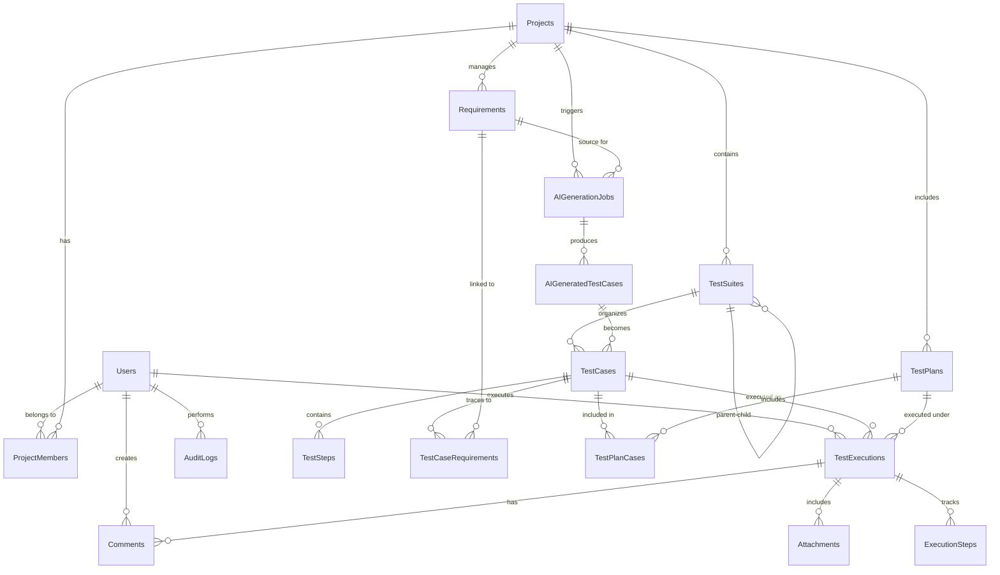

# 02. Database Design

## 2.1 Database Schema Overview

DanHQ uses PostgreSQL as the primary database with a carefully designed schema that supports multi-tenancy, audit trails, and efficient querying for test management workflows.

### 2.1.1 Core Entity Relationship Diagram



## 2.2 Core Tables Design

### 2.2.1 User Management Tables

#### Users Table
```sql
CREATE TABLE Users (
    Id SERIAL PRIMARY KEY,
    ExternalId VARCHAR(100) UNIQUE, -- Google OAuth ID
    Email VARCHAR(255) UNIQUE NOT NULL,
    DisplayName VARCHAR(100) NOT NULL,
    FirstName VARCHAR(50),
    LastName VARCHAR(50),
    ProfilePictureUrl VARCHAR(500),
    AuthProvider VARCHAR(20) NOT NULL DEFAULT 'google', -- 'google', 'local'
    PasswordHash VARCHAR(255), -- For admin/system users
    IsActive BOOLEAN NOT NULL DEFAULT true,
    IsSystemUser BOOLEAN NOT NULL DEFAULT false,
    LastLoginAt TIMESTAMP WITH TIME ZONE,
    CreatedAt TIMESTAMP WITH TIME ZONE NOT NULL DEFAULT NOW(),
    UpdatedAt TIMESTAMP WITH TIME ZONE NOT NULL DEFAULT NOW(),
    
    CONSTRAINT chk_auth_provider CHECK (AuthProvider IN ('google', 'local')),
    CONSTRAINT chk_system_user_password CHECK (
        (IsSystemUser = true AND PasswordHash IS NOT NULL) OR
        (IsSystemUser = false AND PasswordHash IS NULL)
    )
);

CREATE INDEX idx_users_email ON Users(Email);
CREATE INDEX idx_users_external_id ON Users(ExternalId);
CREATE INDEX idx_users_active ON Users(IsActive);
```

#### Projects Table
```sql
CREATE TABLE Projects (
    Id SERIAL PRIMARY KEY,
    Name VARCHAR(100) NOT NULL,
    Description TEXT,
    Key VARCHAR(10) UNIQUE NOT NULL, -- e.g., "PROJ", "TEST"
    IsActive BOOLEAN NOT NULL DEFAULT true,
    CreatedBy INTEGER NOT NULL REFERENCES Users(Id),
    CreatedAt TIMESTAMP WITH TIME ZONE NOT NULL DEFAULT NOW(),
    UpdatedAt TIMESTAMP WITH TIME ZONE NOT NULL DEFAULT NOW(),
    
    CONSTRAINT chk_project_key CHECK (Key ~ '^[A-Z]{2,10}$')
);

CREATE INDEX idx_projects_key ON Projects(Key);
CREATE INDEX idx_projects_active ON Projects(IsActive);
```

#### ProjectMembers Table
```sql
CREATE TABLE ProjectMembers (
    Id SERIAL PRIMARY KEY,
    ProjectId INTEGER NOT NULL REFERENCES Projects(Id) ON DELETE CASCADE,
    UserId INTEGER NOT NULL REFERENCES Users(Id) ON DELETE CASCADE,
    Role VARCHAR(20) NOT NULL,
    IsActive BOOLEAN NOT NULL DEFAULT true,
    InvitedBy INTEGER REFERENCES Users(Id),
    InvitedAt TIMESTAMP WITH TIME ZONE,
    JoinedAt TIMESTAMP WITH TIME ZONE,
    CreatedAt TIMESTAMP WITH TIME ZONE NOT NULL DEFAULT NOW(),
    UpdatedAt TIMESTAMP WITH TIME ZONE NOT NULL DEFAULT NOW(),
    
    CONSTRAINT chk_member_role CHECK (Role IN (
        'ProjectOwner', 'TestManager', 'TestLeader', 
        'TestEngineer', 'SoftwareEngineer', 'Viewer'
    )),
    CONSTRAINT uq_project_user UNIQUE(ProjectId, UserId)
);

CREATE INDEX idx_project_members_project ON ProjectMembers(ProjectId);
CREATE INDEX idx_project_members_user ON ProjectMembers(UserId);
CREATE INDEX idx_project_members_role ON ProjectMembers(Role);
```

### 2.2.2 Test Management Tables

#### TestSuites Table
```sql
CREATE TABLE TestSuites (
    Id SERIAL PRIMARY KEY,
    ProjectId INTEGER NOT NULL REFERENCES Projects(Id) ON DELETE CASCADE,
    ParentId INTEGER REFERENCES TestSuites(Id) ON DELETE CASCADE,
    Name VARCHAR(200) NOT NULL,
    Description TEXT,
    SortOrder INTEGER NOT NULL DEFAULT 0,
    IsActive BOOLEAN NOT NULL DEFAULT true,
    CreatedBy INTEGER NOT NULL REFERENCES Users(Id),
    CreatedAt TIMESTAMP WITH TIME ZONE NOT NULL DEFAULT NOW(),
    UpdatedAt TIMESTAMP WITH TIME ZONE NOT NULL DEFAULT NOW(),
    
    CONSTRAINT chk_parent_project CHECK (
        ParentId IS NULL OR 
        (SELECT ProjectId FROM TestSuites WHERE Id = ParentId) = ProjectId
    )
);

CREATE INDEX idx_test_suites_project ON TestSuites(ProjectId);
CREATE INDEX idx_test_suites_parent ON TestSuites(ParentId);
CREATE INDEX idx_test_suites_sort ON TestSuites(ProjectId, SortOrder);
```

#### TestCases Table
```sql
CREATE TABLE TestCases (
    Id SERIAL PRIMARY KEY,
    TestSuiteId INTEGER NOT NULL REFERENCES TestSuites(Id) ON DELETE CASCADE,
    ExternalId VARCHAR(50), -- e.g., "TC-001"
    Title VARCHAR(255) NOT NULL,
    Description TEXT,
    Preconditions TEXT,
    ExpectedResult TEXT,
    Priority VARCHAR(10) NOT NULL DEFAULT 'Medium',
    Type VARCHAR(20) NOT NULL DEFAULT 'Manual',
    Status VARCHAR(20) NOT NULL DEFAULT 'Draft',
    Tags TEXT[], -- PostgreSQL array for tags
    EstimatedDuration INTEGER, -- in minutes
    IsActive BOOLEAN NOT NULL DEFAULT true,
    Version INTEGER NOT NULL DEFAULT 1,
    CreatedBy INTEGER NOT NULL REFERENCES Users(Id),
    CreatedAt TIMESTAMP WITH TIME ZONE NOT NULL DEFAULT NOW(),
    UpdatedBy INTEGER NOT NULL REFERENCES Users(Id),
    UpdatedAt TIMESTAMP WITH TIME ZONE NOT NULL DEFAULT NOW(),
    
    CONSTRAINT chk_priority CHECK (Priority IN ('Low', 'Medium', 'High', 'Critical')),
    CONSTRAINT chk_type CHECK (Type IN ('Manual', 'Automation', 'Both')),
    CONSTRAINT chk_status CHECK (Status IN (
        'Draft', 'Ready', 'UnderReview', 'Approved', 'Deprecated'
    ))
);

CREATE UNIQUE INDEX idx_test_cases_external_id ON TestCases(ExternalId) 
WHERE ExternalId IS NOT NULL;
CREATE INDEX idx_test_cases_suite ON TestCases(TestSuiteId);
CREATE INDEX idx_test_cases_status ON TestCases(Status);
CREATE INDEX idx_test_cases_type ON TestCases(Type);
CREATE INDEX idx_test_cases_tags ON TestCases USING GIN(Tags);
```

#### TestSteps Table
```sql
CREATE TABLE TestSteps (
    Id SERIAL PRIMARY KEY,
    TestCaseId INTEGER NOT NULL REFERENCES TestCases(Id) ON DELETE CASCADE,
    StepNumber INTEGER NOT NULL,
    Action TEXT NOT NULL,
    ExpectedResult TEXT,
    Notes TEXT,
    CreatedAt TIMESTAMP WITH TIME ZONE NOT NULL DEFAULT NOW(),
    UpdatedAt TIMESTAMP WITH TIME ZONE NOT NULL DEFAULT NOW(),
    
    CONSTRAINT uq_test_case_step UNIQUE(TestCaseId, StepNumber)
);

CREATE INDEX idx_test_steps_case ON TestSteps(TestCaseId);
```

### 2.2.3 Requirements Management Tables

#### Requirements Table
```sql
CREATE TABLE Requirements (
    Id SERIAL PRIMARY KEY,
    ProjectId INTEGER NOT NULL REFERENCES Projects(Id) ON DELETE CASCADE,
    DocumentName VARCHAR(255) NOT NULL,
    Version VARCHAR(20) NOT NULL DEFAULT '1.0',
    FileName VARCHAR(255) NOT NULL,
    FilePath VARCHAR(500) NOT NULL,
    FileSize BIGINT NOT NULL,
    MimeType VARCHAR(100) NOT NULL,
    ContentHash VARCHAR(64) NOT NULL, -- SHA-256 hash
    ExtractedText TEXT, -- Full text extraction for AI processing
    Status VARCHAR(20) NOT NULL DEFAULT 'Uploaded',
    ApprovedBy INTEGER REFERENCES Users(Id),
    ApprovedAt TIMESTAMP WITH TIME ZONE,
    UploadedBy INTEGER NOT NULL REFERENCES Users(Id),
    CreatedAt TIMESTAMP WITH TIME ZONE NOT NULL DEFAULT NOW(),
    UpdatedAt TIMESTAMP WITH TIME ZONE NOT NULL DEFAULT NOW(),
    
    CONSTRAINT chk_req_status CHECK (Status IN (
        'Uploaded', 'Processing', 'Ready', 'Approved', 'Rejected'
    ))
);

CREATE INDEX idx_requirements_project ON Requirements(ProjectId);
CREATE INDEX idx_requirements_status ON Requirements(Status);
CREATE INDEX idx_requirements_hash ON Requirements(ContentHash);
```

#### TestCaseRequirements Table
```sql
CREATE TABLE TestCaseRequirements (
    Id SERIAL PRIMARY KEY,
    TestCaseId INTEGER NOT NULL REFERENCES TestCases(Id) ON DELETE CASCADE,
    RequirementId INTEGER NOT NULL REFERENCES Requirements(Id) ON DELETE CASCADE,
    RequirementSection VARCHAR(255), -- Section/chapter reference
    TraceabilityType VARCHAR(20) NOT NULL DEFAULT 'Covers',
    CreatedBy INTEGER NOT NULL REFERENCES Users(Id),
    CreatedAt TIMESTAMP WITH TIME ZONE NOT NULL DEFAULT NOW(),
    
    CONSTRAINT chk_traceability_type CHECK (TraceabilityType IN (
        'Covers', 'Derives', 'Depends', 'References'
    )),
    CONSTRAINT uq_testcase_requirement UNIQUE(TestCaseId, RequirementId)
);

CREATE INDEX idx_tc_req_testcase ON TestCaseRequirements(TestCaseId);
CREATE INDEX idx_tc_req_requirement ON TestCaseRequirements(RequirementId);
```

### 2.2.4 Test Execution Tables

#### TestPlans Table
```sql
CREATE TABLE TestPlans (
    Id SERIAL PRIMARY KEY,
    ProjectId INTEGER NOT NULL REFERENCES Projects(Id) ON DELETE CASCADE,
    Name VARCHAR(200) NOT NULL,
    Description TEXT,
    Status VARCHAR(20) NOT NULL DEFAULT 'Draft',
    Priority VARCHAR(10) NOT NULL DEFAULT 'Medium',
    StartDate DATE,
    EndDate DATE,
    Environment VARCHAR(50),
    TestType VARCHAR(20) NOT NULL DEFAULT 'Functional',
    CreatedBy INTEGER NOT NULL REFERENCES Users(Id),
    CreatedAt TIMESTAMP WITH TIME ZONE NOT NULL DEFAULT NOW(),
    UpdatedBy INTEGER NOT NULL REFERENCES Users(Id),
    UpdatedAt TIMESTAMP WITH TIME ZONE NOT NULL DEFAULT NOW(),
    
    CONSTRAINT chk_plan_status CHECK (Status IN (
        'Draft', 'Active', 'Completed', 'Cancelled'
    )),
    CONSTRAINT chk_plan_priority CHECK (Priority IN ('Low', 'Medium', 'High', 'Critical')),
    CONSTRAINT chk_plan_dates CHECK (StartDate <= EndDate OR EndDate IS NULL)
);

CREATE INDEX idx_test_plans_project ON TestPlans(ProjectId);
CREATE INDEX idx_test_plans_status ON TestPlans(Status);
```

#### TestPlanCases Table
```sql
CREATE TABLE TestPlanCases (
    Id SERIAL PRIMARY KEY,
    TestPlanId INTEGER NOT NULL REFERENCES TestPlans(Id) ON DELETE CASCADE,
    TestCaseId INTEGER NOT NULL REFERENCES TestCases(Id) ON DELETE CASCADE,
    AssignedTo INTEGER REFERENCES Users(Id),
    ExecutionOrder INTEGER,
    EstimatedDuration INTEGER, -- Override test case duration
    CreatedAt TIMESTAMP WITH TIME ZONE NOT NULL DEFAULT NOW(),
    
    CONSTRAINT uq_plan_case UNIQUE(TestPlanId, TestCaseId)
);

CREATE INDEX idx_plan_cases_plan ON TestPlanCases(TestPlanId);
CREATE INDEX idx_plan_cases_case ON TestPlanCases(TestCaseId);
CREATE INDEX idx_plan_cases_assigned ON TestPlanCases(AssignedTo);
```

#### TestExecutions Table
```sql
CREATE TABLE TestExecutions (
    Id SERIAL PRIMARY KEY,
    TestCaseId INTEGER NOT NULL REFERENCES TestCases(Id),
    TestPlanId INTEGER REFERENCES TestPlans(Id),
    ExecutedBy INTEGER NOT NULL REFERENCES Users(Id),
    Status VARCHAR(20) NOT NULL,
    ExecutionType VARCHAR(20) NOT NULL DEFAULT 'Manual',
    Environment VARCHAR(50),
    BuildVersion VARCHAR(50),
    StartedAt TIMESTAMP WITH TIME ZONE,
    CompletedAt TIMESTAMP WITH TIME ZONE,
    Duration INTEGER, -- in seconds
    Notes TEXT,
    DefectDetails TEXT,
    AutomationScriptPath VARCHAR(500),
    CreatedAt TIMESTAMP WITH TIME ZONE NOT NULL DEFAULT NOW(),
    UpdatedAt TIMESTAMP WITH TIME ZONE NOT NULL DEFAULT NOW(),
    
    CONSTRAINT chk_exec_status CHECK (Status IN (
        'NotExecuted', 'InProgress', 'Passed', 'Failed', 'Blocked', 'Skipped'
    )),
    CONSTRAINT chk_exec_type CHECK (ExecutionType IN ('Manual', 'Automation')),
    CONSTRAINT chk_exec_times CHECK (StartedAt <= CompletedAt OR CompletedAt IS NULL)
);

CREATE INDEX idx_test_executions_case ON TestExecutions(TestCaseId);
CREATE INDEX idx_test_executions_plan ON TestExecutions(TestPlanId);
CREATE INDEX idx_test_executions_executor ON TestExecutions(ExecutedBy);
CREATE INDEX idx_test_executions_status ON TestExecutions(Status);
CREATE INDEX idx_test_executions_date ON TestExecutions(StartedAt);
```

#### ExecutionSteps Table
```sql
CREATE TABLE ExecutionSteps (
    Id SERIAL PRIMARY KEY,
    TestExecutionId INTEGER NOT NULL REFERENCES TestExecutions(Id) ON DELETE CASCADE,
    TestStepId INTEGER NOT NULL REFERENCES TestSteps(Id),
    Status VARCHAR(20) NOT NULL,
    ActualResult TEXT,
    Notes TEXT,
    ExecutedAt TIMESTAMP WITH TIME ZONE,
    
    CONSTRAINT chk_step_status CHECK (Status IN (
        'NotExecuted', 'Passed', 'Failed', 'Blocked', 'Skipped'
    )),
    CONSTRAINT uq_execution_step UNIQUE(TestExecutionId, TestStepId)
);

CREATE INDEX idx_execution_steps_execution ON ExecutionSteps(TestExecutionId);
CREATE INDEX idx_execution_steps_step ON ExecutionSteps(TestStepId);
```

### 2.2.5 AI Integration Tables

#### AIGenerationJobs Table
```sql
CREATE TABLE AIGenerationJobs (
    Id SERIAL PRIMARY KEY,
    ProjectId INTEGER NOT NULL REFERENCES Projects(Id) ON DELETE CASCADE,
    RequirementId INTEGER NOT NULL REFERENCES Requirements(Id),
    JobId UUID UNIQUE NOT NULL DEFAULT gen_random_uuid(),
    Status VARCHAR(20) NOT NULL DEFAULT 'Queued',
    Prompt TEXT NOT NULL,
    ModelUsed VARCHAR(50),
    TokensUsed INTEGER,
    EstimatedCost DECIMAL(10,4),
    ProcessingStartedAt TIMESTAMP WITH TIME ZONE,
    ProcessingCompletedAt TIMESTAMP WITH TIME ZONE,
    ErrorMessage TEXT,
    CreatedBy INTEGER NOT NULL REFERENCES Users(Id),
    CreatedAt TIMESTAMP WITH TIME ZONE NOT NULL DEFAULT NOW(),
    UpdatedAt TIMESTAMP WITH TIME ZONE NOT NULL DEFAULT NOW(),
    
    CONSTRAINT chk_ai_status CHECK (Status IN (
        'Queued', 'Processing', 'Completed', 'Failed', 'Cancelled'
    ))
);

CREATE INDEX idx_ai_jobs_project ON AIGenerationJobs(ProjectId);
CREATE INDEX idx_ai_jobs_requirement ON AIGenerationJobs(RequirementId);
CREATE INDEX idx_ai_jobs_status ON AIGenerationJobs(Status);
CREATE INDEX idx_ai_jobs_created ON AIGenerationJobs(CreatedAt);
```

#### AIGeneratedTestCases Table
```sql
CREATE TABLE AIGeneratedTestCases (
    Id SERIAL PRIMARY KEY,
    AIGenerationJobId INTEGER NOT NULL REFERENCES AIGenerationJobs(Id) ON DELETE CASCADE,
    Title VARCHAR(255) NOT NULL,
    Description TEXT,
    Preconditions TEXT,
    ExpectedResult TEXT,
    Priority VARCHAR(10) NOT NULL DEFAULT 'Medium',
    GeneratedSteps JSONB, -- Array of step objects
    ReviewStatus VARCHAR(20) NOT NULL DEFAULT 'Pending',
    ReviewedBy INTEGER REFERENCES Users(Id),
    ReviewedAt TIMESTAMP WITH TIME ZONE,
    ReviewNotes TEXT,
    ConvertedTestCaseId INTEGER REFERENCES TestCases(Id),
    CreatedAt TIMESTAMP WITH TIME ZONE NOT NULL DEFAULT NOW(),
    
    CONSTRAINT chk_review_status CHECK (ReviewStatus IN (
        'Pending', 'Approved', 'Rejected', 'Modified'
    ))
);

CREATE INDEX idx_ai_generated_job ON AIGeneratedTestCases(AIGenerationJobId);
CREATE INDEX idx_ai_generated_review ON AIGeneratedTestCases(ReviewStatus);
CREATE INDEX idx_ai_generated_converted ON AIGeneratedTestCases(ConvertedTestCaseId);
```

### 2.2.6 Supporting Tables

#### Attachments Table
```sql
CREATE TABLE Attachments (
    Id SERIAL PRIMARY KEY,
    EntityType VARCHAR(50) NOT NULL, -- 'TestExecution', 'TestCase', 'Comment'
    EntityId INTEGER NOT NULL,
    FileName VARCHAR(255) NOT NULL,
    FilePath VARCHAR(500) NOT NULL,
    FileSize BIGINT NOT NULL,
    MimeType VARCHAR(100) NOT NULL,
    ContentHash VARCHAR(64) NOT NULL,
    UploadedBy INTEGER NOT NULL REFERENCES Users(Id),
    CreatedAt TIMESTAMP WITH TIME ZONE NOT NULL DEFAULT NOW(),
    
    CONSTRAINT chk_entity_type CHECK (EntityType IN (
        'TestExecution', 'TestCase', 'Comment', 'Requirement'
    ))
);

CREATE INDEX idx_attachments_entity ON Attachments(EntityType, EntityId);
CREATE INDEX idx_attachments_uploader ON Attachments(UploadedBy);
```

#### Comments Table
```sql
CREATE TABLE Comments (
    Id SERIAL PRIMARY KEY,
    EntityType VARCHAR(50) NOT NULL,
    EntityId INTEGER NOT NULL,
    Content TEXT NOT NULL,
    IsInternal BOOLEAN NOT NULL DEFAULT false,
    ParentId INTEGER REFERENCES Comments(Id), -- For replies
    CreatedBy INTEGER NOT NULL REFERENCES Users(Id),
    CreatedAt TIMESTAMP WITH TIME ZONE NOT NULL DEFAULT NOW(),
    UpdatedAt TIMESTAMP WITH TIME ZONE NOT NULL DEFAULT NOW(),
    
    CONSTRAINT chk_comment_entity_type CHECK (EntityType IN (
        'TestCase', 'TestExecution', 'TestPlan', 'Requirement'
    ))
);

CREATE INDEX idx_comments_entity ON Comments(EntityType, EntityId);
CREATE INDEX idx_comments_parent ON Comments(ParentId);
CREATE INDEX idx_comments_author ON Comments(CreatedBy);
```

#### AuditLogs Table
```sql
CREATE TABLE AuditLogs (
    Id SERIAL PRIMARY KEY,
    EntityType VARCHAR(50) NOT NULL,
    EntityId INTEGER NOT NULL,
    Action VARCHAR(20) NOT NULL, -- CREATE, UPDATE, DELETE
    OldValues JSONB,
    NewValues JSONB,
    ChangedFields TEXT[],
    UserId INTEGER REFERENCES Users(Id),
    IPAddress INET,
    UserAgent TEXT,
    CreatedAt TIMESTAMP WITH TIME ZONE NOT NULL DEFAULT NOW(),
    
    CONSTRAINT chk_audit_action CHECK (Action IN ('CREATE', 'UPDATE', 'DELETE'))
);

CREATE INDEX idx_audit_entity ON AuditLogs(EntityType, EntityId);
CREATE INDEX idx_audit_user ON AuditLogs(UserId);
CREATE INDEX idx_audit_date ON AuditLogs(CreatedAt);
```

## 2.3 Database Performance Optimization

### 2.3.1 Indexing Strategy

#### Composite Indexes for Common Queries
```sql
-- Test case search and filtering
CREATE INDEX idx_testcases_suite_status_type ON TestCases(TestSuiteId, Status, Type);

-- Test execution reporting
CREATE INDEX idx_executions_plan_status_date ON TestExecutions(TestPlanId, Status, StartedAt DESC);

-- Project member access checks
CREATE INDEX idx_project_members_user_active ON ProjectMembers(UserId, IsActive) 
WHERE IsActive = true;

-- AI job monitoring
CREATE INDEX idx_ai_jobs_status_created ON AIGenerationJobs(Status, CreatedAt DESC) 
WHERE Status IN ('Queued', 'Processing');
```

#### Partial Indexes for Active Records
```sql
-- Only index active projects and test cases
CREATE INDEX idx_projects_active_name ON Projects(Name) WHERE IsActive = true;
CREATE INDEX idx_testcases_active_title ON TestCases(Title) WHERE IsActive = true;
```

### 2.3.2 Query Optimization

#### Materialized Views for Reporting
```sql
-- Test execution summary view
CREATE MATERIALIZED VIEW TestExecutionSummary AS
SELECT 
    tp.Id as TestPlanId,
    tp.Name as TestPlanName,
    COUNT(te.Id) as TotalExecutions,
    COUNT(CASE WHEN te.Status = 'Passed' THEN 1 END) as PassedCount,
    COUNT(CASE WHEN te.Status = 'Failed' THEN 1 END) as FailedCount,
    COUNT(CASE WHEN te.Status = 'Blocked' THEN 1 END) as BlockedCount,
    COUNT(CASE WHEN te.Status = 'Skipped' THEN 1 END) as SkippedCount,
    ROUND(
        COUNT(CASE WHEN te.Status = 'Passed' THEN 1 END) * 100.0 / 
        NULLIF(COUNT(CASE WHEN te.Status IN ('Passed', 'Failed') THEN 1 END), 0), 
        2
    ) as PassRate
FROM TestPlans tp
LEFT JOIN TestExecutions te ON tp.Id = te.TestPlanId
GROUP BY tp.Id, tp.Name;

CREATE UNIQUE INDEX idx_test_execution_summary_plan ON TestExecutionSummary(TestPlanId);
```

### 2.3.3 Connection Pool Configuration

```sql
-- PostgreSQL configuration for connection pooling
-- postgresql.conf settings:
-- max_connections = 200
-- shared_buffers = 256MB
-- effective_cache_size = 1GB
-- work_mem = 4MB
-- maintenance_work_mem = 64MB
-- checkpoint_completion_target = 0.9
-- wal_buffers = 16MB
-- default_statistics_target = 100
```

## 2.4 Data Migration Strategy

### 2.4.1 Entity Framework Migrations

#### Initial Migration Script
```csharp
public partial class InitialCreate : Migration
{
    protected override void Up(MigrationBuilder migrationBuilder)
    {
        // Create Users table
        migrationBuilder.CreateTable(
            name: "Users",
            columns: table => new
            {
                Id = table.Column<int>(type: "integer", nullable: false)
                    .Annotation("Npgsql:ValueGenerationStrategy", NpgsqlValueGenerationStrategy.IdentityByDefaultColumn),
                ExternalId = table.Column<string>(type: "character varying(100)", maxLength: 100, nullable: true),
                Email = table.Column<string>(type: "character varying(255)", maxLength: 255, nullable: false),
                DisplayName = table.Column<string>(type: "character varying(100)", maxLength: 100, nullable: false),
                // ... other columns
            },
            constraints: table =>
            {
                table.PrimaryKey("PK_Users", x => x.Id);
            });

        // Create indexes
        migrationBuilder.CreateIndex(
            name: "idx_users_email",
            table: "Users",
            column: "Email",
            unique: true);
    }
}
```

### 2.4.2 Seed Data Strategy

```csharp
public class DatabaseSeeder
{
    public static async Task SeedAsync(DanHQDbContext context)
    {
        // Seed default admin user
        if (!await context.Users.AnyAsync(u => u.IsSystemUser))
        {
            var adminUser = new User
            {
                Email = "admin@danhq.local",
                DisplayName = "System Administrator",
                IsSystemUser = true,
                PasswordHash = BCrypt.Net.BCrypt.HashPassword("admin123"),
                IsActive = true
            };
            
            context.Users.Add(adminUser);
            await context.SaveChangesAsync();
        }

        // Seed test data for development
        if (Environment.GetEnvironmentVariable("ASPNETCORE_ENVIRONMENT") == "Development")
        {
            await SeedDevelopmentDataAsync(context);
        }
    }
}
```

---

*This database design provides a robust foundation for DanHQ's test management capabilities with proper normalization, indexing, and performance considerations.*