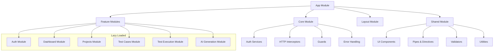
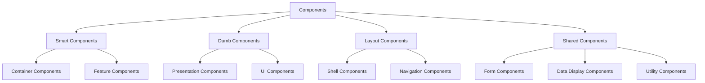
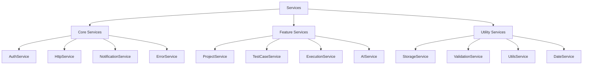

# 04. Frontend Architecture

## 4.1 Angular Application Structure

DanHQ frontend is built with Angular 19 following best practices for enterprise applications with modular architecture, lazy loading, and comprehensive state management.

### 4.1.1 Project Structure

```
src/
├── app/
│   ├── core/                     # Singleton services, guards, interceptors
│   │   ├── auth/
│   │   │   ├── guards/
│   │   │   ├── interceptors/
│   │   │   └── services/
│   │   ├── services/
│   │   ├── models/
│   │   └── core.module.ts
│   ├── shared/                   # Shared components, pipes, directives
│   │   ├── components/
│   │   ├── pipes/
│   │   ├── directives/
│   │   ├── validators/
│   │   └── shared.module.ts
│   ├── features/                 # Feature modules (lazy loaded)
│   │   ├── auth/
│   │   ├── dashboard/
│   │   ├── projects/
│   │   ├── test-cases/
│   │   ├── test-execution/
│   │   ├── test-plans/
│   │   ├── requirements/
│   │   ├── ai-generation/
│   │   └── reporting/
│   ├── layout/                   # Layout components
│   │   ├── header/
│   │   ├── sidebar/
│   │   ├── footer/
│   │   └── main-layout/
│   ├── store/                    # NgRx store
│   │   ├── actions/
│   │   ├── effects/
│   │   ├── reducers/
│   │   ├── selectors/
│   │   └── app.state.ts
│   ├── app-routing.module.ts
│   ├── app.component.ts
│   └── app.module.ts
├── assets/
│   ├── images/
│   ├── icons/
│   ├── fonts/
│   └── i18n/
├── environments/
├── styles/
│   ├── base/
│   ├── components/
│   ├── utilities/
│   └── main.scss
└── index.html
```

### 4.1.2 Module Architecture



## 4.2 State Management with NgRx

### 4.2.1 Store Structure

```typescript
// app.state.ts
export interface AppState {
  auth: AuthState;
  projects: ProjectsState;
  testCases: TestCasesState;
  testExecution: TestExecutionState;
  aiGeneration: AIGenerationState;
  ui: UIState;
}

// Feature state interfaces
export interface AuthState {
  user: User | null;
  isAuthenticated: boolean;
  isLoading: boolean;
  error: string | null;
  tokens: {
    accessToken: string | null;
    refreshToken: string | null;
    expiresAt: Date | null;
  };
}

export interface ProjectsState {
  projects: Project[];
  selectedProject: Project | null;
  currentProjectMembers: ProjectMember[];
  isLoading: boolean;
  error: string | null;
  pagination: PaginationInfo;
}

export interface TestCasesState {
  testCases: TestCase[];
  selectedTestCase: TestCase | null;
  testSuites: TestSuite[];
  selectedTestSuite: TestSuite | null;
  filters: TestCaseFilters;
  isLoading: boolean;
  error: string | null;
  pagination: PaginationInfo;
}
```

### 4.2.2 Actions Definition

```typescript
// auth.actions.ts
export const AuthActions = createActionGroup({
  source: 'Auth',
  events: {
    // Login actions
    'Login': props<{ authCode: string; redirectUri: string }>(),
    'Login Success': props<{ user: User; tokens: AuthTokens }>(),
    'Login Failure': props<{ error: string }>(),
    
    // Logout actions
    'Logout': emptyProps(),
    'Logout Success': emptyProps(),
    
    // Token refresh
    'Refresh Token': props<{ refreshToken: string }>(),
    'Refresh Token Success': props<{ accessToken: string; expiresAt: Date }>(),
    'Refresh Token Failure': props<{ error: string }>(),
    
    // User profile
    'Load User Profile': emptyProps(),
    'Update User Profile': props<{ profile: Partial<User> }>(),
  }
});

// projects.actions.ts
export const ProjectActions = createActionGroup({
  source: 'Projects',
  events: {
    // Load projects
    'Load Projects': props<{ filters?: ProjectFilters; page?: number }>(),
    'Load Projects Success': props<{ projects: Project[]; pagination: PaginationInfo }>(),
    'Load Projects Failure': props<{ error: string }>(),
    
    // Create project
    'Create Project': props<{ project: CreateProjectRequest }>(),
    'Create Project Success': props<{ project: Project }>(),
    'Create Project Failure': props<{ error: string }>(),
    
    // Select project
    'Select Project': props<{ projectId: number }>(),
    'Clear Selected Project': emptyProps(),
    
    // Project members
    'Load Project Members': props<{ projectId: number }>(),
    'Invite Project Member': props<{ projectId: number; invitation: MemberInvitation }>(),
  }
});
```

### 4.2.3 Effects Implementation

```typescript
// auth.effects.ts
@Injectable()
export class AuthEffects {
  constructor(
    private actions$: Actions,
    private authService: AuthService,
    private router: Router,
    private store: Store
  ) {}

  login$ = createEffect(() =>
    this.actions$.pipe(
      ofType(AuthActions.login),
      switchMap(({ authCode, redirectUri }) =>
        this.authService.login(authCode, redirectUri).pipe(
          map(response => AuthActions.loginSuccess({
            user: response.user,
            tokens: {
              accessToken: response.accessToken,
              refreshToken: response.refreshToken,
              expiresAt: new Date(Date.now() + response.expiresIn * 1000)
            }
          })),
          catchError(error => of(AuthActions.loginFailure({ error: error.message })))
        )
      )
    )
  );

  loginSuccess$ = createEffect(() =>
    this.actions$.pipe(
      ofType(AuthActions.loginSuccess),
      tap(() => this.router.navigate(['/dashboard']))
    ), { dispatch: false }
  );

  logout$ = createEffect(() =>
    this.actions$.pipe(
      ofType(AuthActions.logout),
      switchMap(() =>
        this.authService.logout().pipe(
          map(() => AuthActions.logoutSuccess()),
          catchError(() => of(AuthActions.logoutSuccess())) // Logout even if server call fails
        )
      )
    )
  );

  logoutSuccess$ = createEffect(() =>
    this.actions$.pipe(
      ofType(AuthActions.logoutSuccess),
      tap(() => {
        this.router.navigate(['/auth/login']);
        // Clear local storage, etc.
      })
    ), { dispatch: false }
  );
}
```

### 4.2.4 Reducers Implementation

```typescript
// auth.reducer.ts
const initialState: AuthState = {
  user: null,
  isAuthenticated: false,
  isLoading: false,
  error: null,
  tokens: {
    accessToken: null,
    refreshToken: null,
    expiresAt: null
  }
};

export const authReducer = createReducer(
  initialState,
  on(AuthActions.login, (state) => ({
    ...state,
    isLoading: true,
    error: null
  })),
  on(AuthActions.loginSuccess, (state, { user, tokens }) => ({
    ...state,
    user,
    tokens,
    isAuthenticated: true,
    isLoading: false,
    error: null
  })),
  on(AuthActions.loginFailure, (state, { error }) => ({
    ...state,
    isLoading: false,
    error,
    isAuthenticated: false
  })),
  on(AuthActions.logoutSuccess, () => initialState)
);
```

### 4.2.5 Selectors Implementation

```typescript
// auth.selectors.ts
export const selectAuthFeature = createFeatureSelector<AuthState>('auth');

export const selectCurrentUser = createSelector(
  selectAuthFeature,
  (state) => state.user
);

export const selectIsAuthenticated = createSelector(
  selectAuthFeature,
  (state) => state.isAuthenticated
);

export const selectAuthLoading = createSelector(
  selectAuthFeature,
  (state) => state.isLoading
);

export const selectAuthError = createSelector(
  selectAuthFeature,
  (state) => state.error
);

export const selectAccessToken = createSelector(
  selectAuthFeature,
  (state) => state.tokens.accessToken
);

// projects.selectors.ts
export const selectProjectsFeature = createFeatureSelector<ProjectsState>('projects');

export const selectAllProjects = createSelector(
  selectProjectsFeature,
  (state) => state.projects
);

export const selectSelectedProject = createSelector(
  selectProjectsFeature,
  (state) => state.selectedProject
);

export const selectProjectsLoading = createSelector(
  selectProjectsFeature,
  (state) => state.isLoading
);

export const selectCurrentProjectMembers = createSelector(
  selectProjectsFeature,
  (state) => state.currentProjectMembers
);
```

## 4.3 Component Architecture

### 4.3.1 Component Categories



### 4.3.2 Smart Component Example

```typescript
// test-cases-container.component.ts
@Component({
  selector: 'app-test-cases-container',
  template: `
    <div class="test-cases-container">
      <app-test-cases-header
        [project]="selectedProject$ | async"
        [testSuite]="selectedTestSuite$ | async"
        (createTestCase)="onCreateTestCase($event)"
        (filterChange)="onFilterChange($event)">
      </app-test-cases-header>
      
      <div class="flex">
        <app-test-suite-tree
          [testSuites]="testSuites$ | async"
          [selectedSuite]="selectedTestSuite$ | async"
          (suiteSelect)="onTestSuiteSelect($event)">
        </app-test-suite-tree>
        
        <app-test-cases-list
          [testCases]="testCases$ | async"
          [loading]="loading$ | async"
          [pagination]="pagination$ | async"
          (testCaseSelect)="onTestCaseSelect($event)"
          (pageChange)="onPageChange($event)">
        </app-test-cases-list>
      </div>
      
      <app-test-case-detail
        *ngIf="selectedTestCase$ | async as testCase"
        [testCase]="testCase"
        [canEdit]="canEditTestCase$ | async"
        (update)="onUpdateTestCase($event)"
        (delete)="onDeleteTestCase($event)">
      </app-test-case-detail>
    </div>
  `,
  changeDetection: ChangeDetectionStrategy.OnPush
})
export class TestCasesContainerComponent implements OnInit {
  // Observable streams
  selectedProject$ = this.store.select(selectSelectedProject);
  testSuites$ = this.store.select(selectTestSuites);
  selectedTestSuite$ = this.store.select(selectSelectedTestSuite);
  testCases$ = this.store.select(selectFilteredTestCases);
  selectedTestCase$ = this.store.select(selectSelectedTestCase);
  loading$ = this.store.select(selectTestCasesLoading);
  pagination$ = this.store.select(selectTestCasesPagination);
  canEditTestCase$ = this.store.select(selectCanEditTestCase);

  constructor(private store: Store) {}

  ngOnInit() {
    this.store.dispatch(TestCaseActions.loadTestSuites());
  }

  onTestSuiteSelect(testSuiteId: number) {
    this.store.dispatch(TestCaseActions.selectTestSuite({ testSuiteId }));
    this.store.dispatch(TestCaseActions.loadTestCases({ testSuiteId }));
  }

  onCreateTestCase(testCase: CreateTestCaseRequest) {
    this.store.dispatch(TestCaseActions.createTestCase({ testCase }));
  }

  onUpdateTestCase(update: { testCaseId: number; testCase: UpdateTestCaseRequest }) {
    this.store.dispatch(TestCaseActions.updateTestCase(update));
  }

  onDeleteTestCase(testCaseId: number) {
    this.store.dispatch(TestCaseActions.deleteTestCase({ testCaseId }));
  }

  onFilterChange(filters: TestCaseFilters) {
    this.store.dispatch(TestCaseActions.setFilters({ filters }));
  }

  onPageChange(page: number) {
    this.store.dispatch(TestCaseActions.loadTestCases({ page }));
  }
}
```

### 4.3.3 Dumb Component Example

```typescript
// test-case-card.component.ts
@Component({
  selector: 'app-test-case-card',
  template: `
    <div class="test-case-card" 
         [class.selected]="isSelected"
         (click)="onSelect()">
      <div class="header">
        <h3 class="title">{{ testCase.title }}</h3>
        <div class="badges">
          <span class="priority-badge" [class]="'priority-' + testCase.priority.toLowerCase()">
            {{ testCase.priority }}
          </span>
          <span class="type-badge" [class]="'type-' + testCase.type.toLowerCase()">
            {{ testCase.type }}
          </span>
          <span class="status-badge" [class]="'status-' + testCase.status.toLowerCase()">
            {{ testCase.status }}
          </span>
        </div>
      </div>
      
      <p class="description" *ngIf="testCase.description">
        {{ testCase.description | truncate:100 }}
      </p>
      
      <div class="tags" *ngIf="testCase.tags?.length">
        <span class="tag" *ngFor="let tag of testCase.tags">{{ tag }}</span>
      </div>
      
      <div class="footer">
        <div class="meta">
          <span>ID: {{ testCase.externalId }}</span>
          <span>Steps: {{ testCase.steps?.length || 0 }}</span>
          <span *ngIf="testCase.estimatedDuration">{{ testCase.estimatedDuration }}min</span>
        </div>
        
        <div class="actions">
          <button class="action-btn" (click)="onExecute($event)" title="Execute">
            <mat-icon>play_arrow</mat-icon>
          </button>
          <button class="action-btn" (click)="onEdit($event)" title="Edit" *ngIf="canEdit">
            <mat-icon>edit</mat-icon>
          </button>
          <button class="action-btn" (click)="onClone($event)" title="Clone">
            <mat-icon>content_copy</mat-icon>
          </button>
        </div>
      </div>
    </div>
  `,
  styleUrls: ['./test-case-card.component.scss'],
  changeDetection: ChangeDetectionStrategy.OnPush
})
export class TestCaseCardComponent {
  @Input() testCase!: TestCase;
  @Input() isSelected = false;
  @Input() canEdit = false;
  
  @Output() select = new EventEmitter<number>();
  @Output() execute = new EventEmitter<number>();
  @Output() edit = new EventEmitter<number>();
  @Output() clone = new EventEmitter<number>();

  onSelect() {
    this.select.emit(this.testCase.id);
  }

  onExecute(event: Event) {
    event.stopPropagation();
    this.execute.emit(this.testCase.id);
  }

  onEdit(event: Event) {
    event.stopPropagation();
    this.edit.emit(this.testCase.id);
  }

  onClone(event: Event) {
    event.stopPropagation();
    this.clone.emit(this.testCase.id);
  }
}
```

## 4.4 Routing Architecture

### 4.4.1 Route Structure

```typescript
// app-routing.module.ts
const routes: Routes = [
  {
    path: '',
    redirectTo: '/dashboard',
    pathMatch: 'full'
  },
  {
    path: 'auth',
    loadChildren: () => import('./features/auth/auth.module').then(m => m.AuthModule),
    canLoad: [AnonymousGuard]
  },
  {
    path: 'dashboard',
    loadChildren: () => import('./features/dashboard/dashboard.module').then(m => m.DashboardModule),
    canLoad: [AuthGuard]
  },
  {
    path: 'projects/:projectId',
    component: ProjectLayoutComponent,
    canActivate: [AuthGuard, ProjectAccessGuard],
    resolve: { project: ProjectResolver },
    children: [
      {
        path: '',
        redirectTo: 'overview',
        pathMatch: 'full'
      },
      {
        path: 'overview',
        loadChildren: () => import('./features/project-overview/project-overview.module').then(m => m.ProjectOverviewModule)
      },
      {
        path: 'test-cases',
        loadChildren: () => import('./features/test-cases/test-cases.module').then(m => m.TestCasesModule),
        data: { requiredRoles: ['TestEngineer', 'TestLeader', 'TestManager'] }
      },
      {
        path: 'test-plans',
        loadChildren: () => import('./features/test-plans/test-plans.module').then(m => m.TestPlansModule),
        data: { requiredRoles: ['TestLeader', 'TestManager'] }
      },
      {
        path: 'executions',
        loadChildren: () => import('./features/test-execution/test-execution.module').then(m => m.TestExecutionModule)
      },
      {
        path: 'requirements',
        loadChildren: () => import('./features/requirements/requirements.module').then(m => m.RequirementsModule),
        data: { requiredRoles: ['TestLeader', 'TestManager'] }
      },
      {
        path: 'ai-generation',
        loadChildren: () => import('./features/ai-generation/ai-generation.module').then(m => m.AIGenerationModule),
        data: { requiredRoles: ['TestLeader', 'TestManager'] }
      },
      {
        path: 'reports',
        loadChildren: () => import('./features/reporting/reporting.module').then(m => m.ReportingModule)
      },
      {
        path: 'settings',
        loadChildren: () => import('./features/project-settings/project-settings.module').then(m => m.ProjectSettingsModule),
        data: { requiredRoles: ['ProjectOwner', 'TestManager'] }
      }
    ]
  },
  {
    path: 'admin',
    loadChildren: () => import('./features/admin/admin.module').then(m => m.AdminModule),
    canLoad: [AdminGuard]
  },
  {
    path: '**',
    component: NotFoundComponent
  }
];
```

### 4.4.2 Guards Implementation

```typescript
// auth.guard.ts
@Injectable({
  providedIn: 'root'
})
export class AuthGuard implements CanActivate, CanLoad {
  constructor(
    private store: Store,
    private router: Router
  ) {}

  canActivate(): Observable<boolean> {
    return this.checkAuth();
  }

  canLoad(): Observable<boolean> {
    return this.checkAuth();
  }

  private checkAuth(): Observable<boolean> {
    return this.store.select(selectIsAuthenticated).pipe(
      map(isAuthenticated => {
        if (!isAuthenticated) {
          this.router.navigate(['/auth/login']);
          return false;
        }
        return true;
      })
    );
  }
}

// project-access.guard.ts
@Injectable({
  providedIn: 'root'
})
export class ProjectAccessGuard implements CanActivate {
  constructor(
    private store: Store,
    private router: Router,
    private projectService: ProjectService
  ) {}

  canActivate(route: ActivatedRouteSnapshot): Observable<boolean> {
    const projectId = +route.params['projectId'];
    const requiredRoles = route.data['requiredRoles'] as string[];

    return this.store.select(selectCurrentUser).pipe(
      switchMap(user => 
        this.projectService.checkProjectAccess(projectId, user!.id)
      ),
      map(access => {
        if (!access.hasAccess) {
          this.router.navigate(['/dashboard']);
          return false;
        }

        if (requiredRoles && !requiredRoles.includes(access.role)) {
          this.router.navigate([`/projects/${projectId}`]);
          return false;
        }

        return true;
      }),
      catchError(() => {
        this.router.navigate(['/dashboard']);
        return of(false);
      })
    );
  }
}
```

## 4.5 Service Layer Architecture

### 4.5.1 Service Hierarchy



### 4.5.2 Base HTTP Service

```typescript
// http.service.ts
@Injectable({
  providedIn: 'root'
})
export class HttpService {
  private readonly baseUrl = environment.apiUrl;

  constructor(private http: HttpClient) {}

  get<T>(endpoint: string, params?: HttpParams): Observable<ApiResponse<T>> {
    return this.http.get<ApiResponse<T>>(`${this.baseUrl}${endpoint}`, { params })
      .pipe(
        catchError(this.handleError)
      );
  }

  post<T>(endpoint: string, body: any): Observable<ApiResponse<T>> {
    return this.http.post<ApiResponse<T>>(`${this.baseUrl}${endpoint}`, body)
      .pipe(
        catchError(this.handleError)
      );
  }

  put<T>(endpoint: string, body: any): Observable<ApiResponse<T>> {
    return this.http.put<ApiResponse<T>>(`${this.baseUrl}${endpoint}`, body)
      .pipe(
        catchError(this.handleError)
      );
  }

  delete<T>(endpoint: string): Observable<ApiResponse<T>> {
    return this.http.delete<ApiResponse<T>>(`${this.baseUrl}${endpoint}`)
      .pipe(
        catchError(this.handleError)
      );
  }

  upload<T>(endpoint: string, file: File, additionalData?: any): Observable<ApiResponse<T>> {
    const formData = new FormData();
    formData.append('file', file);
    
    if (additionalData) {
      Object.keys(additionalData).forEach(key => {
        formData.append(key, additionalData[key]);
      });
    }

    return this.http.post<ApiResponse<T>>(`${this.baseUrl}${endpoint}`, formData)
      .pipe(
        catchError(this.handleError)
      );
  }

  private handleError(error: HttpErrorResponse): Observable<never> {
    let errorMessage = 'An unexpected error occurred';
    
    if (error.error instanceof ErrorEvent) {
      // Client-side error
      errorMessage = error.error.message;
    } else {
      // Server-side error
      if (error.error?.message) {
        errorMessage = error.error.message;
      } else {
        switch (error.status) {
          case 401:
            errorMessage = 'Unauthorized access';
            break;
          case 403:
            errorMessage = 'Access forbidden';
            break;
          case 404:
            errorMessage = 'Resource not found';
            break;
          case 422:
            errorMessage = 'Validation error';
            break;
          case 500:
            errorMessage = 'Internal server error';
            break;
        }
      }
    }

    return throwError(() => new Error(errorMessage));
  }
}
```

### 4.5.3 Feature Service Example

```typescript
// test-case.service.ts
@Injectable({
  providedIn: 'root'
})
export class TestCaseService {
  constructor(private httpService: HttpService) {}

  getTestCases(projectId: number, filters?: TestCaseFilters, page = 1, pageSize = 20): Observable<PagedResult<TestCase>> {
    let params = new HttpParams()
      .set('page', page.toString())
      .set('pageSize', pageSize.toString());

    if (filters) {
      if (filters.testSuiteId) {
        params = params.set('testSuiteId', filters.testSuiteId.toString());
      }
      if (filters.status?.length) {
        filters.status.forEach(status => {
          params = params.append('status', status);
        });
      }
      if (filters.type) {
        params = params.set('type', filters.type);
      }
      if (filters.priority?.length) {
        filters.priority.forEach(priority => {
          params = params.append('priority', priority);
        });
      }
      if (filters.tags) {
        params = params.set('tags', filters.tags);
      }
      if (filters.search) {
        params = params.set('search', filters.search);
      }
    }

    return this.httpService.get<PagedResult<TestCase>>(`/projects/${projectId}/testcases`, params)
      .pipe(
        map(response => response.data)
      );
  }

  getTestCase(testCaseId: number): Observable<TestCase> {
    return this.httpService.get<TestCase>(`/testcases/${testCaseId}`)
      .pipe(
        map(response => response.data)
      );
  }

  createTestCase(projectId: number, testCase: CreateTestCaseRequest): Observable<TestCase> {
    return this.httpService.post<TestCase>(`/projects/${projectId}/testcases`, testCase)
      .pipe(
        map(response => response.data)
      );
  }

  updateTestCase(testCaseId: number, testCase: UpdateTestCaseRequest): Observable<TestCase> {
    return this.httpService.put<TestCase>(`/testcases/${testCaseId}`, testCase)
      .pipe(
        map(response => response.data)
      );
  }

  deleteTestCase(testCaseId: number): Observable<void> {
    return this.httpService.delete<void>(`/testcases/${testCaseId}`)
      .pipe(
        map(() => void 0)
      );
  }

  cloneTestCase(testCaseId: number, targetSuiteId: number): Observable<TestCase> {
    return this.httpService.post<TestCase>(`/testcases/${testCaseId}/clone`, { targetSuiteId })
      .pipe(
        map(response => response.data)
      );
  }

  exportTestCases(projectId: number, format: 'excel' | 'csv', filters?: TestCaseFilters): Observable<Blob> {
    let params = new HttpParams().set('format', format);
    
    if (filters) {
      // Add filter parameters
    }

    return this.httpService.get<Blob>(`/projects/${projectId}/testcases/export`, params);
  }
}
```

## 4.6 UI Component Library

### 4.6.1 Design System Components

```typescript
// Shared UI components built on Angular Material + Tailwind CSS

// button.component.ts
@Component({
  selector: 'app-button',
  template: `
    <button 
      [class]="computedClasses"
      [disabled]="disabled"
      [type]="type"
      (click)="onClick($event)">
      <mat-icon *ngIf="icon && iconPosition === 'left'" class="mr-2">{{ icon }}</mat-icon>
      <ng-content></ng-content>
      <mat-icon *ngIf="icon && iconPosition === 'right'" class="ml-2">{{ icon }}</mat-icon>
      <mat-spinner *ngIf="loading" diameter="16" class="ml-2"></mat-spinner>
    </button>
  `
})
export class ButtonComponent {
  @Input() variant: 'primary' | 'secondary' | 'outline' | 'ghost' | 'danger' = 'primary';
  @Input() size: 'sm' | 'md' | 'lg' = 'md';
  @Input() icon?: string;
  @Input() iconPosition: 'left' | 'right' = 'left';
  @Input() loading = false;
  @Input() disabled = false;
  @Input() type: 'button' | 'submit' | 'reset' = 'button';
  
  @Output() click = new EventEmitter<MouseEvent>();

  get computedClasses(): string {
    const baseClasses = 'btn inline-flex items-center justify-center rounded-md font-medium transition-colors focus:outline-none focus:ring-2 focus:ring-offset-2';
    
    const variantClasses = {
      primary: 'bg-blue-600 text-white hover:bg-blue-700 focus:ring-blue-500',
      secondary: 'bg-gray-600 text-white hover:bg-gray-700 focus:ring-gray-500',
      outline: 'border border-gray-300 bg-transparent hover:bg-gray-50 focus:ring-gray-500',
      ghost: 'bg-transparent hover:bg-gray-100 focus:ring-gray-500',
      danger: 'bg-red-600 text-white hover:bg-red-700 focus:ring-red-500'
    };
    
    const sizeClasses = {
      sm: 'px-3 py-2 text-sm',
      md: 'px-4 py-2 text-base',
      lg: 'px-6 py-3 text-lg'
    };
    
    const disabledClasses = this.disabled || this.loading ? 'opacity-50 cursor-not-allowed' : '';
    
    return `${baseClasses} ${variantClasses[this.variant]} ${sizeClasses[this.size]} ${disabledClasses}`.trim();
  }

  onClick(event: MouseEvent) {
    if (!this.disabled && !this.loading) {
      this.click.emit(event);
    }
  }
}
```

### 4.6.2 Form Components

```typescript
// form-field.component.ts
@Component({
  selector: 'app-form-field',
  template: `
    <div class="form-field" [class.has-error]="hasError">
      <label *ngIf="label" [for]="fieldId" class="form-label">
        {{ label }}
        <span *ngIf="required" class="text-red-500">*</span>
      </label>
      
      <div class="form-control-wrapper">
        <ng-content></ng-content>
        <mat-icon *ngIf="hasError" class="error-icon">error</mat-icon>
      </div>
      
      <div *ngIf="hasError" class="error-message">
        {{ errorMessage }}
      </div>
      
      <div *ngIf="hint && !hasError" class="hint-message">
        {{ hint }}
      </div>
    </div>
  `,
  styleUrls: ['./form-field.component.scss']
})
export class FormFieldComponent {
  @Input() label?: string;
  @Input() required = false;
  @Input() hint?: string;
  @Input() errorMessage?: string;
  @Input() fieldId?: string;

  get hasError(): boolean {
    return !!this.errorMessage;
  }
}
```

---

*This frontend architecture provides a solid foundation for building a scalable, maintainable Angular application with proper state management, component organization, and reusable UI components.*