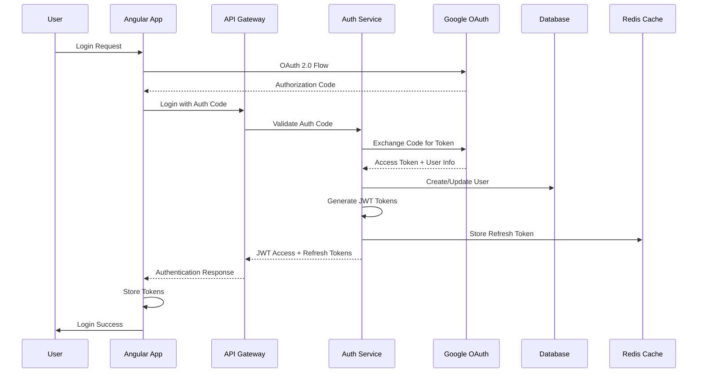

# 05. Security Implementation

## 5.1 Authentication & Authorization Architecture

DanHQ implements a multi-layered security approach with JWT-based authentication, role-based access control, and comprehensive audit trails.

### 5.1.1 Authentication Flow



### 5.1.2 JWT Token Implementation

#### Token Structure
```csharp
// JwtTokenService.cs
public class JwtTokenService
{
    private readonly IConfiguration _configuration;
    private readonly ILogger<JwtTokenService> _logger;

    public class TokenClaims
    {
        public int UserId { get; set; }
        public string Email { get; set; }
        public string DisplayName { get; set; }
        public List<ProjectRole> ProjectRoles { get; set; }
        public bool IsSystemUser { get; set; }
    }

    public class ProjectRole
    {
        public int ProjectId { get; set; }
        public string Role { get; set; }
        public bool IsActive { get; set; }
    }

    public AuthTokens GenerateTokens(User user, List<ProjectMember> projectMemberships)
    {
        var claims = new List<Claim>
        {
            new(ClaimTypes.NameIdentifier, user.Id.ToString()),
            new(ClaimTypes.Email, user.Email),
            new(ClaimTypes.Name, user.DisplayName),
            new("is_system_user", user.IsSystemUser.ToString()),
            new(JwtRegisteredClaimNames.Jti, Guid.NewGuid().ToString()),
            new(JwtRegisteredClaimNames.Iat, DateTimeOffset.UtcNow.ToUnixTimeSeconds().ToString())
        };

        // Add project roles as claims
        foreach (var membership in projectMemberships.Where(m => m.IsActive))
        {
            claims.Add(new Claim("project_role", JsonSerializer.Serialize(new
            {
                ProjectId = membership.ProjectId,
                Role = membership.Role
            })));
        }

        var key = new SymmetricSecurityKey(Encoding.UTF8.GetBytes(_configuration["JWT:Secret"]));
        var credentials = new SigningCredentials(key, SecurityAlgorithms.HmacSha256);

        var accessToken = new JwtSecurityToken(
            issuer: _configuration["JWT:Issuer"],
            audience: _configuration["JWT:Audience"],
            claims: claims,
            expires: DateTime.UtcNow.AddMinutes(int.Parse(_configuration["JWT:AccessTokenExpiryMinutes"])),
            signingCredentials: credentials
        );

        var refreshToken = GenerateRefreshToken();
        
        return new AuthTokens
        {
            AccessToken = new JwtSecurityTokenHandler().WriteToken(accessToken),
            RefreshToken = refreshToken,
            ExpiresAt = accessToken.ValidTo
        };
    }

    private string GenerateRefreshToken()
    {
        var randomBytes = new byte[32];
        using var rng = RandomNumberGenerator.Create();
        rng.GetBytes(randomBytes);
        return Convert.ToBase64String(randomBytes);
    }

    public ClaimsPrincipal? ValidateToken(string token)
    {
        try
        {
            var tokenHandler = new JwtSecurityTokenHandler();
            var key = Encoding.UTF8.GetBytes(_configuration["JWT:Secret"]);
            
            var validationParameters = new TokenValidationParameters
            {
                ValidateIssuerSigningKey = true,
                IssuerSigningKey = new SymmetricSecurityKey(key),
                ValidateIssuer = true,
                ValidIssuer = _configuration["JWT:Issuer"],
                ValidateAudience = true,
                ValidAudience = _configuration["JWT:Audience"],
                ValidateLifetime = true,
                ClockSkew = TimeSpan.Zero
            };

            var principal = tokenHandler.ValidateToken(token, validationParameters, out _);
            return principal;
        }
        catch (Exception ex)
        {
            _logger.LogWarning(ex, "Token validation failed");
            return null;
        }
    }
}
```

### 5.1.3 Role-Based Access Control (RBAC)

#### Authorization Attributes
```csharp
// RequireProjectRoleAttribute.cs
[AttributeUsage(AttributeTargets.Method | AttributeTargets.Class)]
public class RequireProjectRoleAttribute : Attribute, IAuthorizationRequirement
{
    public string[] RequiredRoles { get; }

    public RequireProjectRoleAttribute(params string[] requiredRoles)
    {
        RequiredRoles = requiredRoles;
    }
}

// ProjectRoleAuthorizationHandler.cs
public class ProjectRoleAuthorizationHandler : AuthorizationHandler<RequireProjectRoleAttribute>
{
    private readonly IHttpContextAccessor _httpContextAccessor;

    public ProjectRoleAuthorizationHandler(IHttpContextAccessor httpContextAccessor)
    {
        _httpContextAccessor = httpContextAccessor;
    }

    protected override Task HandleRequirementAsync(
        AuthorizationHandlerContext context,
        RequireProjectRoleAttribute requirement)
    {
        var httpContext = _httpContextAccessor.HttpContext;
        if (httpContext == null)
        {
            context.Fail();
            return Task.CompletedTask;
        }

        // Extract project ID from route
        if (!httpContext.Request.RouteValues.TryGetValue("projectId", out var projectIdValue) ||
            !int.TryParse(projectIdValue?.ToString(), out var projectId))
        {
            context.Fail();
            return Task.CompletedTask;
        }

        // Get user's project roles from claims
        var projectRoleClaims = context.User.FindAll("project_role");
        var userProjectRoles = projectRoleClaims
            .Select(claim => JsonSerializer.Deserialize<ProjectRoleData>(claim.Value))
            .Where(role => role.ProjectId == projectId)
            .ToList();

        // Check if user has any of the required roles for this project
        var hasRequiredRole = userProjectRoles.Any(role => 
            requirement.RequiredRoles.Contains(role.Role));

        if (hasRequiredRole)
        {
            context.Succeed(requirement);
        }
        else
        {
            context.Fail();
        }

        return Task.CompletedTask;
    }

    private class ProjectRoleData
    {
        public int ProjectId { get; set; }
        public string Role { get; set; }
    }
}
```

#### Resource-Based Authorization
```csharp
// RequireResourceOwnershipAttribute.cs
[AttributeUsage(AttributeTargets.Method)]
public class RequireResourceOwnershipAttribute : Attribute, IAuthorizationRequirement
{
    public string ResourceType { get; }
    public string[] AllowedRoles { get; }

    public RequireResourceOwnershipAttribute(string resourceType, params string[] allowedRoles)
    {
        ResourceType = resourceType;
        AllowedRoles = allowedRoles;
    }
}

// ResourceOwnershipAuthorizationHandler.cs
public class ResourceOwnershipAuthorizationHandler : AuthorizationHandler<RequireResourceOwnershipAttribute>
{
    private readonly IServiceProvider _serviceProvider;
    private readonly IHttpContextAccessor _httpContextAccessor;

    protected override async Task HandleRequirementAsync(
        AuthorizationHandlerContext context,
        RequireResourceOwnershipAttribute requirement)
    {
        var httpContext = _httpContextAccessor.HttpContext;
        var userId = int.Parse(context.User.FindFirst(ClaimTypes.NameIdentifier)?.Value ?? "0");

        // Get resource ID from route
        var resourceId = GetResourceIdFromRoute(httpContext, requirement.ResourceType);
        if (resourceId == 0)
        {
            context.Fail();
            return;
        }

        // Check ownership based on resource type
        var hasOwnership = requirement.ResourceType switch
        {
            "TestCase" => await CheckTestCaseOwnership(resourceId, userId),
            "TestExecution" => await CheckTestExecutionOwnership(resourceId, userId),
            "TestPlan" => await CheckTestPlanOwnership(resourceId, userId),
            _ => false
        };

        if (hasOwnership || HasOverrideRole(context.User, requirement.AllowedRoles))
        {
            context.Succeed(requirement);
        }
        else
        {
            context.Fail();
        }
    }

    private async Task<bool> CheckTestCaseOwnership(int testCaseId, int userId)
    {
        using var scope = _serviceProvider.CreateScope();
        var dbContext = scope.ServiceProvider.GetRequiredService<DanHQDbContext>();
        
        var testCase = await dbContext.TestCases
            .FirstOrDefaultAsync(tc => tc.Id == testCaseId);
            
        return testCase?.CreatedBy == userId;
    }

    private bool HasOverrideRole(ClaimsPrincipal user, string[] allowedRoles)
    {
        var projectRoleClaims = user.FindAll("project_role");
        return projectRoleClaims.Any(claim =>
        {
            var role = JsonSerializer.Deserialize<ProjectRoleData>(claim.Value);
            return allowedRoles.Contains(role.Role);
        });
    }
}
```

## 5.2 Data Protection & Encryption

### 5.2.1 Data Encryption at Rest

#### Database Encryption Configuration
```sql
-- PostgreSQL encryption configuration
-- Enable Transparent Data Encryption (TDE) for sensitive columns

-- Encrypted columns for sensitive data
ALTER TABLE Users ADD COLUMN encrypted_external_id BYTEA;
ALTER TABLE Requirements ADD COLUMN encrypted_content_hash BYTEA;
ALTER TABLE AIGenerationJobs ADD COLUMN encrypted_prompt BYTEA;

-- Encryption functions
CREATE OR REPLACE FUNCTION encrypt_sensitive_data(data TEXT, key TEXT)
RETURNS BYTEA AS $$
BEGIN
    RETURN pgp_sym_encrypt(data, key);
END;
$$ LANGUAGE plpgsql;

CREATE OR REPLACE FUNCTION decrypt_sensitive_data(encrypted_data BYTEA, key TEXT)
RETURNS TEXT AS $$
BEGIN
    RETURN pgp_sym_decrypt(encrypted_data, key);
END;
$$ LANGUAGE plpgsql;
```

#### Application-Level Encryption
```csharp
// EncryptionService.cs
public class EncryptionService
{
    private readonly IConfiguration _configuration;
    private readonly string _encryptionKey;

    public EncryptionService(IConfiguration configuration)
    {
        _configuration = configuration;
        _encryptionKey = _configuration["Encryption:Key"];
    }

    public string Encrypt(string plainText)
    {
        if (string.IsNullOrEmpty(plainText))
            return plainText;

        using var aes = Aes.Create();
        aes.Key = Convert.FromBase64String(_encryptionKey);
        aes.GenerateIV();

        using var encryptor = aes.CreateEncryptor();
        using var msEncrypt = new MemoryStream();
        using var csEncrypt = new CryptoStream(msEncrypt, encryptor, CryptoStreamMode.Write);
        using (var swEncrypt = new StreamWriter(csEncrypt))
        {
            swEncrypt.Write(plainText);
        }

        var iv = aes.IV;
        var encrypted = msEncrypt.ToArray();
        var result = new byte[iv.Length + encrypted.Length];
        Buffer.BlockCopy(iv, 0, result, 0, iv.Length);
        Buffer.BlockCopy(encrypted, 0, result, iv.Length, encrypted.Length);

        return Convert.ToBase64String(result);
    }

    public string Decrypt(string cipherText)
    {
        if (string.IsNullOrEmpty(cipherText))
            return cipherText;

        var fullCipher = Convert.FromBase64String(cipherText);
        using var aes = Aes.Create();
        aes.Key = Convert.FromBase64String(_encryptionKey);

        var iv = new byte[aes.BlockSize / 8];
        var cipher = new byte[fullCipher.Length - iv.Length];

        Buffer.BlockCopy(fullCipher, 0, iv, 0, iv.Length);
        Buffer.BlockCopy(fullCipher, iv.Length, cipher, 0, cipher.Length);

        aes.IV = iv;

        using var decryptor = aes.CreateDecryptor();
        using var msDecrypt = new MemoryStream(cipher);
        using var csDecrypt = new CryptoStream(msDecrypt, decryptor, CryptoStreamMode.Read);
        using var srDecrypt = new StreamReader(csDecrypt);
        
        return srDecrypt.ReadToEnd();
    }
}
```

### 5.2.2 Secure File Storage

#### File Upload Security
```csharp
// FileUploadService.cs
public class FileUploadService
{
    private readonly IConfiguration _configuration;
    private readonly ILogger<FileUploadService> _logger;
    private static readonly string[] AllowedExtensions = { ".pdf", ".doc", ".docx", ".txt", ".md" };
    private static readonly string[] AllowedMimeTypes = {
        "application/pdf",
        "application/msword",
        "application/vnd.openxmlformats-officedocument.wordprocessingml.document",
        "text/plain",
        "text/markdown"
    };

    public async Task<FileUploadResult> UploadFileAsync(IFormFile file, string category, int userId)
    {
        // Validate file
        var validationResult = ValidateFile(file);
        if (!validationResult.IsValid)
        {
            return FileUploadResult.Failure(validationResult.ErrorMessage);
        }

        // Generate secure file name
        var fileExtension = Path.GetExtension(file.FileName).ToLowerInvariant();
        var secureFileName = $"{Guid.NewGuid()}{fileExtension}";
        var relativePath = $"{category}/{DateTime.UtcNow:yyyy/MM/dd}/{secureFileName}";

        // Calculate file hash
        var fileHash = await CalculateFileHashAsync(file);

        // Scan for malware (if antivirus service is available)
        if (_configuration.GetValue<bool>("Security:EnableAntivirusScanning"))
        {
            var scanResult = await ScanFileForMalwareAsync(file);
            if (!scanResult.IsClean)
            {
                _logger.LogWarning("Malware detected in uploaded file: {FileName}", file.FileName);
                return FileUploadResult.Failure("File failed security scan");
            }
        }

        // Upload to secure storage
        var uploadResult = await UploadToStorageAsync(file, relativePath);
        if (!uploadResult.Success)
        {
            return FileUploadResult.Failure("Failed to upload file");
        }

        return FileUploadResult.Success(new UploadedFile
        {
            OriginalFileName = file.FileName,
            SecureFileName = secureFileName,
            FilePath = relativePath,
            FileSize = file.Length,
            MimeType = file.ContentType,
            ContentHash = fileHash,
            UploadedBy = userId,
            UploadedAt = DateTime.UtcNow
        });
    }

    private FileValidationResult ValidateFile(IFormFile file)
    {
        // Check file size (50MB limit)
        if (file.Length > 50 * 1024 * 1024)
        {
            return FileValidationResult.Invalid("File size exceeds 50MB limit");
        }

        // Check file extension
        var extension = Path.GetExtension(file.FileName).ToLowerInvariant();
        if (!AllowedExtensions.Contains(extension))
        {
            return FileValidationResult.Invalid($"File extension '{extension}' is not allowed");
        }

        // Check MIME type
        if (!AllowedMimeTypes.Contains(file.ContentType.ToLowerInvariant()))
        {
            return FileValidationResult.Invalid($"MIME type '{file.ContentType}' is not allowed");
        }

        // Additional security checks
        if (IsExecutableFile(file))
        {
            return FileValidationResult.Invalid("Executable files are not allowed");
        }

        return FileValidationResult.Valid();
    }

    private async Task<string> CalculateFileHashAsync(IFormFile file)
    {
        using var sha256 = SHA256.Create();
        using var stream = file.OpenReadStream();
        var hashBytes = await sha256.ComputeHashAsync(stream);
        return Convert.ToHexString(hashBytes);
    }

    private bool IsExecutableFile(IFormFile file)
    {
        var executableExtensions = new[] { ".exe", ".bat", ".cmd", ".com", ".pif", ".scr", ".vbs", ".js" };
        var extension = Path.GetExtension(file.FileName).ToLowerInvariant();
        return executableExtensions.Contains(extension);
    }
}
```

## 5.3 Input Validation & Sanitization

### 5.3.1 Request Validation

#### Model Validation
```csharp
// Input validation with data annotations and custom validators
public class CreateTestCaseRequest
{
    [Required(ErrorMessage = "Test suite ID is required")]
    [Range(1, int.MaxValue, ErrorMessage = "Invalid test suite ID")]
    public int TestSuiteId { get; set; }

    [Required(ErrorMessage = "Title is required")]
    [StringLength(255, MinimumLength = 5, ErrorMessage = "Title must be between 5 and 255 characters")]
    [NoScriptTags(ErrorMessage = "Script tags are not allowed in title")]
    public string Title { get; set; }

    [StringLength(5000, ErrorMessage = "Description cannot exceed 5000 characters")]
    [SanitizedHtml(ErrorMessage = "Invalid HTML content")]
    public string? Description { get; set; }

    [Required(ErrorMessage = "Priority is required")]
    [AllowedValues("Low", "Medium", "High", "Critical", ErrorMessage = "Invalid priority value")]
    public string Priority { get; set; }

    [Required(ErrorMessage = "Type is required")]
    [AllowedValues("Manual", "Automation", "Both", ErrorMessage = "Invalid type value")]
    public string Type { get; set; }

    [MaxLength(10, ErrorMessage = "Maximum 10 tags allowed")]
    public List<string> Tags { get; set; } = new();

    [Range(1, 999999, ErrorMessage = "Estimated duration must be between 1 and 999999 minutes")]
    public int? EstimatedDuration { get; set; }

    [MaxLength(50, ErrorMessage = "Maximum 50 steps allowed")]
    public List<CreateTestStepRequest> Steps { get; set; } = new();
}

// Custom validation attributes
public class NoScriptTagsAttribute : ValidationAttribute
{
    public override bool IsValid(object? value)
    {
        if (value is not string stringValue)
            return true;

        return !stringValue.Contains("<script", StringComparison.OrdinalIgnoreCase);
    }
}

public class SanitizedHtmlAttribute : ValidationAttribute
{
    public override bool IsValid(object? value)
    {
        if (value is not string stringValue)
            return true;

        // Use HtmlSanitizer to validate HTML content
        var sanitizer = new HtmlSanitizer();
        var sanitized = sanitizer.Sanitize(stringValue);
        
        // Check if sanitization removed any content (indicating malicious input)
        return sanitized.Length >= stringValue.Length * 0.9; // Allow some whitespace removal
    }
}
```

#### SQL Injection Prevention
```csharp
// Always use parameterized queries with Entity Framework
public class TestCaseRepository
{
    private readonly DanHQDbContext _context;

    // Good: Parameterized query
    public async Task<List<TestCase>> SearchTestCasesAsync(string searchTerm, int projectId)
    {
        return await _context.TestCases
            .Where(tc => tc.TestSuite.ProjectId == projectId &&
                        (tc.Title.Contains(searchTerm) || tc.Description.Contains(searchTerm)))
            .ToListAsync();
    }

    // Good: Raw SQL with parameters when needed
    public async Task<List<TestExecutionSummary>> GetExecutionSummaryAsync(int projectId, DateTime fromDate)
    {
        return await _context.TestExecutionSummaries
            .FromSqlRaw(@"
                SELECT te.TestCaseId, COUNT(*) as TotalExecutions,
                       SUM(CASE WHEN te.Status = 'Passed' THEN 1 ELSE 0 END) as PassedCount
                FROM TestExecutions te
                INNER JOIN TestCases tc ON te.TestCaseId = tc.Id
                INNER JOIN TestSuites ts ON tc.TestSuiteId = ts.Id
                WHERE ts.ProjectId = {0} AND te.StartedAt >= {1}
                GROUP BY te.TestCaseId", projectId, fromDate)
            .ToListAsync();
    }
}
```

### 5.3.2 XSS Protection

#### Content Security Policy (CSP)
```csharp
// CSP middleware configuration
public class SecurityHeadersMiddleware
{
    private readonly RequestDelegate _next;

    public SecurityHeadersMiddleware(RequestDelegate next)
    {
        _next = next;
    }

    public async Task InvokeAsync(HttpContext context)
    {
        // Content Security Policy
        context.Response.Headers.Add("Content-Security-Policy",
            "default-src 'self'; " +
            "script-src 'self' 'unsafe-inline' https://apis.google.com; " +
            "style-src 'self' 'unsafe-inline' https://fonts.googleapis.com; " +
            "font-src 'self' https://fonts.gstatic.com; " +
            "img-src 'self' data: https:; " +
            "connect-src 'self' https://api.danhq.com; " +
            "frame-ancestors 'none'; " +
            "base-uri 'self'; " +
            "form-action 'self'");

        // X-Frame-Options
        context.Response.Headers.Add("X-Frame-Options", "DENY");

        // X-Content-Type-Options
        context.Response.Headers.Add("X-Content-Type-Options", "nosniff");

        // X-XSS-Protection
        context.Response.Headers.Add("X-XSS-Protection", "1; mode=block");

        // Referrer Policy
        context.Response.Headers.Add("Referrer-Policy", "strict-origin-when-cross-origin");

        // Strict Transport Security
        if (context.Request.IsHttps)
        {
            context.Response.Headers.Add("Strict-Transport-Security", 
                "max-age=31536000; includeSubDomains; preload");
        }

        await _next(context);
    }
}
```

#### HTML Sanitization
```csharp
// HtmlSanitizationService.cs
public class HtmlSanitizationService
{
    private readonly HtmlSanitizer _sanitizer;

    public HtmlSanitizationService()
    {
        _sanitizer = new HtmlSanitizer();
        
        // Configure allowed tags and attributes
        _sanitizer.AllowedTags.Clear();
        _sanitizer.AllowedTags.UnionWith(new[] {
            "p", "br", "strong", "em", "u", "ol", "ul", "li",
            "h1", "h2", "h3", "h4", "h5", "h6",
            "blockquote", "code", "pre"
        });

        _sanitizer.AllowedAttributes.Clear();
        _sanitizer.AllowedAttributes.Add("class");

        // Remove all CSS and JavaScript
        _sanitizer.AllowedCssProperties.Clear();
        _sanitizer.AllowedSchemes.Clear();
        _sanitizer.AllowedSchemes.Add("http");
        _sanitizer.AllowedSchemes.Add("https");
    }

    public string SanitizeHtml(string input)
    {
        if (string.IsNullOrEmpty(input))
            return input;

        return _sanitizer.Sanitize(input);
    }

    public string StripHtml(string input)
    {
        if (string.IsNullOrEmpty(input))
            return input;

        return Regex.Replace(input, "<.*?>", string.Empty);
    }
}
```

## 5.4 API Security

### 5.4.1 Rate Limiting

#### Rate Limiting Configuration
```csharp
// RateLimitingService.cs
public class RateLimitingService
{
    private readonly IMemoryCache _cache;
    private readonly IConfiguration _configuration;

    public class RateLimitOptions
    {
        public int RequestsPerMinute { get; set; }
        public int RequestsPerHour { get; set; }
        public int RequestsPerDay { get; set; }
    }

    public async Task<bool> IsRequestAllowedAsync(string identifier, string endpoint)
    {
        var limits = GetRateLimitsForEndpoint(endpoint);
        var now = DateTime.UtcNow;

        // Check minute limit
        if (!await CheckLimitAsync(identifier, "minute", now.ToString("yyyy-MM-dd-HH-mm"), limits.RequestsPerMinute))
            return false;

        // Check hour limit
        if (!await CheckLimitAsync(identifier, "hour", now.ToString("yyyy-MM-dd-HH"), limits.RequestsPerHour))
            return false;

        // Check day limit
        if (!await CheckLimitAsync(identifier, "day", now.ToString("yyyy-MM-dd"), limits.RequestsPerDay))
            return false;

        return true;
    }

    private async Task<bool> CheckLimitAsync(string identifier, string period, string timeKey, int limit)
    {
        var cacheKey = $"rate_limit:{identifier}:{period}:{timeKey}";
        var current = _cache.Get<int>(cacheKey);

        if (current >= limit)
            return false;

        _cache.Set(cacheKey, current + 1, TimeSpan.FromMinutes(period == "minute" ? 1 : period == "hour" ? 60 : 1440));
        return true;
    }

    private RateLimitOptions GetRateLimitsForEndpoint(string endpoint)
    {
        return endpoint switch
        {
            var ep when ep.Contains("/ai/") => new RateLimitOptions 
            { 
                RequestsPerMinute = 10, 
                RequestsPerHour = 100, 
                RequestsPerDay = 500 
            },
            var ep when ep.Contains("/upload") => new RateLimitOptions 
            { 
                RequestsPerMinute = 20, 
                RequestsPerHour = 200, 
                RequestsPerDay = 1000 
            },
            _ => new RateLimitOptions 
            { 
                RequestsPerMinute = 300, 
                RequestsPerHour = 10000, 
                RequestsPerDay = 50000 
            }
        };
    }
}

// Rate limiting middleware
public class RateLimitingMiddleware
{
    private readonly RequestDelegate _next;
    private readonly RateLimitingService _rateLimitingService;

    public async Task InvokeAsync(HttpContext context)
    {
        var identifier = GetClientIdentifier(context);
        var endpoint = context.Request.Path.Value;

        if (!await _rateLimitingService.IsRequestAllowedAsync(identifier, endpoint))
        {
            context.Response.StatusCode = 429; // Too Many Requests
            context.Response.Headers.Add("Retry-After", "60");
            await context.Response.WriteAsync("Rate limit exceeded");
            return;
        }

        await _next(context);
    }

    private string GetClientIdentifier(HttpContext context)
    {
        // Try to get user ID from claims
        var userId = context.User?.FindFirst(ClaimTypes.NameIdentifier)?.Value;
        if (!string.IsNullOrEmpty(userId))
            return $"user:{userId}";

        // Fall back to IP address
        var ipAddress = context.Connection.RemoteIpAddress?.ToString();
        return $"ip:{ipAddress}";
    }
}
```

### 5.4.2 CORS Configuration

```csharp
// CORS policy configuration
public void ConfigureServices(IServiceCollection services)
{
    services.AddCors(options =>
    {
        options.AddPolicy("DanHQCorsPolicy", builder =>
        {
            if (_environment.IsDevelopment())
            {
                builder
                    .WithOrigins("http://localhost:4200", "https://localhost:4200")
                    .AllowAnyMethod()
                    .AllowAnyHeader()
                    .AllowCredentials();
            }
            else
            {
                builder
                    .WithOrigins(
                        "https://app.danhq.com",
                        "https://staging.danhq.com"
                    )
                    .WithMethods("GET", "POST", "PUT", "DELETE", "OPTIONS")
                    .WithHeaders("Authorization", "Content-Type", "X-Requested-With")
                    .AllowCredentials()
                    .SetIsOriginAllowedToAllowWildcardSubdomains();
            }
        });
    });
}
```

## 5.5 Audit Logging & Monitoring

### 5.5.1 Security Event Logging

```csharp
// SecurityAuditService.cs
public class SecurityAuditService
{
    private readonly ILogger<SecurityAuditService> _logger;
    private readonly DanHQDbContext _context;

    public enum SecurityEventType
    {
        LoginSuccess,
        LoginFailure,
        LogoutSuccess,
        UnauthorizedAccess,
        PrivilegeEscalation,
        DataAccess,
        DataModification,
        FileUpload,
        FileDownload,
        PasswordChange,
        AccountLocked,
        SuspiciousActivity
    }

    public async Task LogSecurityEventAsync(SecurityEventType eventType, int? userId, string details, HttpContext? httpContext = null)
    {
        var auditLog = new SecurityAuditLog
        {
            EventType = eventType.ToString(),
            UserId = userId,
            Details = details,
            IPAddress = httpContext?.Connection.RemoteIpAddress?.ToString(),
            UserAgent = httpContext?.Request.Headers["User-Agent"].ToString(),
            Timestamp = DateTime.UtcNow,
            Severity = GetEventSeverity(eventType)
        };

        _context.SecurityAuditLogs.Add(auditLog);
        await _context.SaveChangesAsync();

        // Log to application logger for immediate alerting
        var logLevel = auditLog.Severity switch
        {
            "Critical" => LogLevel.Critical,
            "High" => LogLevel.Error,
            "Medium" => LogLevel.Warning,
            _ => LogLevel.Information
        };

        _logger.Log(logLevel, "Security Event: {EventType} - {Details} - User: {UserId} - IP: {IPAddress}", 
            eventType, details, userId, auditLog.IPAddress);

        // Send alerts for critical events
        if (auditLog.Severity == "Critical")
        {
            await SendSecurityAlertAsync(auditLog);
        }
    }

    private string GetEventSeverity(SecurityEventType eventType)
    {
        return eventType switch
        {
            SecurityEventType.LoginFailure => "Medium",
            SecurityEventType.UnauthorizedAccess => "High",
            SecurityEventType.PrivilegeEscalation => "Critical",
            SecurityEventType.SuspiciousActivity => "High",
            SecurityEventType.AccountLocked => "High",
            _ => "Low"
        };
    }

    private async Task SendSecurityAlertAsync(SecurityAuditLog auditLog)
    {
        // Implementation to send alerts via email, Slack, etc.
        // This would integrate with notification services
    }
}

// Security audit middleware
public class SecurityAuditMiddleware
{
    private readonly RequestDelegate _next;
    private readonly SecurityAuditService _auditService;

    public async Task InvokeAsync(HttpContext context)
    {
        var originalBodyStream = context.Response.Body;
        
        try
        {
            using var responseBody = new MemoryStream();
            context.Response.Body = responseBody;

            await _next(context);

            // Log suspicious activities
            await LogSuspiciousActivitiesAsync(context);

            responseBody.Seek(0, SeekOrigin.Begin);
            await responseBody.CopyToAsync(originalBodyStream);
        }
        finally
        {
            context.Response.Body = originalBodyStream;
        }
    }

    private async Task LogSuspiciousActivitiesAsync(HttpContext context)
    {
        var userId = context.User?.FindFirst(ClaimTypes.NameIdentifier)?.Value;
        var userIdInt = int.TryParse(userId, out var id) ? id : (int?)null;

        // Log failed authorization attempts
        if (context.Response.StatusCode == 403)
        {
            await _auditService.LogSecurityEventAsync(
                SecurityAuditService.SecurityEventType.UnauthorizedAccess,
                userIdInt,
                $"Access denied to {context.Request.Path}",
                context);
        }

        // Log multiple rapid requests (potential brute force)
        if (await DetectRapidRequestsAsync(context))
        {
            await _auditService.LogSecurityEventAsync(
                SecurityAuditService.SecurityEventType.SuspiciousActivity,
                userIdInt,
                "Multiple rapid requests detected",
                context);
        }
    }

    private async Task<bool> DetectRapidRequestsAsync(HttpContext context)
    {
        // Implementation to detect rapid requests
        // This would use caching to track request frequency
        return false; // Placeholder
    }
}
```

## 5.6 Secrets Management

### 5.6.1 Configuration Security

```csharp
// Secure configuration management
public class SecureConfigurationService
{
    private readonly IConfiguration _configuration;
    private readonly IWebHostEnvironment _environment;

    public SecureConfigurationService(IConfiguration configuration, IWebHostEnvironment environment)
    {
        _configuration = configuration;
        _environment = environment;
    }

    public string GetConnectionString(string name)
    {
        // In production, get from Azure Key Vault or Kubernetes secrets
        if (_environment.IsProduction())
        {
            return GetSecretFromVault($"ConnectionStrings--{name}");
        }
        
        return _configuration.GetConnectionString(name);
    }

    public string GetJwtSecret()
    {
        if (_environment.IsProduction())
        {
            return GetSecretFromVault("JWT--Secret");
        }
        
        return _configuration["JWT:Secret"];
    }

    public string GetEncryptionKey()
    {
        if (_environment.IsProduction())
        {
            return GetSecretFromVault("Encryption--Key");
        }
        
        return _configuration["Encryption:Key"];
    }

    private string GetSecretFromVault(string secretName)
    {
        // Implementation depends on your secrets management solution
        // Azure Key Vault, AWS Secrets Manager, Kubernetes Secrets, etc.
        
        // Example for Kubernetes secrets (mounted as files)
        var secretPath = $"/var/secrets/{secretName.Replace("--", "/")}";
        if (File.Exists(secretPath))
        {
            return File.ReadAllText(secretPath).Trim();
        }
        
        throw new InvalidOperationException($"Secret {secretName} not found");
    }
}
```

### 5.6.2 Kubernetes Secrets Configuration

```yaml
# kubernetes/secrets.yaml
apiVersion: v1
kind: Secret
metadata:
  name: danhq-secrets
  namespace: danhq
type: Opaque
data:
  # Base64 encoded values
  jwt-secret: <base64-encoded-jwt-secret>
  encryption-key: <base64-encoded-encryption-key>
  database-password: <base64-encoded-db-password>
  google-oauth-secret: <base64-encoded-oauth-secret>
  openai-api-key: <base64-encoded-openai-key>

---
apiVersion: v1
kind: Secret
metadata:
  name: danhq-db-secret
  namespace: danhq
type: Opaque
stringData:
  connectionstring: "Host=postgres;Database=danhq;Username=danhq_user;Password=<password>;SSL Mode=Require;"
```

---

*This security implementation provides comprehensive protection for DanHQ with multiple layers of defense, proper authentication/authorization, data encryption, and comprehensive audit logging.*