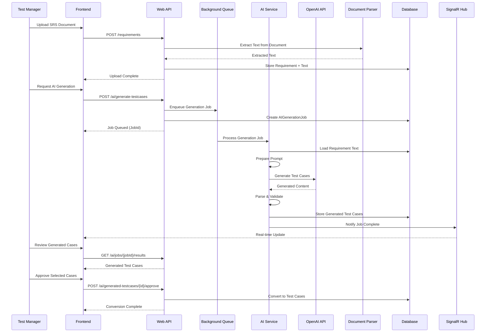
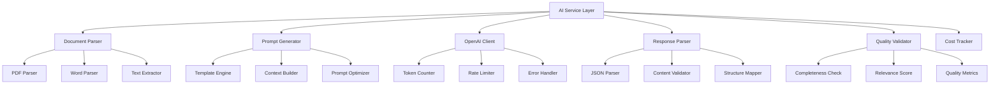

# 06. AI Integration

## 6.1 AI Service Architecture

DanHQ integrates with OpenAI-compatible APIs to automatically generate test cases from Software Requirements Specifications (SRS). The AI integration is designed for scalability, cost optimization, and quality assurance.

### 6.1.1 AI Integration Flow



### 6.1.2 AI Service Components



## 6.2 Document Processing

### 6.2.1 Document Parser Service

```csharp
// DocumentParserService.cs
public class DocumentParserService
{
    private readonly ILogger<DocumentParserService> _logger;
    private readonly IConfiguration _configuration;

    public class ParsedDocument
    {
        public string FullText { get; set; }
        public List<DocumentSection> Sections { get; set; }
        public Dictionary<string, string> Metadata { get; set; }
        public int WordCount { get; set; }
        public int EstimatedTokens { get; set; }
    }

    public class DocumentSection
    {
        public string Title { get; set; }
        public string Content { get; set; }
        public int Level { get; set; }
        public List<string> Requirements { get; set; }
    }

    public async Task<ParsedDocument> ParseDocumentAsync(string filePath, string mimeType)
    {
        return mimeType switch
        {
            "application/pdf" => await ParsePdfAsync(filePath),
            "application/msword" or 
            "application/vnd.openxmlformats-officedocument.wordprocessingml.document" 
                => await ParseWordAsync(filePath),
            "text/plain" => await ParseTextAsync(filePath),
            "text/markdown" => await ParseMarkdownAsync(filePath),
            _ => throw new NotSupportedException($"Document type {mimeType} is not supported")
        };
    }

    private async Task<ParsedDocument> ParsePdfAsync(string filePath)
    {
        using var document = PdfDocument.Open(filePath);
        var fullText = new StringBuilder();
        var sections = new List<DocumentSection>();

        foreach (var page in document.GetPages())
        {
            var pageText = page.Text;
            fullText.AppendLine(pageText);

            // Extract sections based on formatting/headers
            var extractedSections = ExtractSectionsFromText(pageText);
            sections.AddRange(extractedSections);
        }

        var parsedDoc = new ParsedDocument
        {
            FullText = fullText.ToString(),
            Sections = MergeSimilarSections(sections),
            Metadata = ExtractMetadata(document),
            WordCount = CountWords(fullText.ToString())
        };

        parsedDoc.EstimatedTokens = EstimateTokenCount(parsedDoc.FullText);
        return parsedDoc;
    }

    private async Task<ParsedDocument> ParseWordAsync(string filePath)
    {
        using var document = DocX.Load(filePath);
        var fullText = new StringBuilder();
        var sections = new List<DocumentSection>();

        // Extract text and preserve structure
        foreach (var paragraph in document.Paragraphs)
        {
            var text = paragraph.Text;
            fullText.AppendLine(text);

            // Check if this is a heading
            if (IsHeading(paragraph))
            {
                sections.Add(new DocumentSection
                {
                    Title = text,
                    Content = "",
                    Level = GetHeadingLevel(paragraph),
                    Requirements = new List<string>()
                });
            }
            else if (sections.Any())
            {
                // Add content to the last section
                var lastSection = sections.Last();
                lastSection.Content += text + "\n";
                
                // Extract requirements from this paragraph
                var requirements = ExtractRequirements(text);
                lastSection.Requirements.AddRange(requirements);
            }
        }

        var parsedDoc = new ParsedDocument
        {
            FullText = fullText.ToString(),
            Sections = sections,
            Metadata = ExtractWordMetadata(document),
            WordCount = CountWords(fullText.ToString())
        };

        parsedDoc.EstimatedTokens = EstimateTokenCount(parsedDoc.FullText);
        return parsedDoc;
    }

    private List<DocumentSection> ExtractSectionsFromText(string text)
    {
        var sections = new List<DocumentSection>();
        var lines = text.Split('\n', StringSplitOptions.RemoveEmptyEntries);

        DocumentSection currentSection = null;

        foreach (var line in lines)
        {
            var trimmedLine = line.Trim();
            
            // Check if this line is a heading (various patterns)
            if (IsLikelyHeading(trimmedLine))
            {
                // Save previous section if exists
                if (currentSection != null)
                {
                    sections.Add(currentSection);
                }

                // Start new section
                currentSection = new DocumentSection
                {
                    Title = trimmedLine,
                    Content = "",
                    Level = DetermineHeadingLevel(trimmedLine),
                    Requirements = new List<string>()
                };
            }
            else if (currentSection != null)
            {
                // Add content to current section
                currentSection.Content += trimmedLine + "\n";
                
                // Extract requirements
                var requirements = ExtractRequirements(trimmedLine);
                currentSection.Requirements.AddRange(requirements);
            }
        }

        // Add last section
        if (currentSection != null)
        {
            sections.Add(currentSection);
        }

        return sections;
    }

    private bool IsLikelyHeading(string text)
    {
        // Various patterns that indicate headings
        var headingPatterns = new[]
        {
            @"^\d+\.\s+.+",              // 1. Section Title
            @"^\d+\.\d+\s+.+",           // 1.1 Sub Section
            @"^[A-Z][A-Z\s]+$",          // ALL CAPS
            @"^[A-Z].{10,50}$",          // Title case, reasonable length
            @"^Chapter\s+\d+",           // Chapter N
            @"^Section\s+\d+",           // Section N
            @"^Appendix\s+[A-Z]",        // Appendix A
        };

        return headingPatterns.Any(pattern => Regex.IsMatch(text, pattern)) &&
               text.Length < 100; // Headings are usually not too long
    }

    private List<string> ExtractRequirements(string text)
    {
        var requirements = new List<string>();
        
        // Patterns that indicate requirements
        var requirementPatterns = new[]
        {
            @"The system shall\s+(.+)",
            @"The application must\s+(.+)",
            @"REQ-\d+:\s*(.+)",
            @"Requirement\s+\d+:\s*(.+)",
            @"FR-\d+:\s*(.+)",     // Functional Requirement
            @"NFR-\d+:\s*(.+)",    // Non-functional Requirement
        };

        foreach (var pattern in requirementPatterns)
        {
            var matches = Regex.Matches(text, pattern, RegexOptions.IgnoreCase);
            foreach (Match match in matches)
            {
                if (match.Groups.Count > 1)
                {
                    requirements.Add(match.Groups[1].Value.Trim());
                }
            }
        }

        return requirements;
    }

    private int EstimateTokenCount(string text)
    {
        // Rough estimation: 1 token ≈ 4 characters for English text
        // This is used for cost estimation before sending to OpenAI
        return (int)Math.Ceiling(text.Length / 4.0);
    }

    private int CountWords(string text)
    {
        return text.Split(new[] { ' ', '\t', '\n', '\r' }, 
            StringSplitOptions.RemoveEmptyEntries).Length;
    }
}
```

## 6.3 AI Prompt Engineering

### 6.3.1 Prompt Template System

```csharp
// PromptTemplateService.cs
public class PromptTemplateService
{
    private readonly IConfiguration _configuration;
    private readonly ILogger<PromptTemplateService> _logger;

    public class PromptTemplate
    {
        public string SystemMessage { get; set; }
        public string UserMessageTemplate { get; set; }
        public Dictionary<string, object> DefaultParameters { get; set; }
        public int MaxTokens { get; set; }
        public double Temperature { get; set; }
    }

    public class TestCaseGenerationRequest
    {
        public string RequirementText { get; set; }
        public string ProjectContext { get; set; }
        public bool IncludeNegativeTests { get; set; } = true;
        public bool IncludeEdgeCases { get; set; } = true;
        public bool IncludeBoundaryTests { get; set; } = true;
        public int MaxTestCases { get; set; } = 20;
        public string TestingApproach { get; set; } = "Comprehensive";
        public List<string> ExistingTestCases { get; set; } = new();
    }

    public PromptTemplate GetTestCaseGenerationTemplate()
    {
        return new PromptTemplate
        {
            SystemMessage = @"
You are an expert QA engineer and test case designer with extensive experience in software testing methodologies. Your task is to generate comprehensive, well-structured test cases from software requirements.

IMPORTANT GUIDELINES:
1. Generate test cases that are clear, specific, and actionable
2. Include both positive and negative test scenarios
3. Consider edge cases and boundary conditions
4. Each test case should have clear preconditions, steps, and expected results
5. Use realistic test data and scenarios
6. Prioritize test cases based on risk and importance
7. Ensure test cases are independent and can be executed separately
8. Follow industry best practices for test case design

OUTPUT FORMAT:
Return a valid JSON array of test cases with the following structure:
{
  ""testCases"": [
    {
      ""title"": ""Clear, descriptive test case title"",
      ""description"": ""Brief description of what this test validates"",
      ""priority"": ""High|Medium|Low"",
      ""type"": ""Positive|Negative|Edge Case|Boundary"",
      ""preconditions"": ""What needs to be set up before executing this test"",
      ""testData"": ""Specific test data to be used"",
      ""steps"": [
        {
          ""stepNumber"": 1,
          ""action"": ""Clear action to perform"",
          ""expectedResult"": ""Expected outcome of this step""
        }
      ],
      ""expectedResult"": ""Overall expected result of the test case"",
      ""riskLevel"": ""High|Medium|Low"",
      ""estimatedDuration"": ""Estimated time in minutes""
    }
  ]
}
",
            UserMessageTemplate = @"
Generate comprehensive test cases for the following software requirement:

REQUIREMENT CONTEXT:
Project: {projectContext}
Testing Approach: {testingApproach}
Maximum Test Cases: {maxTestCases}

REQUIREMENTS SPECIFICATION:
{requirementText}

ADDITIONAL INSTRUCTIONS:
- Include negative test cases: {includeNegativeTests}
- Include edge cases: {includeEdgeCases}
- Include boundary tests: {includeBoundaryTests}

{existingTestCasesContext}

Please generate test cases that cover all aspects of the requirement, including happy path scenarios, error conditions, edge cases, and boundary conditions. Ensure each test case is detailed enough for a tester to execute without ambiguity.
",
            DefaultParameters = new Dictionary<string, object>
            {
                ["projectContext"] = "General Software Application",
                ["testingApproach"] = "Comprehensive",
                ["maxTestCases"] = 20,
                ["includeNegativeTests"] = true,
                ["includeEdgeCases"] = true,
                ["includeBoundaryTests"] = true,
                ["existingTestCasesContext"] = ""
            },
            MaxTokens = 4000,
            Temperature = 0.3 // Lower temperature for more consistent, structured output
        };
    }

    public string BuildPrompt(PromptTemplate template, TestCaseGenerationRequest request)
    {
        var parameters = new Dictionary<string, object>
        {
            ["requirementText"] = request.RequirementText,
            ["projectContext"] = request.ProjectContext ?? "General Software Application",
            ["testingApproach"] = request.TestingApproach,
            ["maxTestCases"] = request.MaxTestCases,
            ["includeNegativeTests"] = request.IncludeNegativeTests,
            ["includeEdgeCases"] = request.IncludeEdgeCases,
            ["includeBoundaryTests"] = request.IncludeBoundaryTests,
            ["existingTestCasesContext"] = BuildExistingTestCasesContext(request.ExistingTestCases)
        };

        return ReplaceParameters(template.UserMessageTemplate, parameters);
    }

    private string BuildExistingTestCasesContext(List<string> existingTestCases)
    {
        if (!existingTestCases.Any())
            return "";

        var context = new StringBuilder();
        context.AppendLine("EXISTING TEST CASES TO AVOID DUPLICATION:");
        foreach (var testCase in existingTestCases.Take(10)) // Limit to avoid token overflow
        {
            context.AppendLine($"- {testCase}");
        }
        context.AppendLine("\nPlease ensure new test cases don't duplicate the above scenarios.");

        return context.ToString();
    }

    private string ReplaceParameters(string template, Dictionary<string, object> parameters)
    {
        var result = template;
        foreach (var parameter in parameters)
        {
            var placeholder = $"{{{parameter.Key}}}";
            result = result.Replace(placeholder, parameter.Value?.ToString() ?? "");
        }
        return result;
    }

    public PromptTemplate GetTestCaseOptimizationTemplate()
    {
        return new PromptTemplate
        {
            SystemMessage = @"
You are an expert QA engineer specializing in test case optimization and review. Your task is to analyze and improve existing test cases for better coverage, clarity, and efficiency.
",
            UserMessageTemplate = @"
Please review and optimize the following test cases:

ORIGINAL TEST CASES:
{originalTestCases}

OPTIMIZATION CRITERIA:
1. Improve clarity and specificity of test steps
2. Enhance test data specifications
3. Add missing edge cases or boundary conditions
4. Consolidate redundant test cases
5. Improve expected results descriptions
6. Adjust priority levels based on risk assessment

Please return the optimized test cases in the same JSON format, with explanations for major changes made.
",
            MaxTokens = 3000,
            Temperature = 0.2
        };
    }
}
```

### 6.3.2 OpenAI Client Service

```csharp
// OpenAIClientService.cs
public class OpenAIClientService
{
    private readonly HttpClient _httpClient;
    private readonly IConfiguration _configuration;
    private readonly ILogger<OpenAIClientService> _logger;
    private readonly ICostTrackingService _costTracker;

    public class ChatRequest
    {
        public string Model { get; set; } = "gpt-4";
        public List<ChatMessage> Messages { get; set; } = new();
        public int MaxTokens { get; set; } = 2000;
        public double Temperature { get; set; } = 0.7;
        public string? User { get; set; }
    }

    public class ChatMessage
    {
        public string Role { get; set; } // "system", "user", "assistant"
        public string Content { get; set; }
    }

    public class ChatResponse
    {
        public string Id { get; set; }
        public string Object { get; set; }
        public long Created { get; set; }
        public string Model { get; set; }
        public List<ChatChoice> Choices { get; set; } = new();
        public Usage Usage { get; set; }
    }

    public class ChatChoice
    {
        public int Index { get; set; }
        public ChatMessage Message { get; set; }
        public string FinishReason { get; set; }
    }

    public class Usage
    {
        public int PromptTokens { get; set; }
        public int CompletionTokens { get; set; }
        public int TotalTokens { get; set; }
    }

    public OpenAIClientService(
        HttpClient httpClient, 
        IConfiguration configuration, 
        ILogger<OpenAIClientService> logger,
        ICostTrackingService costTracker)
    {
        _httpClient = httpClient;
        _configuration = configuration;
        _logger = logger;
        _costTracker = costTracker;

        var apiKey = configuration["OpenAI:ApiKey"];
        _httpClient.DefaultRequestHeaders.Authorization = 
            new System.Net.Http.Headers.AuthenticationHeaderValue("Bearer", apiKey);
        _httpClient.BaseAddress = new Uri(configuration["OpenAI:BaseUrl"] ?? "https://api.openai.com/v1/");
    }

    public async Task<ChatResponse> CreateChatCompletionAsync(ChatRequest request, int userId)
    {
        try
        {
            // Pre-request validation
            ValidateRequest(request);

            // Log request for monitoring
            _logger.LogInformation("OpenAI request - User: {UserId}, Model: {Model}, EstimatedTokens: {EstimatedTokens}",
                userId, request.Model, EstimateRequestTokens(request));

            // Make API call
            var response = await _httpClient.PostAsJsonAsync("chat/completions", request);
            
            if (!response.IsSuccessStatusCode)
            {
                var errorContent = await response.Content.ReadAsStringAsync();
                _logger.LogError("OpenAI API error: Status {StatusCode}, Content: {Content}", 
                    response.StatusCode, errorContent);
                throw new OpenAIException($"API call failed: {response.StatusCode}");
            }

            var result = await response.Content.ReadFromJsonAsync<ChatResponse>();
            
            // Track usage and costs
            await _costTracker.TrackUsageAsync(userId, request.Model, result.Usage);

            _logger.LogInformation("OpenAI response - Tokens used: {TotalTokens}, Cost: ${Cost:F4}",
                result.Usage.TotalTokens, await _costTracker.CalculateCostAsync(request.Model, result.Usage));

            return result;
        }
        catch (HttpRequestException ex)
        {
            _logger.LogError(ex, "Network error calling OpenAI API");
            throw new OpenAIException("Network error occurred", ex);
        }
        catch (TaskCanceledException ex)
        {
            _logger.LogError(ex, "OpenAI API call timed out");
            throw new OpenAIException("Request timed out", ex);
        }
        catch (Exception ex)
        {
            _logger.LogError(ex, "Unexpected error calling OpenAI API");
            throw;
        }
    }

    private void ValidateRequest(ChatRequest request)
    {
        if (request.Messages == null || !request.Messages.Any())
            throw new ArgumentException("Messages cannot be empty");

        if (request.MaxTokens < 1 || request.MaxTokens > 8000)
            throw new ArgumentException("MaxTokens must be between 1 and 8000");

        if (request.Temperature < 0 || request.Temperature > 2)
            throw new ArgumentException("Temperature must be between 0 and 2");

        // Validate total content length
        var totalContentLength = request.Messages.Sum(m => m.Content?.Length ?? 0);
        if (totalContentLength > 100000) // ~25k tokens estimated
            throw new ArgumentException("Total content length exceeds maximum allowed");
    }

    private int EstimateRequestTokens(ChatRequest request)
    {
        // Rough estimation for cost calculation
        var totalChars = request.Messages.Sum(m => m.Content?.Length ?? 0);
        return (int)Math.Ceiling(totalChars / 4.0) + 100; // Add buffer for formatting
    }

    public async Task<bool> IsServiceAvailableAsync()
    {
        try
        {
            var response = await _httpClient.GetAsync("models");
            return response.IsSuccessStatusCode;
        }
        catch
        {
            return false;
        }
    }
}

public class OpenAIException : Exception
{
    public OpenAIException(string message) : base(message) { }
    public OpenAIException(string message, Exception innerException) : base(message, innerException) { }
}
```

## 6.4 Background Job Processing

### 6.4.1 AI Generation Job Service

```csharp
// AIGenerationJobService.cs
[Queue("ai-generation")]
public class AIGenerationJobService
{
    private readonly ILogger<AIGenerationJobService> _logger;
    private readonly DanHQDbContext _context;
    private readonly OpenAIClientService _openAIClient;
    private readonly PromptTemplateService _promptService;
    private readonly IHubContext<NotificationHub> _hubContext;
    private readonly DocumentParserService _documentParser;

    [BackgroundJob]
    public async Task ProcessTestCaseGenerationAsync(int jobId)
    {
        var job = await _context.AIGenerationJobs
            .Include(j => j.Requirement)
            .Include(j => j.Project)
            .FirstOrDefaultAsync(j => j.Id == jobId);

        if (job == null)
        {
            _logger.LogError("AI generation job not found: {JobId}", jobId);
            return;
        }

        try
        {
            _logger.LogInformation("Starting AI generation job {JobId} for project {ProjectId}", 
                jobId, job.ProjectId);

            // Update job status
            job.Status = "Processing";
            job.ProcessingStartedAt = DateTime.UtcNow;
            await _context.SaveChangesAsync();

            // Notify clients
            await NotifyJobStatusAsync(job, "Processing");

            // Generate test cases
            var generatedTestCases = await GenerateTestCasesAsync(job);

            // Save generated test cases
            await SaveGeneratedTestCasesAsync(job, generatedTestCases);

            // Update job completion
            job.Status = "Completed";
            job.ProcessingCompletedAt = DateTime.UtcNow;
            await _context.SaveChangesAsync();

            await NotifyJobStatusAsync(job, "Completed", generatedTestCases.Count);

            _logger.LogInformation("Completed AI generation job {JobId}. Generated {Count} test cases",
                jobId, generatedTestCases.Count);
        }
        catch (Exception ex)
        {
            _logger.LogError(ex, "Error processing AI generation job {JobId}", jobId);

            job.Status = "Failed";
            job.ErrorMessage = ex.Message;
            job.ProcessingCompletedAt = DateTime.UtcNow;
            await _context.SaveChangesAsync();

            await NotifyJobStatusAsync(job, "Failed", errorMessage: ex.Message);
        }
    }

    private async Task<List<GeneratedTestCase>> GenerateTestCasesAsync(AIGenerationJob job)
    {
        // Parse the requirement document if not already done
        if (string.IsNullOrEmpty(job.Requirement.ExtractedText))
        {
            var parsedDoc = await _documentParser.ParseDocumentAsync(
                job.Requirement.FilePath, 
                job.Requirement.MimeType);
            
            job.Requirement.ExtractedText = parsedDoc.FullText;
            await _context.SaveChangesAsync();
        }

        // Get existing test cases for context
        var existingTestCases = await GetExistingTestCasesAsync(job.ProjectId);

        // Prepare generation request
        var generationRequest = new PromptTemplateService.TestCaseGenerationRequest
        {
            RequirementText = job.Requirement.ExtractedText,
            ProjectContext = $"{job.Project.Name} - {job.Project.Description}",
            MaxTestCases = 20, // Configurable
            IncludeNegativeTests = true,
            IncludeEdgeCases = true,
            IncludeBoundaryTests = true,
            ExistingTestCases = existingTestCases.Take(10).ToList() // Limit for prompt size
        };

        // Build prompt
        var template = _promptService.GetTestCaseGenerationTemplate();
        var prompt = _promptService.BuildPrompt(template, generationRequest);

        // Prepare OpenAI request
        var chatRequest = new OpenAIClientService.ChatRequest
        {
            Model = "gpt-4",
            Messages = new List<OpenAIClientService.ChatMessage>
            {
                new() { Role = "system", Content = template.SystemMessage },
                new() { Role = "user", Content = prompt }
            },
            MaxTokens = template.MaxTokens,
            Temperature = template.Temperature,
            User = job.CreatedBy.ToString()
        };

        // Call OpenAI
        var response = await _openAIClient.CreateChatCompletionAsync(chatRequest, job.CreatedBy);

        // Update job with usage info
        job.ModelUsed = response.Model;
        job.TokensUsed = response.Usage.TotalTokens;
        job.EstimatedCost = await CalculateCostAsync(response.Model, response.Usage);

        // Parse response
        var generatedContent = response.Choices.FirstOrDefault()?.Message.Content;
        if (string.IsNullOrEmpty(generatedContent))
        {
            throw new InvalidOperationException("No content generated by AI");
        }

        // Parse JSON response
        var testCases = ParseGeneratedTestCases(generatedContent);
        
        // Validate and clean up generated test cases
        var validatedTestCases = ValidateGeneratedTestCases(testCases);

        return validatedTestCases;
    }

    private List<GeneratedTestCase> ParseGeneratedTestCases(string jsonContent)
    {
        try
        {
            // Try to extract JSON from response (AI might include extra text)
            var jsonStart = jsonContent.IndexOf('{');
            var jsonEnd = jsonContent.LastIndexOf('}') + 1;
            
            if (jsonStart >= 0 && jsonEnd > jsonStart)
            {
                var jsonText = jsonContent.Substring(jsonStart, jsonEnd - jsonStart);
                
                var options = new JsonSerializerOptions
                {
                    PropertyNameCaseInsensitive = true,
                    AllowTrailingCommas = true
                };

                var response = JsonSerializer.Deserialize<AITestCaseResponse>(jsonText, options);
                return response?.TestCases ?? new List<GeneratedTestCase>();
            }

            throw new InvalidOperationException("No valid JSON found in AI response");
        }
        catch (JsonException ex)
        {
            _logger.LogError(ex, "Failed to parse AI response JSON: {Content}", jsonContent);
            throw new InvalidOperationException("Failed to parse AI response", ex);
        }
    }

    private List<GeneratedTestCase> ValidateGeneratedTestCases(List<GeneratedTestCase> testCases)
    {
        var validatedTestCases = new List<GeneratedTestCase>();

        foreach (var testCase in testCases)
        {
            // Basic validation
            if (string.IsNullOrWhiteSpace(testCase.Title) || 
                testCase.Title.Length < 5 || testCase.Title.Length > 255)
            {
                _logger.LogWarning("Skipping test case with invalid title: {Title}", testCase.Title);
                continue;
            }

            if (testCase.Steps == null || !testCase.Steps.Any())
            {
                _logger.LogWarning("Skipping test case without steps: {Title}", testCase.Title);
                continue;
            }

            // Validate priority
            if (!new[] { "Low", "Medium", "High", "Critical" }.Contains(testCase.Priority))
            {
                testCase.Priority = "Medium"; // Default
            }

            // Validate type
            if (!new[] { "Positive", "Negative", "Edge Case", "Boundary" }.Contains(testCase.Type))
            {
                testCase.Type = "Positive"; // Default
            }

            // Validate estimated duration
            if (testCase.EstimatedDuration <= 0 || testCase.EstimatedDuration > 480)
            {
                testCase.EstimatedDuration = 15; // Default 15 minutes
            }

            // Validate steps
            for (int i = 0; i < testCase.Steps.Count; i++)
            {
                var step = testCase.Steps[i];
                step.StepNumber = i + 1; // Ensure proper numbering
                
                if (string.IsNullOrWhiteSpace(step.Action))
                {
                    step.Action = $"Step {step.StepNumber} action"; // Placeholder
                }
                
                if (string.IsNullOrWhiteSpace(step.ExpectedResult))
                {
                    step.ExpectedResult = "Expected result"; // Placeholder
                }
            }

            validatedTestCases.Add(testCase);
        }

        return validatedTestCases;
    }

    private async Task SaveGeneratedTestCasesAsync(AIGenerationJob job, List<GeneratedTestCase> testCases)
    {
        foreach (var testCase in testCases)
        {
            var generatedTestCase = new AIGeneratedTestCase
            {
                AIGenerationJobId = job.Id,
                Title = testCase.Title,
                Description = testCase.Description,
                Preconditions = testCase.Preconditions,
                ExpectedResult = testCase.ExpectedResult,
                Priority = testCase.Priority,
                GeneratedSteps = JsonSerializer.Serialize(testCase.Steps),
                ReviewStatus = "Pending",
                CreatedAt = DateTime.UtcNow
            };

            _context.AIGeneratedTestCases.Add(generatedTestCase);
        }

        await _context.SaveChangesAsync();
    }

    private async Task NotifyJobStatusAsync(AIGenerationJob job, string status, int? generatedCount = null, string? errorMessage = null)
    {
        var notification = new
        {
            JobId = job.JobId,
            Status = status,
            GeneratedCount = generatedCount,
            ErrorMessage = errorMessage,
            Timestamp = DateTime.UtcNow
        };

        await _hubContext.Clients.User(job.CreatedBy.ToString())
            .SendAsync("AIGenerationUpdate", notification);
    }

    // Supporting classes for JSON deserialization
    private class AITestCaseResponse
    {
        public List<GeneratedTestCase> TestCases { get; set; } = new();
    }

    private class GeneratedTestCase
    {
        public string Title { get; set; }
        public string Description { get; set; }
        public string Priority { get; set; }
        public string Type { get; set; }
        public string Preconditions { get; set; }
        public string TestData { get; set; }
        public List<GeneratedTestStep> Steps { get; set; } = new();
        public string ExpectedResult { get; set; }
        public string RiskLevel { get; set; }
        public int EstimatedDuration { get; set; }
    }

    private class GeneratedTestStep
    {
        public int StepNumber { get; set; }
        public string Action { get; set; }
        public string ExpectedResult { get; set; }
    }
}
```

## 6.5 Cost Tracking & Usage Management

### 6.5.1 Cost Tracking Service

```csharp
// ICostTrackingService.cs
public interface ICostTrackingService
{
    Task TrackUsageAsync(int userId, string model, OpenAIClientService.Usage usage);
    Task<decimal> CalculateCostAsync(string model, OpenAIClientService.Usage usage);
    Task<UsageSummary> GetUsageSummaryAsync(int userId, DateTime fromDate, DateTime toDate);
    Task<bool> IsUsageWithinLimitsAsync(int userId, int projectId);
}

// CostTrackingService.cs
public class CostTrackingService : ICostTrackingService
{
    private readonly DanHQDbContext _context;
    private readonly IConfiguration _configuration;
    private readonly ILogger<CostTrackingService> _logger;

    // OpenAI pricing (as of 2024) - should be configurable
    private readonly Dictionary<string, ModelPricing> _modelPricing = new()
    {
        ["gpt-4"] = new ModelPricing 
        { 
            InputTokenCost = 0.03m / 1000,   // $0.03 per 1K input tokens
            OutputTokenCost = 0.06m / 1000   // $0.06 per 1K output tokens
        },
        ["gpt-4-turbo"] = new ModelPricing 
        { 
            InputTokenCost = 0.01m / 1000,   // $0.01 per 1K input tokens
            OutputTokenCost = 0.03m / 1000   // $0.03 per 1K output tokens
        },
        ["gpt-3.5-turbo"] = new ModelPricing 
        { 
            InputTokenCost = 0.001m / 1000,  // $0.001 per 1K input tokens
            OutputTokenCost = 0.002m / 1000  // $0.002 per 1K output tokens
        }
    };

    public class ModelPricing
    {
        public decimal InputTokenCost { get; set; }
        public decimal OutputTokenCost { get; set; }
    }

    public class UsageSummary
    {
        public int TotalRequests { get; set; }
        public int TotalTokens { get; set; }
        public decimal TotalCost { get; set; }
        public Dictionary<string, ModelUsage> ModelBreakdown { get; set; } = new();
        public Dictionary<DateTime, decimal> DailyCosts { get; set; } = new();
    }

    public class ModelUsage
    {
        public int Requests { get; set; }
        public int Tokens { get; set; }
        public decimal Cost { get; set; }
    }

    public async Task TrackUsageAsync(int userId, string model, OpenAIClientService.Usage usage)
    {
        var cost = await CalculateCostAsync(model, usage);

        var usageRecord = new AIUsageLog
        {
            UserId = userId,
            Model = model,
            PromptTokens = usage.PromptTokens,
            CompletionTokens = usage.CompletionTokens,
            TotalTokens = usage.TotalTokens,
            EstimatedCost = cost,
            Timestamp = DateTime.UtcNow
        };

        _context.AIUsageLogs.Add(usageRecord);
        await _context.SaveChangesAsync();

        _logger.LogInformation("AI usage tracked - User: {UserId}, Model: {Model}, Tokens: {Tokens}, Cost: ${Cost:F4}",
            userId, model, usage.TotalTokens, cost);
    }

    public async Task<decimal> CalculateCostAsync(string model, OpenAIClientService.Usage usage)
    {
        if (!_modelPricing.TryGetValue(model, out var pricing))
        {
            _logger.LogWarning("Unknown model for cost calculation: {Model}", model);
            return 0; // Or use a default pricing
        }

        var inputCost = usage.PromptTokens * pricing.InputTokenCost;
        var outputCost = usage.CompletionTokens * pricing.OutputTokenCost;
        
        return inputCost + outputCost;
    }

    public async Task<UsageSummary> GetUsageSummaryAsync(int userId, DateTime fromDate, DateTime toDate)
    {
        var usageLogs = await _context.AIUsageLogs
            .Where(log => log.UserId == userId && 
                         log.Timestamp >= fromDate && 
                         log.Timestamp <= toDate)
            .ToListAsync();

        var summary = new UsageSummary
        {
            TotalRequests = usageLogs.Count,
            TotalTokens = usageLogs.Sum(log => log.TotalTokens),
            TotalCost = usageLogs.Sum(log => log.EstimatedCost)
        };

        // Model breakdown
        summary.ModelBreakdown = usageLogs
            .GroupBy(log => log.Model)
            .ToDictionary(
                group => group.Key,
                group => new ModelUsage
                {
                    Requests = group.Count(),
                    Tokens = group.Sum(log => log.TotalTokens),
                    Cost = group.Sum(log => log.EstimatedCost)
                });

        // Daily breakdown
        summary.DailyCosts = usageLogs
            .GroupBy(log => log.Timestamp.Date)
            .ToDictionary(
                group => group.Key,
                group => group.Sum(log => log.EstimatedCost));

        return summary;
    }

    public async Task<bool> IsUsageWithinLimitsAsync(int userId, int projectId)
    {
        var limits = await GetUsageLimitsAsync(userId, projectId);
        var currentMonth = DateTime.UtcNow.Date.AddDays(-DateTime.UtcNow.Day + 1); // First day of current month
        
        var monthlyUsage = await GetUsageSummaryAsync(userId, currentMonth, DateTime.UtcNow);

        // Check monthly cost limit
        if (limits.MonthlyCostLimit.HasValue && monthlyUsage.TotalCost >= limits.MonthlyCostLimit.Value)
        {
            _logger.LogWarning("User {UserId} exceeded monthly cost limit: ${Current:F2} >= ${Limit:F2}",
                userId, monthlyUsage.TotalCost, limits.MonthlyCostLimit.Value);
            return false;
        }

        // Check monthly request limit
        if (limits.MonthlyRequestLimit.HasValue && monthlyUsage.TotalRequests >= limits.MonthlyRequestLimit.Value)
        {
            _logger.LogWarning("User {UserId} exceeded monthly request limit: {Current} >= {Limit}",
                userId, monthlyUsage.TotalRequests, limits.MonthlyRequestLimit.Value);
            return false;
        }

        return true;
    }

    private async Task<UsageLimits> GetUsageLimitsAsync(int userId, int projectId)
    {
        // In a real implementation, this would come from user/project settings
        // For now, return default limits
        return new UsageLimits
        {
            MonthlyCostLimit = 50.00m,  // $50 per month
            MonthlyRequestLimit = 1000   // 1000 requests per month
        };
    }

    private class UsageLimits
    {
        public decimal? MonthlyCostLimit { get; set; }
        public int? MonthlyRequestLimit { get; set; }
    }
}
```

---

*This AI integration provides a comprehensive system for generating test cases from requirements using OpenAI's API, with proper cost tracking, usage limits, and quality validation.*