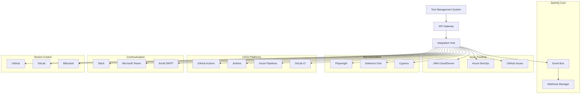
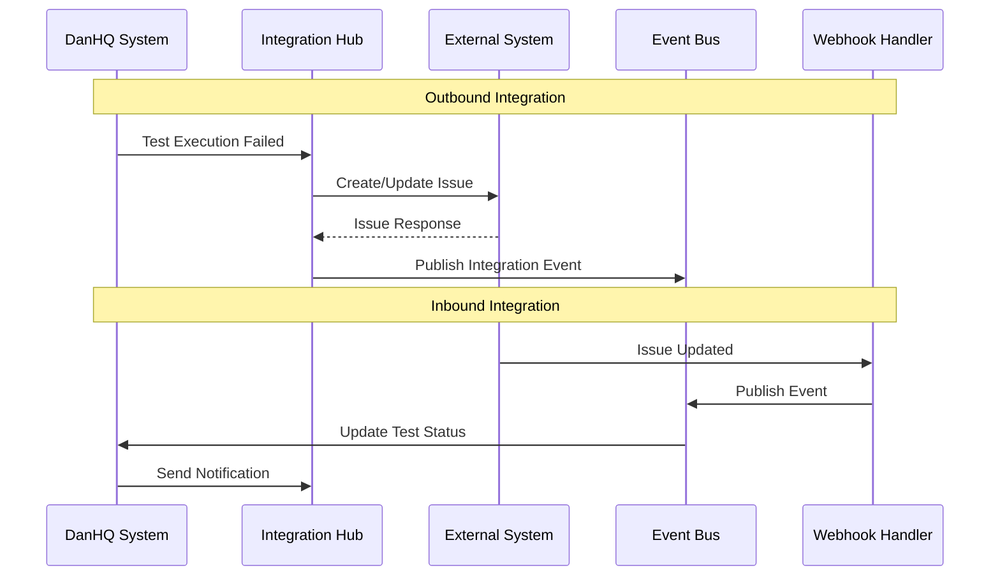

# 07. External Integrations

## 7.1 Integration Architecture Overview

DanHQ provides seamless integration with popular development and testing tools to create a unified workflow for test management and execution.

### 7.1.1 Integration Ecosystem



### 7.1.2 Integration Patterns



## 7.2 JIRA Integration

### 7.2.1 JIRA Client Service

```csharp
// JiraIntegrationService.cs
public class JiraIntegrationService
{
    private readonly HttpClient _httpClient;
    private readonly IConfiguration _configuration;
    private readonly ILogger<JiraIntegrationService> _logger;
    private readonly IEncryptionService _encryptionService;

    public class JiraConfiguration
    {
        public string BaseUrl { get; set; }
        public string Username { get; set; }
        public string ApiToken { get; set; }
        public string DefaultProject { get; set; }
        public Dictionary<string, string> IssueTypeMapping { get; set; } = new();
        public Dictionary<string, string> PriorityMapping { get; set; } = new();
        public Dictionary<string, string> CustomFieldMapping { get; set; } = new();
        public bool EnableBidirectionalSync { get; set; } = false;
    }

    public class JiraIssue
    {
        public string Key { get; set; }
        public string Summary { get; set; }
        public string Description { get; set; }
        public string IssueType { get; set; }
        public string Priority { get; set; }
        public string Status { get; set; }
        public string Assignee { get; set; }
        public List<string> Labels { get; set; } = new();
        public Dictionary<string, object> CustomFields { get; set; } = new();
        public DateTime Created { get; set; }
        public DateTime Updated { get; set; }
    }

    public class CreateIssueRequest
    {
        public string ProjectKey { get; set; }
        public string IssueType { get; set; }
        public string Summary { get; set; }
        public string Description { get; set; }
        public string Priority { get; set; } = "Medium";
        public string Assignee { get; set; }
        public List<string> Labels { get; set; } = new();
        public Dictionary<string, object> CustomFields { get; set; } = new();
    }

    public JiraIntegrationService(
        HttpClient httpClient, 
        IConfiguration configuration, 
        ILogger<JiraIntegrationService> logger,
        IEncryptionService encryptionService)
    {
        _httpClient = httpClient;
        _configuration = configuration;
        _logger = logger;
        _encryptionService = encryptionService;
    }

    public async Task<bool> TestConnectionAsync(JiraConfiguration config)
    {
        try
        {
            ConfigureHttpClient(config);
            var response = await _httpClient.GetAsync("/rest/api/3/myself");
            return response.IsSuccessStatusCode;
        }
        catch (Exception ex)
        {
            _logger.LogError(ex, "Failed to test JIRA connection");
            return false;
        }
    }

    public async Task<JiraIssue> CreateIssueAsync(JiraConfiguration config, CreateIssueRequest request)
    {
        ConfigureHttpClient(config);

        var jiraRequest = new
        {
            fields = new Dictionary<string, object>
            {
                ["project"] = new { key = request.ProjectKey },
                ["issuetype"] = new { name = GetMappedIssueType(config, request.IssueType) },
                ["summary"] = request.Summary,
                ["description"] = new
                {
                    type = "doc",
                    version = 1,
                    content = new[]
                    {
                        new
                        {
                            type = "paragraph",
                            content = new[]
                            {
                                new
                                {
                                    type = "text",
                                    text = request.Description
                                }
                            }
                        }
                    }
                },
                ["priority"] = new { name = GetMappedPriority(config, request.Priority) }
            }
        };

        // Add assignee if specified
        if (!string.IsNullOrEmpty(request.Assignee))
        {
            jiraRequest.fields["assignee"] = new { accountId = request.Assignee };
        }

        // Add labels
        if (request.Labels.Any())
        {
            jiraRequest.fields["labels"] = request.Labels;
        }

        // Add custom fields
        foreach (var customField in request.CustomFields)
        {
            if (config.CustomFieldMapping.TryGetValue(customField.Key, out var jiraFieldId))
            {
                jiraRequest.fields[jiraFieldId] = customField.Value;
            }
        }

        try
        {
            var response = await _httpClient.PostAsJsonAsync("/rest/api/3/issue", jiraRequest);
            
            if (!response.IsSuccessStatusCode)
            {
                var errorContent = await response.Content.ReadAsStringAsync();
                _logger.LogError("Failed to create JIRA issue: {StatusCode} - {Content}", 
                    response.StatusCode, errorContent);
                throw new JiraIntegrationException($"Failed to create issue: {response.StatusCode}");
            }

            var result = await response.Content.ReadFromJsonAsync<dynamic>();
            var issueKey = result.key.ToString();

            _logger.LogInformation("Created JIRA issue: {IssueKey}", issueKey);

            // Fetch the created issue to return complete data
            return await GetIssueAsync(config, issueKey);
        }
        catch (HttpRequestException ex)
        {
            _logger.LogError(ex, "Network error creating JIRA issue");
            throw new JiraIntegrationException("Network error occurred", ex);
        }
    }

    public async Task<JiraIssue> GetIssueAsync(JiraConfiguration config, string issueKey)
    {
        ConfigureHttpClient(config);

        try
        {
            var response = await _httpClient.GetAsync($"/rest/api/3/issue/{issueKey}");
            
            if (!response.IsSuccessStatusCode)
            {
                if (response.StatusCode == HttpStatusCode.NotFound)
                {
                    return null;
                }
                throw new JiraIntegrationException($"Failed to get issue: {response.StatusCode}");
            }

            var issueData = await response.Content.ReadFromJsonAsync<JiraIssueResponse>();
            return MapJiraIssue(issueData);
        }
        catch (HttpRequestException ex)
        {
            _logger.LogError(ex, "Network error getting JIRA issue {IssueKey}", issueKey);
            throw new JiraIntegrationException("Network error occurred", ex);
        }
    }

    public async Task<bool> UpdateIssueAsync(JiraConfiguration config, string issueKey, Dictionary<string, object> updates)
    {
        ConfigureHttpClient(config);

        var updateRequest = new
        {
            fields = updates
        };

        try
        {
            var response = await _httpClient.PutAsJsonAsync($"/rest/api/3/issue/{issueKey}", updateRequest);
            
            if (response.IsSuccessStatusCode)
            {
                _logger.LogInformation("Updated JIRA issue: {IssueKey}", issueKey);
                return true;
            }
            else
            {
                var errorContent = await response.Content.ReadAsStringAsync();
                _logger.LogError("Failed to update JIRA issue {IssueKey}: {StatusCode} - {Content}", 
                    issueKey, response.StatusCode, errorContent);
                return false;
            }
        }
        catch (HttpRequestException ex)
        {
            _logger.LogError(ex, "Network error updating JIRA issue {IssueKey}", issueKey);
            return false;
        }
    }

    public async Task<bool> TransitionIssueAsync(JiraConfiguration config, string issueKey, string transitionName)
    {
        ConfigureHttpClient(config);

        // First, get available transitions
        var transitionsResponse = await _httpClient.GetAsync($"/rest/api/3/issue/{issueKey}/transitions");
        if (!transitionsResponse.IsSuccessStatusCode)
        {
            return false;
        }

        var transitions = await transitionsResponse.Content.ReadFromJsonAsync<JiraTransitionsResponse>();
        var transition = transitions.Transitions.FirstOrDefault(t => 
            t.Name.Equals(transitionName, StringComparison.OrdinalIgnoreCase));

        if (transition == null)
        {
            _logger.LogWarning("Transition '{TransitionName}' not found for issue {IssueKey}", transitionName, issueKey);
            return false;
        }

        // Execute transition
        var transitionRequest = new
        {
            transition = new { id = transition.Id }
        };

        var response = await _httpClient.PostAsJsonAsync($"/rest/api/3/issue/{issueKey}/transitions", transitionRequest);
        
        if (response.IsSuccessStatusCode)
        {
            _logger.LogInformation("Transitioned JIRA issue {IssueKey} to {TransitionName}", issueKey, transitionName);
            return true;
        }

        return false;
    }

    public async Task<string> CreateTestExecutionIssueAsync(JiraConfiguration config, TestExecution execution)
    {
        var request = new CreateIssueRequest
        {
            ProjectKey = config.DefaultProject,
            IssueType = "Bug",
            Summary = $"Test Failure: {execution.TestCase.Title}",
            Description = BuildTestExecutionDescription(execution),
            Priority = MapTestPriorityToJira(execution.TestCase.Priority),
            Labels = new List<string> { "automated-test", "test-failure", $"test-case-{execution.TestCaseId}" }
        };

        // Add custom fields for test execution tracking
        request.CustomFields["test_case_id"] = execution.TestCaseId.ToString();
        request.CustomFields["test_execution_id"] = execution.Id.ToString();
        request.CustomFields["environment"] = execution.Environment;

        var issue = await CreateIssueAsync(config, request);
        return issue.Key;
    }

    private void ConfigureHttpClient(JiraConfiguration config)
    {
        _httpClient.BaseAddress = new Uri(config.BaseUrl);
        
        var credentials = Convert.ToBase64String(
            Encoding.ASCII.GetBytes($"{config.Username}:{config.ApiToken}"));
        
        _httpClient.DefaultRequestHeaders.Authorization = 
            new System.Net.Http.Headers.AuthenticationHeaderValue("Basic", credentials);
        
        _httpClient.DefaultRequestHeaders.Accept.Clear();
        _httpClient.DefaultRequestHeaders.Accept.Add(
            new System.Net.Http.Headers.MediaTypeWithQualityHeaderValue("application/json"));
    }

    private string GetMappedIssueType(JiraConfiguration config, string testIssueType)
    {
        return config.IssueTypeMapping.TryGetValue(testIssueType, out var mapped) ? mapped : "Bug";
    }

    private string GetMappedPriority(JiraConfiguration config, string testPriority)
    {
        return config.PriorityMapping.TryGetValue(testPriority, out var mapped) ? mapped : "Medium";
    }

    private string BuildTestExecutionDescription(TestExecution execution)
    {
        var description = new StringBuilder();
        description.AppendLine($"**Test Case:** {execution.TestCase.Title}");
        description.AppendLine($"**Test Case ID:** {execution.TestCase.ExternalId}");
        description.AppendLine($"**Environment:** {execution.Environment}");
        description.AppendLine($"**Build Version:** {execution.BuildVersion}");
        description.AppendLine($"**Execution Date:** {execution.StartedAt:yyyy-MM-dd HH:mm:ss}");
        description.AppendLine($"**Executed By:** {execution.ExecutedBy.DisplayName}");
        description.AppendLine();
        description.AppendLine("**Test Steps and Results:**");
        
        foreach (var step in execution.ExecutionSteps.OrderBy(s => s.TestStep.StepNumber))
        {
            description.AppendLine($"{step.TestStep.StepNumber}. {step.TestStep.Action}");
            description.AppendLine($"   **Expected:** {step.TestStep.ExpectedResult}");
            description.AppendLine($"   **Actual:** {step.ActualResult}");
            description.AppendLine($"   **Status:** {step.Status}");
            description.AppendLine();
        }

        if (!string.IsNullOrEmpty(execution.Notes))
        {
            description.AppendLine("**Additional Notes:**");
            description.AppendLine(execution.Notes);
        }

        return description.ToString();
    }

    private JiraIssue MapJiraIssue(JiraIssueResponse response)
    {
        return new JiraIssue
        {
            Key = response.Key,
            Summary = response.Fields.Summary,
            Description = ExtractTextFromADF(response.Fields.Description),
            IssueType = response.Fields.IssueType.Name,
            Priority = response.Fields.Priority?.Name,
            Status = response.Fields.Status.Name,
            Assignee = response.Fields.Assignee?.AccountId,
            Labels = response.Fields.Labels ?? new List<string>(),
            Created = response.Fields.Created,
            Updated = response.Fields.Updated
        };
    }

    private string ExtractTextFromADF(dynamic description)
    {
        // Extract plain text from Atlassian Document Format (ADF)
        // This is a simplified implementation
        if (description?.content != null)
        {
            var text = new StringBuilder();
            foreach (var content in description.content)
            {
                if (content.content != null)
                {
                    foreach (var textNode in content.content)
                    {
                        if (textNode.text != null)
                        {
                            text.Append(textNode.text.ToString());
                        }
                    }
                }
            }
            return text.ToString();
        }
        return string.Empty;
    }

    // Supporting classes for JSON deserialization
    private class JiraIssueResponse
    {
        public string Key { get; set; }
        public JiraFields Fields { get; set; }
    }

    private class JiraFields
    {
        public string Summary { get; set; }
        public dynamic Description { get; set; }
        public JiraIssueType IssueType { get; set; }
        public JiraPriority Priority { get; set; }
        public JiraStatus Status { get; set; }
        public JiraUser Assignee { get; set; }
        public List<string> Labels { get; set; }
        public DateTime Created { get; set; }
        public DateTime Updated { get; set; }
    }

    private class JiraIssueType
    {
        public string Name { get; set; }
    }

    private class JiraPriority
    {
        public string Name { get; set; }
    }

    private class JiraStatus
    {
        public string Name { get; set; }
    }

    private class JiraUser
    {
        public string AccountId { get; set; }
        public string DisplayName { get; set; }
    }

    private class JiraTransitionsResponse
    {
        public List<JiraTransition> Transitions { get; set; }
    }

    private class JiraTransition
    {
        public string Id { get; set; }
        public string Name { get; set; }
    }
}

public class JiraIntegrationException : Exception
{
    public JiraIntegrationException(string message) : base(message) { }
    public JiraIntegrationException(string message, Exception innerException) : base(message, innerException) { }
}
```

### 7.2.2 JIRA Synchronization Service

```csharp
// JiraSynchronizationService.cs
public class JiraSynchronizationService
{
    private readonly JiraIntegrationService _jiraService;
    private readonly DanHQDbContext _context;
    private readonly ILogger<JiraSynchronizationService> _logger;
    private readonly IHubContext<NotificationHub> _hubContext;

    public class SyncConfiguration
    {
        public bool EnableAutoSync { get; set; } = false;
        public bool SyncTestFailures { get; set; } = true;
        public bool SyncTestCaseUpdates { get; set; } = false;
        public bool SyncRequirements { get; set; } = false;
        public TimeSpan SyncInterval { get; set; } = TimeSpan.FromMinutes(15);
        public List<string> SyncStatuses { get; set; } = new() { "Failed", "Blocked" };
    }

    [BackgroundJob]
    public async Task SynchronizeTestExecutionAsync(int executionId, int projectId)
    {
        var execution = await _context.TestExecutions
            .Include(e => e.TestCase)
            .Include(e => e.ExecutedBy)
            .Include(e => e.ExecutionSteps)
                .ThenInclude(s => s.TestStep)
            .FirstOrDefaultAsync(e => e.Id == executionId);

        if (execution == null)
        {
            _logger.LogWarning("Test execution not found: {ExecutionId}", executionId);
            return;
        }

        var jiraConfig = await GetJiraConfigurationAsync(projectId);
        if (jiraConfig == null || !jiraConfig.SyncTestFailures)
        {
            return;
        }

        try
        {
            if (execution.Status == "Failed" || execution.Status == "Blocked")
            {
                await CreateOrUpdateJiraIssueForFailureAsync(execution, jiraConfig);
            }
            else if (execution.Status == "Passed")
            {
                await ResolveJiraIssueIfExistsAsync(execution, jiraConfig);
            }
        }
        catch (Exception ex)
        {
            _logger.LogError(ex, "Failed to synchronize test execution {ExecutionId} with JIRA", executionId);
        }
    }

    private async Task CreateOrUpdateJiraIssueForFailureAsync(TestExecution execution, JiraConfigurationWithSettings config)
    {
        // Check if there's already a JIRA issue for this test case
        var existingLink = await _context.JiraTestLinks
            .FirstOrDefaultAsync(l => l.TestCaseId == execution.TestCaseId && 
                                     l.IsActive);

        if (existingLink != null)
        {
            // Update existing issue
            await UpdateExistingJiraIssueAsync(execution, existingLink, config);
        }
        else
        {
            // Create new issue
            await CreateNewJiraIssueAsync(execution, config);
        }
    }

    private async Task CreateNewJiraIssueAsync(TestExecution execution, JiraConfigurationWithSettings config)
    {
        var issueKey = await _jiraService.CreateTestExecutionIssueAsync(config.JiraConfig, execution);

        // Store the link in database
        var jiraLink = new JiraTestLink
        {
            TestCaseId = execution.TestCaseId,
            JiraIssueKey = issueKey,
            LinkType = "DefectTracking",
            IsActive = true,
            CreatedAt = DateTime.UtcNow,
            CreatedBy = execution.ExecutedBy.Id
        };

        _context.JiraTestLinks.Add(jiraLink);
        await _context.SaveChangesAsync();

        _logger.LogInformation("Created JIRA issue {IssueKey} for test execution {ExecutionId}", 
            issueKey, execution.Id);

        // Notify users
        await NotifyJiraIssueCreatedAsync(execution, issueKey);
    }

    private async Task UpdateExistingJiraIssueAsync(TestExecution execution, JiraTestLink link, JiraConfigurationWithSettings config)
    {
        var updates = new Dictionary<string, object>
        {
            ["description"] = _jiraService.BuildTestExecutionDescription(execution)
        };

        var success = await _jiraService.UpdateIssueAsync(config.JiraConfig, link.JiraIssueKey, updates);
        
        if (success)
        {
            // Add comment about the new failure
            await AddJiraCommentAsync(config.JiraConfig, link.JiraIssueKey, 
                $"Test failed again on {execution.StartedAt:yyyy-MM-dd HH:mm:ss} in environment {execution.Environment}");
            
            _logger.LogInformation("Updated JIRA issue {IssueKey} for test execution {ExecutionId}", 
                link.JiraIssueKey, execution.Id);
        }
    }

    private async Task ResolveJiraIssueIfExistsAsync(TestExecution execution, JiraConfigurationWithSettings config)
    {
        var existingLink = await _context.JiraTestLinks
            .FirstOrDefaultAsync(l => l.TestCaseId == execution.TestCaseId && 
                                     l.IsActive);

        if (existingLink != null)
        {
            // Transition issue to resolved/done
            var success = await _jiraService.TransitionIssueAsync(config.JiraConfig, existingLink.JiraIssueKey, "Done");
            
            if (success)
            {
                await AddJiraCommentAsync(config.JiraConfig, existingLink.JiraIssueKey,
                    $"Test passed successfully on {execution.StartedAt:yyyy-MM-dd HH:mm:ss}. Auto-resolving issue.");
                
                existingLink.IsActive = false;
                existingLink.ResolvedAt = DateTime.UtcNow;
                await _context.SaveChangesAsync();

                _logger.LogInformation("Resolved JIRA issue {IssueKey} for passed test execution {ExecutionId}", 
                    existingLink.JiraIssueKey, execution.Id);
            }
        }
    }

    private async Task AddJiraCommentAsync(JiraIntegrationService.JiraConfiguration config, string issueKey, string comment)
    {
        // Implementation to add comment to JIRA issue
        // This would use JIRA's comment API
    }

    private async Task NotifyJiraIssueCreatedAsync(TestExecution execution, string issueKey)
    {
        var notification = new
        {
            Type = "JiraIssueCreated",
            TestCaseId = execution.TestCaseId,
            TestCaseTitle = execution.TestCase.Title,
            JiraIssueKey = issueKey,
            ExecutionId = execution.Id,
            Timestamp = DateTime.UtcNow
        };

        await _hubContext.Clients.Group($"project_{execution.TestCase.TestSuite.ProjectId}")
            .SendAsync("JiraNotification", notification);
    }

    private class JiraConfigurationWithSettings
    {
        public JiraIntegrationService.JiraConfiguration JiraConfig { get; set; }
        public SyncConfiguration SyncConfig { get; set; }
    }
}
```

## 7.3 Playwright Integration

### 7.3.1 Playwright Execution Service

```csharp
// PlaywrightIntegrationService.cs
public class PlaywrightIntegrationService
{
    private readonly IConfiguration _configuration;
    private readonly ILogger<PlaywrightIntegrationService> _logger;
    private readonly DanHQDbContext _context;
    private readonly IFileStorageService _fileStorage;

    public class PlaywrightConfiguration
    {
        public string BaseUrl { get; set; }
        public string BrowserType { get; set; } = "chromium";
        public bool Headless { get; set; } = true;
        public int Timeout { get; set; } = 30000;
        public string ScreenshotPath { get; set; }
        public string VideoPath { get; set; }
        public Dictionary<string, string> Environment { get; set; } = new();
    }

    public class PlaywrightTestResult
    {
        public string Status { get; set; } // "passed", "failed", "skipped"
        public string ErrorMessage { get; set; }
        public List<string> Screenshots { get; set; } = new();
        public string VideoPath { get; set; }
        public int Duration { get; set; }
        public List<PlaywrightStep> Steps { get; set; } = new();
        public Dictionary<string, object> Metadata { get; set; } = new();
    }

    public class PlaywrightStep
    {
        public int StepNumber { get; set; }
        public string Action { get; set; }
        public string Status { get; set; }
        public string Screenshot { get; set; }
        public string ErrorMessage { get; set; }
        public int Duration { get; set; }
    }

    public class AutomationScript
    {
        public string Language { get; set; } = "javascript";
        public string Framework { get; set; } = "playwright";
        public string Script { get; set; }
        public Dictionary<string, object> Parameters { get; set; } = new();
    }

    public async Task<PlaywrightTestResult> ExecuteTestAsync(int testCaseId, PlaywrightConfiguration config)
    {
        var testCase = await _context.TestCases
            .Include(tc => tc.Steps)
            .FirstOrDefaultAsync(tc => tc.Id == testCaseId);

        if (testCase == null)
        {
            throw new ArgumentException($"Test case {testCaseId} not found");
        }

        if (string.IsNullOrEmpty(testCase.AutomationScriptPath))
        {
            throw new InvalidOperationException($"Test case {testCaseId} does not have an automation script");
        }

        try
        {
            _logger.LogInformation("Starting Playwright execution for test case {TestCaseId}", testCaseId);

            // Load automation script
            var script = await LoadAutomationScriptAsync(testCase.AutomationScriptPath);
            
            // Execute with Playwright
            var result = await ExecutePlaywrightScriptAsync(script, config, testCase);
            
            // Upload artifacts to storage
            await UploadArtifactsAsync(result, testCaseId);

            _logger.LogInformation("Completed Playwright execution for test case {TestCaseId} with status {Status}", 
                testCaseId, result.Status);

            return result;
        }
        catch (Exception ex)
        {
            _logger.LogError(ex, "Failed to execute Playwright test for test case {TestCaseId}", testCaseId);
            
            return new PlaywrightTestResult
            {
                Status = "failed",
                ErrorMessage = ex.Message,
                Duration = 0
            };
        }
    }

    private async Task<AutomationScript> LoadAutomationScriptAsync(string scriptPath)
    {
        var scriptContent = await _fileStorage.ReadFileAsync(scriptPath);
        
        // Parse script metadata and content
        var script = new AutomationScript
        {
            Script = scriptContent,
            Language = Path.GetExtension(scriptPath).ToLower() switch
            {
                ".js" => "javascript",
                ".ts" => "typescript",
                ".py" => "python",
                ".cs" => "csharp",
                _ => "javascript"
            }
        };

        return script;
    }

    private async Task<PlaywrightTestResult> ExecutePlaywrightScriptAsync(
        AutomationScript script, 
        PlaywrightConfiguration config, 
        TestCase testCase)
    {
        var result = new PlaywrightTestResult();
        var startTime = DateTime.UtcNow;

        try
        {
            // Create execution directory
            var executionId = Guid.NewGuid().ToString();
            var executionDir = Path.Combine(Path.GetTempPath(), "playwright-executions", executionId);
            Directory.CreateDirectory(executionDir);

            // Write script to file
            var scriptPath = Path.Combine(executionDir, $"test.{GetScriptExtension(script.Language)}");
            await File.WriteAllTextAsync(scriptPath, script.Script);

            // Prepare Playwright command
            var command = BuildPlaywrightCommand(scriptPath, config, executionDir);
            
            // Execute script
            var processResult = await ExecuteCommandAsync(command, executionDir);
            
            // Parse results
            result = await ParsePlaywrightResultsAsync(executionDir, processResult);
            
            // Clean up temporary files
            Directory.Delete(executionDir, true);
        }
        catch (Exception ex)
        {
            result.Status = "failed";
            result.ErrorMessage = ex.Message;
        }

        result.Duration = (int)(DateTime.UtcNow - startTime).TotalMilliseconds;
        return result;
    }

    private string BuildPlaywrightCommand(string scriptPath, PlaywrightConfiguration config, string outputDir)
    {
        var command = new StringBuilder();
        
        if (config.BrowserType == "chromium")
        {
            command.Append("npx playwright test ");
        }
        else
        {
            command.Append($"npx playwright test --browser={config.BrowserType} ");
        }

        command.Append($"--timeout={config.Timeout} ");
        
        if (config.Headless)
        {
            command.Append("--headed=false ");
        }

        // Screenshot and video configuration
        command.Append($"--output-dir={outputDir} ");
        command.Append("--screenshot=only-on-failure ");
        command.Append("--video=retain-on-failure ");
        
        // Reporter for structured output
        command.Append("--reporter=json ");
        
        command.Append(scriptPath);

        return command.ToString();
    }

    private async Task<ProcessResult> ExecuteCommandAsync(string command, string workingDirectory)
    {
        var startInfo = new ProcessStartInfo
        {
            FileName = "/bin/bash", // Use appropriate shell for the OS
            Arguments = $"-c \"{command}\"",
            WorkingDirectory = workingDirectory,
            RedirectStandardOutput = true,
            RedirectStandardError = true,
            UseShellExecute = false,
            CreateNoWindow = true
        };

        using var process = new Process { StartInfo = startInfo };
        var outputBuilder = new StringBuilder();
        var errorBuilder = new StringBuilder();

        process.OutputDataReceived += (sender, args) =>
        {
            if (args.Data != null)
                outputBuilder.AppendLine(args.Data);
        };

        process.ErrorDataReceived += (sender, args) =>
        {
            if (args.Data != null)
                errorBuilder.AppendLine(args.Data);
        };

        process.Start();
        process.BeginOutputReadLine();
        process.BeginErrorReadLine();

        await process.WaitForExitAsync();

        return new ProcessResult
        {
            ExitCode = process.ExitCode,
            StandardOutput = outputBuilder.ToString(),
            StandardError = errorBuilder.ToString()
        };
    }

    private async Task<PlaywrightTestResult> ParsePlaywrightResultsAsync(string executionDir, ProcessResult processResult)
    {
        var result = new PlaywrightTestResult();

        try
        {
            // Parse JSON report if available
            var reportPath = Path.Combine(executionDir, "results.json");
            if (File.Exists(reportPath))
            {
                var reportContent = await File.ReadAllTextAsync(reportPath);
                var report = JsonSerializer.Deserialize<PlaywrightReport>(reportContent);
                
                result.Status = report.Status;
                result.Duration = report.Duration;
                result.ErrorMessage = report.ErrorMessage;
            }
            else
            {
                // Parse from process output
                result.Status = processResult.ExitCode == 0 ? "passed" : "failed";
                result.ErrorMessage = processResult.StandardError;
            }

            // Collect screenshots
            var screenshotFiles = Directory.GetFiles(executionDir, "*.png", SearchOption.AllDirectories);
            result.Screenshots.AddRange(screenshotFiles);

            // Collect video
            var videoFiles = Directory.GetFiles(executionDir, "*.webm", SearchOption.AllDirectories);
            if (videoFiles.Any())
            {
                result.VideoPath = videoFiles.First();
            }
        }
        catch (Exception ex)
        {
            _logger.LogError(ex, "Failed to parse Playwright results");
            result.Status = "failed";
            result.ErrorMessage = "Failed to parse test results";
        }

        return result;
    }

    private async Task UploadArtifactsAsync(PlaywrightTestResult result, int testCaseId)
    {
        var uploadTasks = new List<Task>();

        // Upload screenshots
        foreach (var screenshot in result.Screenshots)
        {
            uploadTasks.Add(UploadArtifactAsync(screenshot, testCaseId, "screenshot"));
        }

        // Upload video
        if (!string.IsNullOrEmpty(result.VideoPath))
        {
            uploadTasks.Add(UploadArtifactAsync(result.VideoPath, testCaseId, "video"));
        }

        await Task.WhenAll(uploadTasks);
    }

    private async Task UploadArtifactAsync(string filePath, int testCaseId, string artifactType)
    {
        try
        {
            var fileName = Path.GetFileName(filePath);
            var storageKey = $"automation-artifacts/{testCaseId}/{artifactType}/{fileName}";
            
            await _fileStorage.UploadFileAsync(filePath, storageKey);
            
            _logger.LogInformation("Uploaded {ArtifactType} artifact: {FileName} for test case {TestCaseId}", 
                artifactType, fileName, testCaseId);
        }
        catch (Exception ex)
        {
            _logger.LogError(ex, "Failed to upload artifact {FilePath} for test case {TestCaseId}", 
                filePath, testCaseId);
        }
    }

    public async Task<AutomationScript> GeneratePlaywrightScriptAsync(TestCase testCase)
    {
        var script = new StringBuilder();
        
        // Generate Playwright test script from test case steps
        script.AppendLine("const { test, expect } = require('@playwright/test');");
        script.AppendLine();
        script.AppendLine($"test('{testCase.Title}', async ({{ page }}) => {{");
        
        foreach (var step in testCase.Steps.OrderBy(s => s.StepNumber))
        {
            script.AppendLine($"  // Step {step.StepNumber}: {step.Action}");
            script.AppendLine(GeneratePlaywrightStepCode(step));
            script.AppendLine();
        }
        
        script.AppendLine("});");

        return new AutomationScript
        {
            Language = "javascript",
            Framework = "playwright",
            Script = script.ToString()
        };
    }

    private string GeneratePlaywrightStepCode(TestStep step)
    {
        // This is a simplified example of generating Playwright code from test steps
        // In a real implementation, this would be much more sophisticated with AI assistance
        
        var action = step.Action.ToLower();
        
        if (action.Contains("navigate") || action.Contains("go to"))
        {
            return "  await page.goto('${BASE_URL}');";
        }
        else if (action.Contains("click"))
        {
            return "  await page.click('selector');";
        }
        else if (action.Contains("type") || action.Contains("enter"))
        {
            return "  await page.fill('selector', 'text');";
        }
        else if (action.Contains("verify") || action.Contains("check"))
        {
            return "  await expect(page.locator('selector')).toBeVisible();";
        }
        else
        {
            return $"  // TODO: Implement step - {step.Action}";
        }
    }

    private string GetScriptExtension(string language)
    {
        return language.ToLower() switch
        {
            "javascript" => "js",
            "typescript" => "ts",
            "python" => "py",
            "csharp" => "cs",
            _ => "js"
        };
    }

    // Supporting classes
    private class ProcessResult
    {
        public int ExitCode { get; set; }
        public string StandardOutput { get; set; }
        public string StandardError { get; set; }
    }

    private class PlaywrightReport
    {
        public string Status { get; set; }
        public int Duration { get; set; }
        public string ErrorMessage { get; set; }
    }
}
```

## 7.4 CI/CD Integration

### 7.4.1 GitHub Actions Integration

```csharp
// GitHubActionsIntegrationService.cs
public class GitHubActionsIntegrationService
{
    private readonly HttpClient _httpClient;
    private readonly IConfiguration _configuration;
    private readonly ILogger<GitHubActionsIntegrationService> _logger;

    public class GitHubConfiguration
    {
        public string Token { get; set; }
        public string Owner { get; set; }
        public string Repository { get; set; }
        public string WorkflowFileName { get; set; } = "test-execution.yml";
    }

    public class WorkflowTrigger
    {
        public string Ref { get; set; } = "main";
        public Dictionary<string, object> Inputs { get; set; } = new();
    }

    public async Task<string> TriggerTestExecutionWorkflowAsync(GitHubConfiguration config, int testPlanId, string environment)
    {
        ConfigureHttpClient(config);

        var trigger = new WorkflowTrigger
        {
            Ref = "main",
            Inputs = new Dictionary<string, object>
            {
                ["test_plan_id"] = testPlanId.ToString(),
                ["environment"] = environment,
                ["danhq_webhook_url"] = BuildWebhookUrl()
            }
        };

        var requestBody = new
        {
            @ref = trigger.Ref,
            inputs = trigger.Inputs
        };

        try
        {
            var response = await _httpClient.PostAsJsonAsync(
                $"/repos/{config.Owner}/{config.Repository}/actions/workflows/{config.WorkflowFileName}/dispatches",
                requestBody);

            if (response.IsSuccessStatusCode)
            {
                _logger.LogInformation("Triggered GitHub Actions workflow for test plan {TestPlanId}", testPlanId);
                
                // GitHub Actions doesn't return a workflow run ID immediately
                // We need to fetch the latest run for this workflow
                await Task.Delay(2000); // Wait a bit for the workflow to start
                return await GetLatestWorkflowRunIdAsync(config);
            }
            else
            {
                var error = await response.Content.ReadAsStringAsync();
                _logger.LogError("Failed to trigger GitHub Actions workflow: {StatusCode} - {Error}", 
                    response.StatusCode, error);
                throw new GitHubIntegrationException($"Failed to trigger workflow: {response.StatusCode}");
            }
        }
        catch (HttpRequestException ex)
        {
            _logger.LogError(ex, "Network error triggering GitHub Actions workflow");
            throw new GitHubIntegrationException("Network error occurred", ex);
        }
    }

    public async Task<WorkflowRun> GetWorkflowRunAsync(GitHubConfiguration config, string runId)
    {
        ConfigureHttpClient(config);

        try
        {
            var response = await _httpClient.GetAsync(
                $"/repos/{config.Owner}/{config.Repository}/actions/runs/{runId}");

            if (response.IsSuccessStatusCode)
            {
                var runData = await response.Content.ReadFromJsonAsync<GitHubWorkflowRun>();
                return MapWorkflowRun(runData);
            }
            else if (response.StatusCode == HttpStatusCode.NotFound)
            {
                return null;
            }
            else
            {
                throw new GitHubIntegrationException($"Failed to get workflow run: {response.StatusCode}");
            }
        }
        catch (HttpRequestException ex)
        {
            _logger.LogError(ex, "Network error getting GitHub Actions workflow run {RunId}", runId);
            throw new GitHubIntegrationException("Network error occurred", ex);
        }
    }

    public async Task<List<WorkflowArtifact>> GetWorkflowArtifactsAsync(GitHubConfiguration config, string runId)
    {
        ConfigureHttpClient(config);

        try
        {
            var response = await _httpClient.GetAsync(
                $"/repos/{config.Owner}/{config.Repository}/actions/runs/{runId}/artifacts");

            if (response.IsSuccessStatusCode)
            {
                var artifactsData = await response.Content.ReadFromJsonAsync<GitHubArtifactsResponse>();
                return artifactsData.Artifacts.Select(MapWorkflowArtifact).ToList();
            }
            else
            {
                _logger.LogError("Failed to get workflow artifacts: {StatusCode}", response.StatusCode);
                return new List<WorkflowArtifact>();
            }
        }
        catch (HttpRequestException ex)
        {
            _logger.LogError(ex, "Network error getting workflow artifacts for run {RunId}", runId);
            return new List<WorkflowArtifact>();
        }
    }

    public async Task<byte[]> DownloadArtifactAsync(GitHubConfiguration config, string artifactId)
    {
        ConfigureHttpClient(config);

        try
        {
            var response = await _httpClient.GetAsync(
                $"/repos/{config.Owner}/{config.Repository}/actions/artifacts/{artifactId}/zip");

            if (response.IsSuccessStatusCode)
            {
                return await response.Content.ReadAsByteArrayAsync();
            }
            else
            {
                throw new GitHubIntegrationException($"Failed to download artifact: {response.StatusCode}");
            }
        }
        catch (HttpRequestException ex)
        {
            _logger.LogError(ex, "Network error downloading artifact {ArtifactId}", artifactId);
            throw new GitHubIntegrationException("Network error occurred", ex);
        }
    }

    private void ConfigureHttpClient(GitHubConfiguration config)
    {
        _httpClient.BaseAddress = new Uri("https://api.github.com");
        _httpClient.DefaultRequestHeaders.Authorization = 
            new System.Net.Http.Headers.AuthenticationHeaderValue("Bearer", config.Token);
        _httpClient.DefaultRequestHeaders.UserAgent.ParseAdd("DanHQ/1.0");
        _httpClient.DefaultRequestHeaders.Accept.Clear();
        _httpClient.DefaultRequestHeaders.Accept.Add(
            new System.Net.Http.Headers.MediaTypeWithQualityHeaderValue("application/vnd.github.v3+json"));
    }

    private async Task<string> GetLatestWorkflowRunIdAsync(GitHubConfiguration config)
    {
        var response = await _httpClient.GetAsync(
            $"/repos/{config.Owner}/{config.Repository}/actions/workflows/{config.WorkflowFileName}/runs?per_page=1");

        if (response.IsSuccessStatusCode)
        {
            var runsData = await response.Content.ReadFromJsonAsync<GitHubWorkflowRunsResponse>();
            return runsData.WorkflowRuns.FirstOrDefault()?.Id.ToString();
        }

        return null;
    }

    private string BuildWebhookUrl()
    {
        var baseUrl = _configuration["App:BaseUrl"];
        return $"{baseUrl}/api/v1/webhooks/github/workflow-complete";
    }

    private WorkflowRun MapWorkflowRun(GitHubWorkflowRun gitHubRun)
    {
        return new WorkflowRun
        {
            Id = gitHubRun.Id.ToString(),
            Status = gitHubRun.Status,
            Conclusion = gitHubRun.Conclusion,
            CreatedAt = gitHubRun.CreatedAt,
            UpdatedAt = gitHubRun.UpdatedAt,
            HtmlUrl = gitHubRun.HtmlUrl
        };
    }

    private WorkflowArtifact MapWorkflowArtifact(GitHubArtifact gitHubArtifact)
    {
        return new WorkflowArtifact
        {
            Id = gitHubArtifact.Id.ToString(),
            Name = gitHubArtifact.Name,
            SizeInBytes = gitHubArtifact.SizeInBytes,
            CreatedAt = gitHubArtifact.CreatedAt,
            ExpiresAt = gitHubArtifact.ExpiresAt
        };
    }

    // Supporting classes for GitHub API responses
    private class GitHubWorkflowRun
    {
        public long Id { get; set; }
        public string Status { get; set; }
        public string Conclusion { get; set; }
        public DateTime CreatedAt { get; set; }
        public DateTime UpdatedAt { get; set; }
        public string HtmlUrl { get; set; }
    }

    private class GitHubWorkflowRunsResponse
    {
        public List<GitHubWorkflowRun> WorkflowRuns { get; set; }
    }

    private class GitHubArtifactsResponse
    {
        public List<GitHubArtifact> Artifacts { get; set; }
    }

    private class GitHubArtifact
    {
        public long Id { get; set; }
        public string Name { get; set; }
        public long SizeInBytes { get; set; }
        public DateTime CreatedAt { get; set; }
        public DateTime ExpiresAt { get; set; }
    }

    // Public DTOs
    public class WorkflowRun
    {
        public string Id { get; set; }
        public string Status { get; set; }
        public string Conclusion { get; set; }
        public DateTime CreatedAt { get; set; }
        public DateTime UpdatedAt { get; set; }
        public string HtmlUrl { get; set; }
    }

    public class WorkflowArtifact
    {
        public string Id { get; set; }
        public string Name { get; set; }
        public long SizeInBytes { get; set; }
        public DateTime CreatedAt { get; set; }
        public DateTime ExpiresAt { get; set; }
    }
}

public class GitHubIntegrationException : Exception
{
    public GitHubIntegrationException(string message) : base(message) { }
    public GitHubIntegrationException(string message, Exception innerException) : base(message, innerException) { }
}
```

## 7.5 Webhook Management

### 7.5.1 Webhook Controller

```csharp
// WebhookController.cs
[ApiController]
[Route("api/v1/webhooks")]
public class WebhookController : ControllerBase
{
    private readonly ILogger<WebhookController> _logger;
    private readonly WebhookProcessingService _webhookService;
    private readonly IConfiguration _configuration;

    [HttpPost("github/workflow-complete")]
    public async Task<IActionResult> HandleGitHubWorkflowComplete([FromBody] GitHubWorkflowWebhook webhook)
    {
        try
        {
            // Verify webhook signature
            if (!VerifyGitHubSignature(Request, webhook))
            {
                return Unauthorized("Invalid signature");
            }

            await _webhookService.ProcessGitHubWorkflowWebhookAsync(webhook);
            return Ok();
        }
        catch (Exception ex)
        {
            _logger.LogError(ex, "Failed to process GitHub workflow webhook");
            return StatusCode(500, "Internal server error");
        }
    }

    [HttpPost("jira/issue-updated")]
    public async Task<IActionResult> HandleJiraIssueUpdated([FromBody] JiraIssueWebhook webhook)
    {
        try
        {
            // Verify JIRA webhook
            if (!VerifyJiraWebhook(Request, webhook))
            {
                return Unauthorized("Invalid webhook");
            }

            await _webhookService.ProcessJiraIssueWebhookAsync(webhook);
            return Ok();
        }
        catch (Exception ex)
        {
            _logger.LogError(ex, "Failed to process JIRA issue webhook");
            return StatusCode(500, "Internal server error");
        }
    }

    [HttpPost("playwright/test-results")]
    public async Task<IActionResult> HandlePlaywrightResults([FromBody] PlaywrightResultsWebhook webhook)
    {
        try
        {
            await _webhookService.ProcessPlaywrightResultsWebhookAsync(webhook);
            return Ok();
        }
        catch (Exception ex)
        {
            _logger.LogError(ex, "Failed to process Playwright results webhook");
            return StatusCode(500, "Internal server error");
        }
    }

    private bool VerifyGitHubSignature(HttpRequest request, object payload)
    {
        var signature = request.Headers["X-Hub-Signature-256"].FirstOrDefault();
        if (string.IsNullOrEmpty(signature))
        {
            return false;
        }

        var secret = _configuration["Webhooks:GitHub:Secret"];
        var payloadJson = JsonSerializer.Serialize(payload);
        var expectedSignature = ComputeGitHubSignature(payloadJson, secret);

        return signature.Equals(expectedSignature, StringComparison.OrdinalIgnoreCase);
    }

    private string ComputeGitHubSignature(string payload, string secret)
    {
        var keyBytes = Encoding.UTF8.GetBytes(secret);
        var payloadBytes = Encoding.UTF8.GetBytes(payload);
        
        using var hmac = new HMACSHA256(keyBytes);
        var hashBytes = hmac.ComputeHash(payloadBytes);
        var hash = Convert.ToHexString(hashBytes).ToLower();
        
        return $"sha256={hash}";
    }

    private bool VerifyJiraWebhook(HttpRequest request, JiraIssueWebhook webhook)
    {
        // Implement JIRA webhook verification
        // This could be based on IP allowlist, shared secret, etc.
        return true; // Simplified for example
    }
}

// Webhook DTOs
public class GitHubWorkflowWebhook
{
    public string Action { get; set; }
    public GitHubWorkflowRun WorkflowRun { get; set; }
    public GitHubRepository Repository { get; set; }
}

public class JiraIssueWebhook
{
    public string WebhookEvent { get; set; }
    public JiraIssueData Issue { get; set; }
    public JiraChangeLog ChangeLog { get; set; }
}

public class PlaywrightResultsWebhook
{
    public string TestPlanId { get; set; }
    public string Status { get; set; }
    public List<PlaywrightTestResult> Results { get; set; }
    public string ArtifactsUrl { get; set; }
}
```

---

*This external integrations implementation provides comprehensive connectivity with popular development tools, enabling DanHQ to fit seamlessly into existing development workflows.*