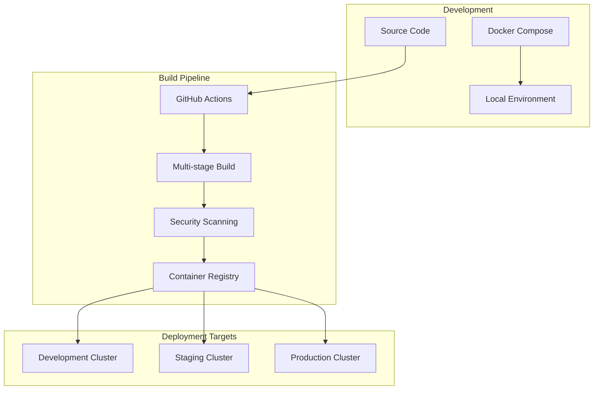
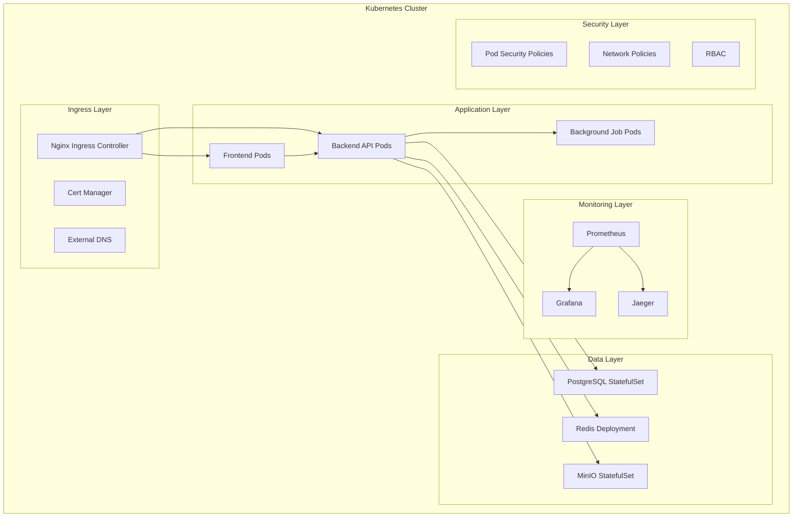
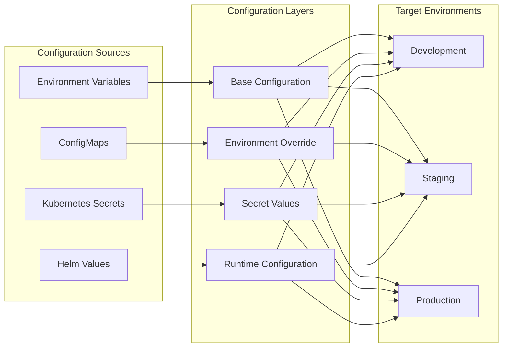

# 08. DevOps & Deployment

## 8.1 Containerization Strategy

DanHQ uses Docker containers for consistent deployment across different environments, with multi-stage builds for optimization and security.

### 8.1.1 Docker Architecture



### 8.1.2 Backend Dockerfile

```dockerfile
# Backend/Dockerfile
# Multi-stage build for .NET Core API
FROM mcr.microsoft.com/dotnet/aspnet:8.0-alpine AS base
WORKDIR /app
EXPOSE 80
EXPOSE 443

# Create non-root user
RUN addgroup -g 1001 -S appuser && \
    adduser -S appuser -G appuser -u 1001
USER appuser

FROM mcr.microsoft.com/dotnet/sdk:8.0-alpine AS build
WORKDIR /src

# Copy project files
COPY ["DanHQ.API/DanHQ.API.csproj", "DanHQ.API/"]
COPY ["DanHQ.Application/DanHQ.Application.csproj", "DanHQ.Application/"]
COPY ["DanHQ.Domain/DanHQ.Domain.csproj", "DanHQ.Domain/"]
COPY ["DanHQ.Infrastructure/DanHQ.Infrastructure.csproj", "DanHQ.Infrastructure/"]

# Restore dependencies
RUN dotnet restore "DanHQ.API/DanHQ.API.csproj"

# Copy source code
COPY . .

# Build application
WORKDIR "/src/DanHQ.API"
RUN dotnet build "DanHQ.API.csproj" -c Release -o /app/build

FROM build AS publish
RUN dotnet publish "DanHQ.API.csproj" -c Release -o /app/publish /p:UseAppHost=false

FROM base AS final
WORKDIR /app
COPY --from=publish /app/publish .

# Health check
HEALTHCHECK --interval=30s --timeout=3s --start-period=5s --retries=3 \
  CMD curl -f http://localhost:80/health || exit 1

ENTRYPOINT ["dotnet", "DanHQ.API.dll"]
```

### 8.1.3 Frontend Dockerfile

```dockerfile
# Frontend/Dockerfile
# Multi-stage build for Angular application
FROM node:20-alpine AS build
WORKDIR /app

# Install dependencies
COPY package*.json ./
RUN npm ci --only=production && npm cache clean --force

# Copy source and build
COPY . .
RUN npm run build:prod

# Production stage with Nginx
FROM nginx:alpine AS production

# Copy custom nginx configuration
COPY nginx.conf /etc/nginx/nginx.conf

# Copy built application
COPY --from=build /app/dist/danhq-frontend /usr/share/nginx/html

# Copy environment configuration script
COPY docker-entrypoint.sh /docker-entrypoint.sh
RUN chmod +x /docker-entrypoint.sh

# Create non-root user
RUN addgroup -g 1001 -S appuser && \
    adduser -S appuser -G appuser -u 1001 && \
    chown -R appuser:appuser /usr/share/nginx/html && \
    chown -R appuser:appuser /var/cache/nginx && \
    chown -R appuser:appuser /var/log/nginx && \
    chown -R appuser:appuser /etc/nginx/conf.d

USER appuser

EXPOSE 8080

ENTRYPOINT ["/docker-entrypoint.sh"]
CMD ["nginx", "-g", "daemon off;"]
```

### 8.1.4 Docker Compose for Development

```yaml
# docker-compose.yml
version: '3.8'

services:
  # PostgreSQL Database
  postgres:
    image: postgres:15-alpine
    container_name: danhq-postgres
    environment:
      POSTGRES_DB: danhq
      POSTGRES_USER: danhq_user
      POSTGRES_PASSWORD: dev_password
    ports:
      - "5432:5432"
    volumes:
      - postgres_data:/var/lib/postgresql/data
      - ./scripts/init-db.sql:/docker-entrypoint-initdb.d/init.sql
    healthcheck:
      test: ["CMD-SHELL", "pg_isready -U danhq_user -d danhq"]
      interval: 10s
      timeout: 5s
      retries: 5

  # Redis Cache
  redis:
    image: redis:7-alpine
    container_name: danhq-redis
    command: redis-server --appendonly yes --requirepass dev_password
    ports:
      - "6379:6379"
    volumes:
      - redis_data:/data
    healthcheck:
      test: ["CMD", "redis-cli", "--raw", "incr", "ping"]
      interval: 10s
      timeout: 3s
      retries: 5

  # MinIO for file storage
  minio:
    image: minio/minio:latest
    container_name: danhq-minio
    command: server /data --console-address ":9001"
    ports:
      - "9000:9000"
      - "9001:9001"
    environment:
      MINIO_ROOT_USER: minioadmin
      MINIO_ROOT_PASSWORD: minioadmin123
    volumes:
      - minio_data:/data
    healthcheck:
      test: ["CMD", "curl", "-f", "http://localhost:9000/minio/health/live"]
      interval: 30s
      timeout: 20s
      retries: 3

  # Backend API
  api:
    build:
      context: ./Backend
      dockerfile: Dockerfile
      target: base
    container_name: danhq-api
    environment:
      - ASPNETCORE_ENVIRONMENT=Development
      - ASPNETCORE_URLS=http://+:80
      - ConnectionStrings__DefaultConnection=Host=postgres;Database=danhq;Username=danhq_user;Password=dev_password
      - Redis__Configuration=redis:6379,password=dev_password
      - MinIO__Endpoint=minio:9000
      - MinIO__AccessKey=minioadmin
      - MinIO__SecretKey=minioadmin123
      - JWT__Secret=your-super-secret-jwt-key-for-development-only
      - OpenAI__ApiKey=${OPENAI_API_KEY}
    ports:
      - "5000:80"
    depends_on:
      postgres:
        condition: service_healthy
      redis:
        condition: service_healthy
      minio:
        condition: service_healthy
    volumes:
      - ./Backend:/src
      - /src/bin
      - /src/obj
    healthcheck:
      test: ["CMD", "curl", "-f", "http://localhost:80/health"]
      interval: 30s
      timeout: 10s
      retries: 3

  # Frontend
  frontend:
    build:
      context: ./Frontend
      dockerfile: Dockerfile
      target: build
    container_name: danhq-frontend
    environment:
      - API_URL=http://localhost:5000
    ports:
      - "4200:4200"
    volumes:
      - ./Frontend:/app
      - /app/node_modules
    command: npm run start
    depends_on:
      - api

  # Nginx Reverse Proxy
  nginx:
    image: nginx:alpine
    container_name: danhq-nginx
    ports:
      - "80:80"
      - "443:443"
    volumes:
      - ./nginx/nginx.conf:/etc/nginx/nginx.conf
      - ./nginx/ssl:/etc/nginx/ssl
    depends_on:
      - api
      - frontend

volumes:
  postgres_data:
  redis_data:
  minio_data:

networks:
  default:
    name: danhq-network
```

## 8.2 Kubernetes Deployment

### 8.2.1 Kubernetes Architecture



### 8.2.2 Namespace Configuration

```yaml
# k8s/namespaces.yaml
apiVersion: v1
kind: Namespace
metadata:
  name: danhq-prod
  labels:
    name: danhq-prod
    environment: production
---
apiVersion: v1
kind: Namespace
metadata:
  name: danhq-staging
  labels:
    name: danhq-staging
    environment: staging
---
apiVersion: v1
kind: Namespace
metadata:
  name: danhq-dev
  labels:
    name: danhq-dev
    environment: development
```

### 8.2.3 ConfigMaps and Secrets

```yaml
# k8s/configmap.yaml
apiVersion: v1
kind: ConfigMap
metadata:
  name: danhq-config
  namespace: danhq-prod
data:
  appsettings.json: |
    {
      "Logging": {
        "LogLevel": {
          "Default": "Information",
          "Microsoft.AspNetCore": "Warning"
        }
      },
      "AllowedHosts": "*",
      "JWT": {
        "Issuer": "danhq-api",
        "Audience": "danhq-client",
        "AccessTokenExpiryMinutes": "60",
        "RefreshTokenExpiryDays": "30"
      },
      "MinIO": {
        "Endpoint": "minio:9000",
        "BucketName": "danhq-files",
        "UseSSL": false
      },
      "OpenAI": {
        "BaseUrl": "https://api.openai.com/v1/"
      },
      "Features": {
        "EnableAIGeneration": true,
        "EnableJiraIntegration": true,
        "EnablePlaywrightIntegration": true
      }
    }

---
apiVersion: v1
kind: Secret
metadata:
  name: danhq-secrets
  namespace: danhq-prod
type: Opaque
data:
  database-password: <base64-encoded-password>
  jwt-secret: <base64-encoded-jwt-secret>
  redis-password: <base64-encoded-redis-password>
  minio-access-key: <base64-encoded-access-key>
  minio-secret-key: <base64-encoded-secret-key>
  openai-api-key: <base64-encoded-openai-key>
```

### 8.2.4 PostgreSQL StatefulSet

```yaml
# k8s/postgresql.yaml
apiVersion: apps/v1
kind: StatefulSet
metadata:
  name: postgresql
  namespace: danhq-prod
spec:
  serviceName: postgresql-headless
  replicas: 1
  selector:
    matchLabels:
      app: postgresql
  template:
    metadata:
      labels:
        app: postgresql
    spec:
      containers:
      - name: postgresql
        image: postgres:15-alpine
        env:
        - name: POSTGRES_DB
          value: "danhq"
        - name: POSTGRES_USER
          value: "danhq_user"
        - name: POSTGRES_PASSWORD
          valueFrom:
            secretKeyRef:
              name: danhq-secrets
              key: database-password
        - name: PGDATA
          value: "/var/lib/postgresql/data/pgdata"
        ports:
        - containerPort: 5432
        volumeMounts:
        - name: postgresql-storage
          mountPath: /var/lib/postgresql/data
        resources:
          requests:
            memory: "256Mi"
            cpu: "250m"
          limits:
            memory: "512Mi"
            cpu: "500m"
        livenessProbe:
          exec:
            command:
            - /bin/sh
            - -c
            - pg_isready -U danhq_user -d danhq
          initialDelaySeconds: 30
          periodSeconds: 10
        readinessProbe:
          exec:
            command:
            - /bin/sh
            - -c
            - pg_isready -U danhq_user -d danhq
          initialDelaySeconds: 5
          periodSeconds: 5
  volumeClaimTemplates:
  - metadata:
      name: postgresql-storage
    spec:
      accessModes: ["ReadWriteOnce"]
      resources:
        requests:
          storage: 10Gi
      storageClassName: fast-ssd

---
apiVersion: v1
kind: Service
metadata:
  name: postgresql
  namespace: danhq-prod
spec:
  selector:
    app: postgresql
  ports:
  - port: 5432
    targetPort: 5432
  type: ClusterIP

---
apiVersion: v1
kind: Service
metadata:
  name: postgresql-headless
  namespace: danhq-prod
spec:
  selector:
    app: postgresql
  ports:
  - port: 5432
    targetPort: 5432
  clusterIP: None
```

### 8.2.5 Backend API Deployment

```yaml
# k8s/backend-api.yaml
apiVersion: apps/v1
kind: Deployment
metadata:
  name: danhq-api
  namespace: danhq-prod
  labels:
    app: danhq-api
spec:
  replicas: 3
  selector:
    matchLabels:
      app: danhq-api
  template:
    metadata:
      labels:
        app: danhq-api
      annotations:
        prometheus.io/scrape: "true"
        prometheus.io/port: "80"
        prometheus.io/path: "/metrics"
    spec:
      serviceAccountName: danhq-api
      containers:
      - name: api
        image: danhq/api:latest
        imagePullPolicy: Always
        ports:
        - containerPort: 80
          name: http
        env:
        - name: ASPNETCORE_ENVIRONMENT
          value: "Production"
        - name: ASPNETCORE_URLS
          value: "http://+:80"
        - name: ConnectionStrings__DefaultConnection
          value: "Host=postgresql;Database=danhq;Username=danhq_user;Password=$(DATABASE_PASSWORD);SSL Mode=Require"
        - name: DATABASE_PASSWORD
          valueFrom:
            secretKeyRef:
              name: danhq-secrets
              key: database-password
        - name: Redis__Configuration
          value: "redis:6379,password=$(REDIS_PASSWORD)"
        - name: REDIS_PASSWORD
          valueFrom:
            secretKeyRef:
              name: danhq-secrets
              key: redis-password
        - name: JWT__Secret
          valueFrom:
            secretKeyRef:
              name: danhq-secrets
              key: jwt-secret
        - name: MinIO__AccessKey
          valueFrom:
            secretKeyRef:
              name: danhq-secrets
              key: minio-access-key
        - name: MinIO__SecretKey
          valueFrom:
            secretKeyRef:
              name: danhq-secrets
              key: minio-secret-key
        - name: OpenAI__ApiKey
          valueFrom:
            secretKeyRef:
              name: danhq-secrets
              key: openai-api-key
        volumeMounts:
        - name: config-volume
          mountPath: /app/appsettings.Production.json
          subPath: appsettings.json
        resources:
          requests:
            memory: "256Mi"
            cpu: "250m"
          limits:
            memory: "512Mi"
            cpu: "500m"
        livenessProbe:
          httpGet:
            path: /health
            port: 80
          initialDelaySeconds: 30
          periodSeconds: 30
        readinessProbe:
          httpGet:
            path: /health/ready
            port: 80
          initialDelaySeconds: 5
          periodSeconds: 10
        securityContext:
          runAsNonRoot: true
          runAsUser: 1001
          allowPrivilegeEscalation: false
          capabilities:
            drop:
            - ALL
      volumes:
      - name: config-volume
        configMap:
          name: danhq-config
      nodeSelector:
        kubernetes.io/os: linux
      affinity:
        podAntiAffinity:
          preferredDuringSchedulingIgnoredDuringExecution:
          - weight: 100
            podAffinityTerm:
              labelSelector:
                matchExpressions:
                - key: app
                  operator: In
                  values:
                  - danhq-api
              topologyKey: kubernetes.io/hostname

---
apiVersion: v1
kind: Service
metadata:
  name: danhq-api
  namespace: danhq-prod
  labels:
    app: danhq-api
spec:
  selector:
    app: danhq-api
  ports:
  - port: 80
    targetPort: 80
    name: http
  type: ClusterIP

---
apiVersion: v1
kind: ServiceAccount
metadata:
  name: danhq-api
  namespace: danhq-prod
```

### 8.2.6 Frontend Deployment

```yaml
# k8s/frontend.yaml
apiVersion: apps/v1
kind: Deployment
metadata:
  name: danhq-frontend
  namespace: danhq-prod
  labels:
    app: danhq-frontend
spec:
  replicas: 2
  selector:
    matchLabels:
      app: danhq-frontend
  template:
    metadata:
      labels:
        app: danhq-frontend
    spec:
      containers:
      - name: frontend
        image: danhq/frontend:latest
        imagePullPolicy: Always
        ports:
        - containerPort: 8080
          name: http
        env:
        - name: API_URL
          value: "https://api.danhq.com"
        resources:
          requests:
            memory: "64Mi"
            cpu: "50m"
          limits:
            memory: "128Mi"
            cpu: "100m"
        livenessProbe:
          httpGet:
            path: /
            port: 8080
          initialDelaySeconds: 30
          periodSeconds: 30
        readinessProbe:
          httpGet:
            path: /
            port: 8080
          initialDelaySeconds: 5
          periodSeconds: 10
        securityContext:
          runAsNonRoot: true
          runAsUser: 1001
          allowPrivilegeEscalation: false
          capabilities:
            drop:
            - ALL

---
apiVersion: v1
kind: Service
metadata:
  name: danhq-frontend
  namespace: danhq-prod
  labels:
    app: danhq-frontend
spec:
  selector:
    app: danhq-frontend
  ports:
  - port: 80
    targetPort: 8080
    name: http
  type: ClusterIP
```

### 8.2.7 Ingress Configuration

```yaml
# k8s/ingress.yaml
apiVersion: networking.k8s.io/v1
kind: Ingress
metadata:
  name: danhq-ingress
  namespace: danhq-prod
  annotations:
    kubernetes.io/ingress.class: nginx
    cert-manager.io/cluster-issuer: letsencrypt-prod
    nginx.ingress.kubernetes.io/use-regex: "true"
    nginx.ingress.kubernetes.io/rewrite-target: /$2
    nginx.ingress.kubernetes.io/ssl-redirect: "true"
    nginx.ingress.kubernetes.io/force-ssl-redirect: "true"
    nginx.ingress.kubernetes.io/proxy-body-size: "50m"
    nginx.ingress.kubernetes.io/rate-limit: "100"
    nginx.ingress.kubernetes.io/rate-limit-window: "1m"
spec:
  tls:
  - hosts:
    - danhq.com
    - api.danhq.com
    - app.danhq.com
    secretName: danhq-tls
  rules:
  - host: app.danhq.com
    http:
      paths:
      - path: /()(.*)
        pathType: Prefix
        backend:
          service:
            name: danhq-frontend
            port:
              number: 80
  - host: api.danhq.com
    http:
      paths:
      - path: /()(.*)
        pathType: Prefix
        backend:
          service:
            name: danhq-api
            port:
              number: 80
  - host: danhq.com
    http:
      paths:
      - path: /
        pathType: Prefix
        backend:
          service:
            name: danhq-frontend
            port:
              number: 80
```

## 8.3 CI/CD Pipeline

### 8.3.1 GitHub Actions Workflow

```yaml
# .github/workflows/ci-cd.yml
name: CI/CD Pipeline

on:
  push:
    branches: [ main, develop ]
  pull_request:
    branches: [ main ]
  release:
    types: [ published ]

env:
  REGISTRY: ghcr.io
  IMAGE_NAME_API: ${{ github.repository }}/api
  IMAGE_NAME_FRONTEND: ${{ github.repository }}/frontend

jobs:
  # Test Stage
  test:
    runs-on: ubuntu-latest
    strategy:
      matrix:
        component: [backend, frontend]
    
    steps:
    - name: Checkout code
      uses: actions/checkout@v4

    - name: Setup .NET (Backend)
      if: matrix.component == 'backend'
      uses: actions/setup-dotnet@v3
      with:
        dotnet-version: '8.0.x'

    - name: Setup Node.js (Frontend)
      if: matrix.component == 'frontend'
      uses: actions/setup-node@v4
      with:
        node-version: '20'
        cache: 'npm'
        cache-dependency-path: Frontend/package-lock.json

    - name: Restore dependencies (Backend)
      if: matrix.component == 'backend'
      working-directory: ./Backend
      run: dotnet restore

    - name: Install dependencies (Frontend)
      if: matrix.component == 'frontend'
      working-directory: ./Frontend
      run: npm ci

    - name: Build (Backend)
      if: matrix.component == 'backend'
      working-directory: ./Backend
      run: dotnet build --no-restore --configuration Release

    - name: Build (Frontend)
      if: matrix.component == 'frontend'
      working-directory: ./Frontend
      run: npm run build:prod

    - name: Test (Backend)
      if: matrix.component == 'backend'
      working-directory: ./Backend
      run: dotnet test --no-build --configuration Release --collect:"XPlat Code Coverage" --results-directory coverage

    - name: Test (Frontend)
      if: matrix.component == 'frontend'
      working-directory: ./Frontend
      run: npm run test:ci

    - name: Upload test results
      uses: actions/upload-artifact@v3
      if: always()
      with:
        name: test-results-${{ matrix.component }}
        path: |
          Backend/coverage/**/*
          Frontend/coverage/**/*

  # Security Scanning
  security:
    runs-on: ubuntu-latest
    needs: test
    
    steps:
    - name: Checkout code
      uses: actions/checkout@v4

    - name: Run Trivy vulnerability scanner
      uses: aquasecurity/trivy-action@master
      with:
        scan-type: 'fs'
        format: 'sarif'
        output: 'trivy-results.sarif'

    - name: Upload Trivy scan results
      uses: github/codeql-action/upload-sarif@v2
      with:
        sarif_file: 'trivy-results.sarif'

    - name: Run CodeQL Analysis
      uses: github/codeql-action/analyze@v2
      with:
        languages: javascript, csharp

  # Build and Push Images
  build:
    runs-on: ubuntu-latest
    needs: [test, security]
    if: github.event_name != 'pull_request'
    
    strategy:
      matrix:
        component: [api, frontend]
    
    outputs:
      api-image: ${{ steps.meta-api.outputs.tags }}
      frontend-image: ${{ steps.meta-frontend.outputs.tags }}
      api-digest: ${{ steps.build-api.outputs.digest }}
      frontend-digest: ${{ steps.build-frontend.outputs.digest }}

    steps:
    - name: Checkout code
      uses: actions/checkout@v4

    - name: Set up Docker Buildx
      uses: docker/setup-buildx-action@v3

    - name: Log in to Container Registry
      uses: docker/login-action@v3
      with:
        registry: ${{ env.REGISTRY }}
        username: ${{ github.actor }}
        password: ${{ secrets.GITHUB_TOKEN }}

    - name: Extract metadata (API)
      if: matrix.component == 'api'
      id: meta-api
      uses: docker/metadata-action@v5
      with:
        images: ${{ env.REGISTRY }}/${{ env.IMAGE_NAME_API }}
        tags: |
          type=ref,event=branch
          type=ref,event=pr
          type=sha,prefix={{branch}}-
          type=raw,value=latest,enable={{is_default_branch}}

    - name: Extract metadata (Frontend)
      if: matrix.component == 'frontend'
      id: meta-frontend
      uses: docker/metadata-action@v5
      with:
        images: ${{ env.REGISTRY }}/${{ env.IMAGE_NAME_FRONTEND }}
        tags: |
          type=ref,event=branch
          type=ref,event=pr
          type=sha,prefix={{branch}}-
          type=raw,value=latest,enable={{is_default_branch}}

    - name: Build and push API image
      if: matrix.component == 'api'
      id: build-api
      uses: docker/build-push-action@v5
      with:
        context: ./Backend
        file: ./Backend/Dockerfile
        push: true
        tags: ${{ steps.meta-api.outputs.tags }}
        labels: ${{ steps.meta-api.outputs.labels }}
        cache-from: type=gha
        cache-to: type=gha,mode=max
        platforms: linux/amd64,linux/arm64

    - name: Build and push Frontend image
      if: matrix.component == 'frontend'
      id: build-frontend
      uses: docker/build-push-action@v5
      with:
        context: ./Frontend
        file: ./Frontend/Dockerfile
        push: true
        tags: ${{ steps.meta-frontend.outputs.tags }}
        labels: ${{ steps.meta-frontend.outputs.labels }}
        cache-from: type=gha
        cache-to: type=gha,mode=max
        platforms: linux/amd64,linux/arm64

  # Deploy to Staging
  deploy-staging:
    runs-on: ubuntu-latest
    needs: build
    if: github.ref == 'refs/heads/develop'
    environment: staging
    
    steps:
    - name: Checkout code
      uses: actions/checkout@v4

    - name: Setup kubectl
      uses: azure/setup-kubectl@v3
      with:
        version: 'v1.28.0'

    - name: Setup Helm
      uses: azure/setup-helm@v3
      with:
        version: 'v3.12.0'

    - name: Configure Kubernetes context
      uses: azure/k8s-set-context@v3
      with:
        method: kubeconfig
        kubeconfig: ${{ secrets.STAGING_KUBECONFIG }}

    - name: Deploy to staging
      run: |
        helm upgrade --install danhq-staging ./helm/danhq \
          --namespace danhq-staging \
          --create-namespace \
          --set image.api.tag=${{ github.sha }} \
          --set image.frontend.tag=${{ github.sha }} \
          --set environment=staging \
          --set ingress.hostname=staging.danhq.com \
          --values ./helm/danhq/values-staging.yaml \
          --wait --timeout=10m

    - name: Run smoke tests
      run: |
        kubectl wait --for=condition=ready pod -l app=danhq-api -n danhq-staging --timeout=300s
        kubectl wait --for=condition=ready pod -l app=danhq-frontend -n danhq-staging --timeout=300s
        
        # Basic health check
        curl -f https://staging.danhq.com/health || exit 1

  # Deploy to Production
  deploy-production:
    runs-on: ubuntu-latest
    needs: build
    if: github.ref == 'refs/heads/main'
    environment: production
    
    steps:
    - name: Checkout code
      uses: actions/checkout@v4

    - name: Setup kubectl
      uses: azure/setup-kubectl@v3
      with:
        version: 'v1.28.0'

    - name: Setup Helm
      uses: azure/setup-helm@v3
      with:
        version: 'v3.12.0'

    - name: Configure Kubernetes context
      uses: azure/k8s-set-context@v3
      with:
        method: kubeconfig
        kubeconfig: ${{ secrets.PRODUCTION_KUBECONFIG }}

    - name: Deploy to production
      run: |
        helm upgrade --install danhq-prod ./helm/danhq \
          --namespace danhq-prod \
          --create-namespace \
          --set image.api.tag=${{ github.sha }} \
          --set image.frontend.tag=${{ github.sha }} \
          --set environment=production \
          --set ingress.hostname=app.danhq.com \
          --values ./helm/danhq/values-production.yaml \
          --wait --timeout=15m

    - name: Run post-deployment tests
      run: |
        kubectl wait --for=condition=ready pod -l app=danhq-api -n danhq-prod --timeout=300s
        kubectl wait --for=condition=ready pod -l app=danhq-frontend -n danhq-prod --timeout=300s
        
        # Comprehensive health checks
        curl -f https://app.danhq.com/health || exit 1
        curl -f https://api.danhq.com/health || exit 1
```

## 8.4 Helm Charts

### 8.4.1 Helm Chart Structure

```
helm/
└── danhq/
    ├── Chart.yaml
    ├── values.yaml
    ├── values-staging.yaml
    ├── values-production.yaml
    └── templates/
        ├── deployment-api.yaml
        ├── deployment-frontend.yaml
        ├── service-api.yaml
        ├── service-frontend.yaml
        ├── ingress.yaml
        ├── configmap.yaml
        ├── secrets.yaml
        ├── serviceaccount.yaml
        ├── hpa.yaml
        └── pdb.yaml
```

### 8.4.2 Helm Chart Values

```yaml
# helm/danhq/values.yaml
# Default values for DanHQ
replicaCount:
  api: 3
  frontend: 2

image:
  api:
    repository: ghcr.io/danhq/api
    tag: latest
    pullPolicy: Always
  frontend:
    repository: ghcr.io/danhq/frontend
    tag: latest
    pullPolicy: Always

service:
  api:
    type: ClusterIP
    port: 80
  frontend:
    type: ClusterIP
    port: 80

ingress:
  enabled: true
  className: nginx
  annotations:
    cert-manager.io/cluster-issuer: letsencrypt-prod
    nginx.ingress.kubernetes.io/ssl-redirect: "true"
    nginx.ingress.kubernetes.io/proxy-body-size: "50m"
  hostname: app.danhq.com
  tls:
    enabled: true
    secretName: danhq-tls

resources:
  api:
    requests:
      memory: "256Mi"
      cpu: "250m"
    limits:
      memory: "512Mi"
      cpu: "500m"
  frontend:
    requests:
      memory: "64Mi"
      cpu: "50m"
    limits:
      memory: "128Mi"
      cpu: "100m"

autoscaling:
  api:
    enabled: true
    minReplicas: 3
    maxReplicas: 10
    targetCPUUtilizationPercentage: 70
    targetMemoryUtilizationPercentage: 80
  frontend:
    enabled: true
    minReplicas: 2
    maxReplicas: 5
    targetCPUUtilizationPercentage: 70

podDisruptionBudget:
  api:
    enabled: true
    minAvailable: 2
  frontend:
    enabled: true
    minAvailable: 1

nodeSelector: {}
tolerations: []
affinity: {}

postgresql:
  enabled: true
  auth:
    postgresPassword: ""
    username: danhq_user
    password: ""
    database: danhq
  primary:
    persistence:
      enabled: true
      size: 10Gi
      storageClass: fast-ssd

redis:
  enabled: true
  auth:
    enabled: true
    password: ""
  master:
    persistence:
      enabled: true
      size: 1Gi

minio:
  enabled: true
  auth:
    rootUser: minioadmin
    rootPassword: ""
  persistence:
    enabled: true
    size: 10Gi

config:
  environment: production
  jwt:
    issuer: danhq-api
    audience: danhq-client
    accessTokenExpiryMinutes: 60
    refreshTokenExpiryDays: 30
  features:
    enableAIGeneration: true
    enableJiraIntegration: true
    enablePlaywrightIntegration: true
```

### 8.4.3 Production Values Override

```yaml
# helm/danhq/values-production.yaml
replicaCount:
  api: 5
  frontend: 3

ingress:
  hostname: app.danhq.com
  annotations:
    nginx.ingress.kubernetes.io/rate-limit: "1000"
    nginx.ingress.kubernetes.io/rate-limit-window: "1m"

resources:
  api:
    requests:
      memory: "512Mi"
      cpu: "500m"
    limits:
      memory: "1Gi"
      cpu: "1000m"
  frontend:
    requests:
      memory: "128Mi"
      cpu: "100m"
    limits:
      memory: "256Mi"
      cpu: "200m"

autoscaling:
  api:
    enabled: true
    minReplicas: 5
    maxReplicas: 20
    targetCPUUtilizationPercentage: 60
    targetMemoryUtilizationPercentage: 70
  frontend:
    enabled: true
    minReplicas: 3
    maxReplicas: 10
    targetCPUUtilizationPercentage: 60

podDisruptionBudget:
  api:
    enabled: true
    minAvailable: 3
  frontend:
    enabled: true
    minAvailable: 2

postgresql:
  primary:
    persistence:
      size: 50Gi
    resources:
      requests:
        memory: "1Gi"
        cpu: "500m"
      limits:
        memory: "2Gi"
        cpu: "1000m"

redis:
  master:
    persistence:
      size: 5Gi
    resources:
      requests:
        memory: "256Mi"
        cpu: "250m"
      limits:
        memory: "512Mi"
        cpu: "500m"

minio:
  persistence:
    size: 100Gi
  resources:
    requests:
      memory: "512Mi"
      cpu: "250m"
    limits:
      memory: "1Gi"
      cpu: "500m"

affinity:
  podAntiAffinity:
    preferredDuringSchedulingIgnoredDuringExecution:
    - weight: 100
      podAffinityTerm:
        labelSelector:
          matchExpressions:
          - key: app
            operator: In
            values:
            - danhq-api
            - danhq-frontend
        topologyKey: kubernetes.io/hostname
```

## 8.5 Environment Management

### 8.5.1 Environment Configuration Strategy



### 8.5.2 Environment-specific Configurations

```bash
# scripts/deploy.sh
#!/bin/bash

set -e

ENVIRONMENT=${1:-staging}
NAMESPACE="danhq-${ENVIRONMENT}"
HELM_RELEASE="danhq-${ENVIRONMENT}"

echo "Deploying DanHQ to ${ENVIRONMENT} environment..."

# Validate environment
case $ENVIRONMENT in
  development|staging|production)
    echo "Valid environment: $ENVIRONMENT"
    ;;
  *)
    echo "Invalid environment: $ENVIRONMENT"
    echo "Valid environments: development, staging, production"
    exit 1
    ;;
esac

# Create namespace if it doesn't exist
kubectl create namespace $NAMESPACE --dry-run=client -o yaml | kubectl apply -f -

# Deploy using Helm
helm upgrade --install $HELM_RELEASE ./helm/danhq \
  --namespace $NAMESPACE \
  --values ./helm/danhq/values.yaml \
  --values ./helm/danhq/values-${ENVIRONMENT}.yaml \
  --set image.api.tag=${GITHUB_SHA:-latest} \
  --set image.frontend.tag=${GITHUB_SHA:-latest} \
  --wait --timeout=15m

echo "Deployment to ${ENVIRONMENT} completed successfully!"

# Run health checks
echo "Running health checks..."
kubectl wait --for=condition=ready pod -l app=danhq-api -n $NAMESPACE --timeout=300s
kubectl wait --for=condition=ready pod -l app=danhq-frontend -n $NAMESPACE --timeout=300s

echo "Health checks passed!"
```

### 8.5.3 Database Migration Strategy

```yaml
# k8s/migration-job.yaml
apiVersion: batch/v1
kind: Job
metadata:
  name: danhq-migration
  namespace: danhq-prod
  annotations:
    helm.sh/hook: pre-upgrade,pre-install
    helm.sh/hook-weight: "-1"
    helm.sh/hook-delete-policy: before-hook-creation
spec:
  template:
    spec:
      restartPolicy: Never
      containers:
      - name: migration
        image: danhq/api:latest
        command: ["dotnet", "DanHQ.API.dll", "--migrate"]
        env:
        - name: ASPNETCORE_ENVIRONMENT
          value: "Production"
        - name: ConnectionStrings__DefaultConnection
          value: "Host=postgresql;Database=danhq;Username=danhq_user;Password=$(DATABASE_PASSWORD);SSL Mode=Require"
        - name: DATABASE_PASSWORD
          valueFrom:
            secretKeyRef:
              name: danhq-secrets
              key: database-password
        resources:
          requests:
            memory: "128Mi"
            cpu: "100m"
          limits:
            memory: "256Mi"
            cpu: "200m"
      nodeSelector:
        kubernetes.io/os: linux
  backoffLimit: 3
```

---

*This DevOps and deployment implementation provides a comprehensive, production-ready infrastructure for DanHQ with automated CI/CD, container orchestration, and environment management.*