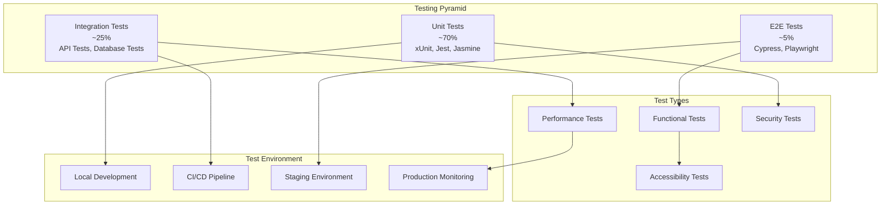

# 09. Testing Strategy

## 9.1 Testing Pyramid Implementation

DanHQ follows the testing pyramid methodology with comprehensive coverage across unit, integration, and end-to-end tests to ensure reliability and maintainability.

### 9.1.1 Testing Pyramid Overview



### 9.1.2 Test Coverage Goals

| Test Type | Coverage Target | Tool | Frequency |
|-----------|----------------|------|-----------|
| **Unit Tests** | 80%+ | xUnit (.NET), Jest (Angular) | Every commit |
| **Integration Tests** | 70%+ | TestContainers, WebApplicationFactory | Every commit |
| **API Tests** | 90%+ | Postman/Newman, RestSharp | Every build |
| **E2E Tests** | Critical paths | Cypress, Playwright | Every deployment |
| **Performance Tests** | Key endpoints | k6, NBomber | Nightly/Weekly |
| **Security Tests** | Full application | OWASP ZAP, SonarQube | Weekly |

## 9.2 Backend Testing (.NET Core)

### 9.2.1 Unit Testing Framework

```csharp
// Tests/DanHQ.Application.Tests/TestCases/CreateTestCaseCommandHandlerTests.cs
public class CreateTestCaseCommandHandlerTests
{
    private readonly Mock<IDanHQDbContext> _mockContext;
    private readonly Mock<ICurrentUserService> _mockCurrentUserService;
    private readonly Mock<IAuthorizationService> _mockAuthorizationService;
    private readonly CreateTestCaseCommandHandler _handler;

    public CreateTestCaseCommandHandlerTests()
    {
        _mockContext = new Mock<IDanHQDbContext>();
        _mockCurrentUserService = new Mock<ICurrentUserService>();
        _mockAuthorizationService = new Mock<IAuthorizationService>();
        
        _handler = new CreateTestCaseCommandHandler(
            _mockContext.Object,
            _mockCurrentUserService.Object,
            _mockAuthorizationService.Object);
    }

    [Fact]
    public async Task Handle_ValidRequest_ShouldCreateTestCase()
    {
        // Arrange
        var command = new CreateTestCaseCommand
        {
            TestSuiteId = 1,
            Title = "Test Login Functionality",
            Description = "Verify user can login with valid credentials",
            Priority = "High",
            Type = "Manual",
            Steps = new List<CreateTestStepDto>
            {
                new() { StepNumber = 1, Action = "Navigate to login page", ExpectedResult = "Login form displayed" },
                new() { StepNumber = 2, Action = "Enter valid credentials", ExpectedResult = "User logged in successfully" }
            }
        };

        var testSuite = new TestSuite { Id = 1, ProjectId = 1, Name = "Authentication Tests" };
        var mockTestSuites = new List<TestSuite> { testSuite }.AsQueryable().BuildMockDbSet();
        var mockTestCases = new List<TestCase>().AsQueryable().BuildMockDbSet();

        _mockContext.Setup(x => x.TestSuites).Returns(mockTestSuites.Object);
        _mockContext.Setup(x => x.TestCases).Returns(mockTestCases.Object);
        _mockCurrentUserService.Setup(x => x.UserId).Returns(1);

        // Setup authorization to return success
        _mockAuthorizationService
            .Setup(x => x.AuthorizeAsync(It.IsAny<ClaimsPrincipal>(), It.IsAny<object>(), It.IsAny<string>()))
            .ReturnsAsync(AuthorizationResult.Success());

        // Act
        var result = await _handler.Handle(command, CancellationToken.None);

        // Assert
        result.Should().NotBeNull();
        result.Id.Should().BeGreaterThan(0);
        result.Title.Should().Be(command.Title);
        result.Description.Should().Be(command.Description);
        result.Priority.Should().Be(command.Priority);
        result.Type.Should().Be(command.Type);
        result.Steps.Should().HaveCount(2);

        _mockContext.Verify(x => x.SaveChangesAsync(It.IsAny<CancellationToken>()), Times.Once);
    }

    [Fact]
    public async Task Handle_InvalidTestSuite_ShouldThrowNotFoundException()
    {
        // Arrange
        var command = new CreateTestCaseCommand
        {
            TestSuiteId = 999,
            Title = "Test Case",
            Priority = "Medium",
            Type = "Manual"
        };

        var mockTestSuites = new List<TestSuite>().AsQueryable().BuildMockDbSet();
        _mockContext.Setup(x => x.TestSuites).Returns(mockTestSuites.Object);

        // Act & Assert
        await Assert.ThrowsAsync<NotFoundException>(() => 
            _handler.Handle(command, CancellationToken.None));
    }

    [Theory]
    [InlineData("")]
    [InlineData(null)]
    [InlineData("ab")] // Too short
    public async Task Handle_InvalidTitle_ShouldThrowValidationException(string title)
    {
        // Arrange
        var command = new CreateTestCaseCommand
        {
            TestSuiteId = 1,
            Title = title,
            Priority = "Medium",
            Type = "Manual"
        };

        // Act & Assert
        await Assert.ThrowsAsync<ValidationException>(() => 
            _handler.Handle(command, CancellationToken.None));
    }

    [Fact]
    public async Task Handle_UnauthorizedUser_ShouldThrowForbiddenException()
    {
        // Arrange
        var command = new CreateTestCaseCommand
        {
            TestSuiteId = 1,
            Title = "Test Case",
            Priority = "Medium",
            Type = "Manual"
        };

        var testSuite = new TestSuite { Id = 1, ProjectId = 1 };
        var mockTestSuites = new List<TestSuite> { testSuite }.AsQueryable().BuildMockDbSet();
        _mockContext.Setup(x => x.TestSuites).Returns(mockTestSuites.Object);

        // Setup authorization to return failure
        _mockAuthorizationService
            .Setup(x => x.AuthorizeAsync(It.IsAny<ClaimsPrincipal>(), It.IsAny<object>(), It.IsAny<string>()))
            .ReturnsAsync(AuthorizationResult.Failed());

        // Act & Assert
        await Assert.ThrowsAsync<ForbiddenAccessException>(() => 
            _handler.Handle(command, CancellationToken.None));
    }
}
```

### 9.2.2 Integration Testing with TestContainers

```csharp
// Tests/DanHQ.API.IntegrationTests/TestCases/TestCasesControllerTests.cs
public class TestCasesControllerTests : IntegrationTestBase
{
    public TestCasesControllerTests(IntegrationTestWebApplicationFactory factory) : base(factory)
    {
    }

    [Fact]
    public async Task CreateTestCase_ValidRequest_ShouldReturnCreatedTestCase()
    {
        // Arrange
        await AuthenticateAsTestManagerAsync();
        
        var project = await CreateTestProjectAsync();
        var testSuite = await CreateTestSuiteAsync(project.Id);
        
        var request = new CreateTestCaseRequest
        {
            TestSuiteId = testSuite.Id,
            Title = "Test User Registration",
            Description = "Verify user can register with valid information",
            Priority = "High",
            Type = "Manual",
            Steps = new List<CreateTestStepDto>
            {
                new() { StepNumber = 1, Action = "Navigate to registration page", ExpectedResult = "Registration form displayed" },
                new() { StepNumber = 2, Action = "Fill valid information", ExpectedResult = "Form accepts input" },
                new() { StepNumber = 3, Action = "Click Register button", ExpectedResult = "User registered successfully" }
            }
        };

        // Act
        var response = await Client.PostAsJsonAsync($"/api/v1/projects/{project.Id}/testcases", request);

        // Assert
        response.StatusCode.Should().Be(HttpStatusCode.Created);
        
        var result = await response.Content.ReadFromJsonAsync<ApiResponse<TestCaseDto>>();
        result.Should().NotBeNull();
        result.Success.Should().BeTrue();
        result.Data.Should().NotBeNull();
        result.Data.Title.Should().Be(request.Title);
        result.Data.Description.Should().Be(request.Description);
        result.Data.Priority.Should().Be(request.Priority);
        result.Data.Type.Should().Be(request.Type);
        result.Data.Steps.Should().HaveCount(3);

        // Verify in database
        using var scope = Factory.Services.CreateScope();
        var context = scope.ServiceProvider.GetRequiredService<DanHQDbContext>();
        
        var testCase = await context.TestCases
            .Include(tc => tc.Steps)
            .FirstOrDefaultAsync(tc => tc.Id == result.Data.Id);
            
        testCase.Should().NotBeNull();
        testCase.Title.Should().Be(request.Title);
        testCase.Steps.Should().HaveCount(3);
    }

    [Fact]
    public async Task GetTestCases_WithFilters_ShouldReturnFilteredResults()
    {
        // Arrange
        await AuthenticateAsTestManagerAsync();
        
        var project = await CreateTestProjectAsync();
        var testSuite = await CreateTestSuiteAsync(project.Id);
        
        // Create test cases with different properties
        var testCase1 = await CreateTestCaseAsync(testSuite.Id, "High Priority Test", priority: "High", type: "Manual");
        var testCase2 = await CreateTestCaseAsync(testSuite.Id, "Medium Priority Test", priority: "Medium", type: "Automation");
        var testCase3 = await CreateTestCaseAsync(testSuite.Id, "Another High Priority", priority: "High", type: "Manual");

        // Act - Filter by priority
        var response = await Client.GetAsync($"/api/v1/projects/{project.Id}/testcases?priority=High");

        // Assert
        response.StatusCode.Should().Be(HttpStatusCode.OK);
        
        var result = await response.Content.ReadFromJsonAsync<ApiResponse<PagedResult<TestCaseDto>>>();
        result.Data.Data.Should().HaveCount(2);
        result.Data.Data.All(tc => tc.Priority == "High").Should().BeTrue();
    }

    [Fact]
    public async Task UpdateTestCase_UnauthorizedUser_ShouldReturnForbidden()
    {
        // Arrange
        await AuthenticateAsViewerAsync();
        
        var project = await CreateTestProjectAsync();
        var testSuite = await CreateTestSuiteAsync(project.Id);
        var testCase = await CreateTestCaseAsync(testSuite.Id, "Test Case");
        
        var updateRequest = new UpdateTestCaseRequest
        {
            Title = "Updated Test Case",
            Priority = "Critical"
        };

        // Act
        var response = await Client.PutAsJsonAsync($"/api/v1/testcases/{testCase.Id}", updateRequest);

        // Assert
        response.StatusCode.Should().Be(HttpStatusCode.Forbidden);
    }
}

// Base class for integration tests
public abstract class IntegrationTestBase : IClassFixture<IntegrationTestWebApplicationFactory>
{
    protected readonly IntegrationTestWebApplicationFactory Factory;
    protected readonly HttpClient Client;

    protected IntegrationTestBase(IntegrationTestWebApplicationFactory factory)
    {
        Factory = factory;
        Client = factory.CreateClient();
    }

    protected async Task AuthenticateAsTestManagerAsync()
    {
        var token = await GetJwtTokenAsync("testmanager@test.com", new[] { "TestManager" });
        Client.DefaultRequestHeaders.Authorization = new AuthenticationHeaderValue("Bearer", token);
    }

    protected async Task AuthenticateAsViewerAsync()
    {
        var token = await GetJwtTokenAsync("viewer@test.com", new[] { "Viewer" });
        Client.DefaultRequestHeaders.Authorization = new AuthenticationHeaderValue("Bearer", token);
    }

    private async Task<string> GetJwtTokenAsync(string email, string[] roles)
    {
        using var scope = Factory.Services.CreateScope();
        var jwtService = scope.ServiceProvider.GetRequiredService<JwtTokenService>();
        
        var user = new User
        {
            Id = 1,
            Email = email,
            DisplayName = "Test User",
            IsActive = true
        };

        var projectMemberships = roles.Select(role => new ProjectMember
        {
            ProjectId = 1,
            UserId = 1,
            Role = role,
            IsActive = true
        }).ToList();

        var tokens = jwtService.GenerateTokens(user, projectMemberships);
        return tokens.AccessToken;
    }
}

// Custom WebApplicationFactory for integration tests
public class IntegrationTestWebApplicationFactory : WebApplicationFactory<Program>
{
    private readonly PostgreSqlContainer _postgresContainer;
    private readonly RedisContainer _redisContainer;

    public IntegrationTestWebApplicationFactory()
    {
        _postgresContainer = new PostgreSqlBuilder()
            .WithImage("postgres:15-alpine")
            .WithDatabase("danhq_test")
            .WithUsername("test_user")
            .WithPassword("test_password")
            .Build();

        _redisContainer = new RedisBuilder()
            .WithImage("redis:7-alpine")
            .Build();
    }

    protected override void ConfigureWebHost(IWebHostBuilder builder)
    {
        builder.ConfigureTestServices(services =>
        {
            // Remove the app DbContext registration
            var descriptor = services.SingleOrDefault(d => d.ServiceType == typeof(DbContextOptions<DanHQDbContext>));
            if (descriptor != null)
            {
                services.Remove(descriptor);
            }

            // Add DbContext using test container
            services.AddDbContext<DanHQDbContext>(options =>
            {
                options.UseNpgsql(_postgresContainer.GetConnectionString());
            });

            // Configure Redis for testing
            services.Configure<RedisOptions>(options =>
            {
                options.Configuration = _redisContainer.GetConnectionString();
            });

            // Disable external services
            services.Configure<OpenAIOptions>(options =>
            {
                options.ApiKey = "test-key";
                options.BaseUrl = "https://api.openai.com/v1/";
            });
        });

        builder.UseEnvironment("Testing");
    }

    public async Task InitializeAsync()
    {
        await _postgresContainer.StartAsync();
        await _redisContainer.StartAsync();

        // Run database migrations
        using var scope = Services.CreateScope();
        var context = scope.ServiceProvider.GetRequiredService<DanHQDbContext>();
        await context.Database.MigrateAsync();
    }

    public new async Task DisposeAsync()
    {
        await _postgresContainer.DisposeAsync();
        await _redisContainer.DisposeAsync();
        await base.DisposeAsync();
    }
}
```

### 9.2.3 Repository Testing

```csharp
// Tests/DanHQ.Infrastructure.Tests/Repositories/TestCaseRepositoryTests.cs
public class TestCaseRepositoryTests : RepositoryTestBase
{
    private readonly TestCaseRepository _repository;

    public TestCaseRepositoryTests()
    {
        _repository = new TestCaseRepository(Context);
    }

    [Fact]
    public async Task GetTestCasesAsync_WithFilters_ShouldReturnCorrectResults()
    {
        // Arrange
        var project = await SeedProjectAsync();
        var testSuite = await SeedTestSuiteAsync(project.Id);
        
        var testCase1 = await SeedTestCaseAsync(testSuite.Id, "Login Test", "High", "Manual");
        var testCase2 = await SeedTestCaseAsync(testSuite.Id, "Logout Test", "Medium", "Automation");
        var testCase3 = await SeedTestCaseAsync(testSuite.Id, "Password Reset", "High", "Manual");

        var filters = new TestCaseFilters
        {
            TestSuiteId = testSuite.Id,
            Priority = new[] { "High" },
            Type = "Manual"
        };

        // Act
        var result = await _repository.GetTestCasesAsync(filters, 1, 10);

        // Assert
        result.Items.Should().HaveCount(2);
        result.Items.All(tc => tc.Priority == "High" && tc.Type == "Manual").Should().BeTrue();
        result.TotalCount.Should().Be(2);
    }

    [Fact]
    public async Task GetTestCaseWithStepsAsync_ShouldIncludeSteps()
    {
        // Arrange
        var project = await SeedProjectAsync();
        var testSuite = await SeedTestSuiteAsync(project.Id);
        var testCase = await SeedTestCaseAsync(testSuite.Id, "Test with Steps");
        
        await SeedTestStepAsync(testCase.Id, 1, "First step", "Expected result 1");
        await SeedTestStepAsync(testCase.Id, 2, "Second step", "Expected result 2");

        // Act
        var result = await _repository.GetTestCaseWithStepsAsync(testCase.Id);

        // Assert
        result.Should().NotBeNull();
        result.Steps.Should().HaveCount(2);
        result.Steps.Should().BeInAscendingOrder(s => s.StepNumber);
    }

    [Theory]
    [InlineData("login", 1)]
    [InlineData("test", 3)]
    [InlineData("api", 0)]
    public async Task SearchTestCasesAsync_ShouldReturnMatchingResults(string searchTerm, int expectedCount)
    {
        // Arrange
        var project = await SeedProjectAsync();
        var testSuite = await SeedTestSuiteAsync(project.Id);
        
        await SeedTestCaseAsync(testSuite.Id, "Login functionality test");
        await SeedTestCaseAsync(testSuite.Id, "User registration test");
        await SeedTestCaseAsync(testSuite.Id, "Password reset test");

        // Act
        var result = await _repository.SearchTestCasesAsync(project.Id, searchTerm);

        // Assert
        result.Should().HaveCount(expectedCount);
    }
}

// Base class for repository tests
public abstract class RepositoryTestBase : IDisposable
{
    protected readonly DanHQDbContext Context;

    protected RepositoryTestBase()
    {
        var options = new DbContextOptionsBuilder<DanHQDbContext>()
            .UseInMemoryDatabase(databaseName: Guid.NewGuid().ToString())
            .EnableSensitiveDataLogging()
            .Options;

        Context = new DanHQDbContext(options);
        Context.Database.EnsureCreated();
    }

    protected async Task<Project> SeedProjectAsync(string name = "Test Project")
    {
        var project = new Project
        {
            Name = name,
            Key = "TEST",
            Description = "Test project for unit tests",
            CreatedBy = 1,
            CreatedAt = DateTime.UtcNow
        };

        Context.Projects.Add(project);
        await Context.SaveChangesAsync();
        return project;
    }

    protected async Task<TestSuite> SeedTestSuiteAsync(int projectId, string name = "Test Suite")
    {
        var testSuite = new TestSuite
        {
            ProjectId = projectId,
            Name = name,
            Description = "Test suite for unit tests",
            CreatedBy = 1,
            CreatedAt = DateTime.UtcNow
        };

        Context.TestSuites.Add(testSuite);
        await Context.SaveChangesAsync();
        return testSuite;
    }

    protected async Task<TestCase> SeedTestCaseAsync(int testSuiteId, string title, string priority = "Medium", string type = "Manual")
    {
        var testCase = new TestCase
        {
            TestSuiteId = testSuiteId,
            Title = title,
            Description = "Test case description",
            Priority = priority,
            Type = type,
            Status = "Ready",
            CreatedBy = 1,
            UpdatedBy = 1,
            CreatedAt = DateTime.UtcNow,
            UpdatedAt = DateTime.UtcNow
        };

        Context.TestCases.Add(testCase);
        await Context.SaveChangesAsync();
        return testCase;
    }

    public void Dispose()
    {
        Context.Dispose();
    }
}
```

## 9.3 Frontend Testing (Angular)

### 9.3.1 Unit Testing with Jest

```typescript
// Frontend/src/app/features/test-cases/components/test-case-form/test-case-form.component.spec.ts
describe('TestCaseFormComponent', () => {
  let component: TestCaseFormComponent;
  let fixture: ComponentFixture<TestCaseFormComponent>;
  let mockTestCaseService: jasmine.SpyObj<TestCaseService>;
  let mockStore: jasmine.SpyObj<Store>;

  beforeEach(async () => {
    const testCaseServiceSpy = jasmine.createSpyObj('TestCaseService', ['createTestCase', 'updateTestCase']);
    const storeSpy = jasmine.createSpyObj('Store', ['select', 'dispatch']);

    await TestBed.configureTestingModule({
      declarations: [TestCaseFormComponent],
      imports: [
        ReactiveFormsModule,
        MaterialModule,
        NoopAnimationsModule
      ],
      providers: [
        { provide: TestCaseService, useValue: testCaseServiceSpy },
        { provide: Store, useValue: storeSpy }
      ]
    }).compileComponents();

    fixture = TestBed.createComponent(TestCaseFormComponent);
    component = fixture.componentInstance;
    mockTestCaseService = TestBed.inject(TestCaseService) as jasmine.SpyObj<TestCaseService>;
    mockStore = TestBed.inject(Store) as jasmine.SpyObj<Store>;
  });

  describe('Form Validation', () => {
    it('should create form with required validators', () => {
      component.ngOnInit();

      expect(component.testCaseForm.get('title')?.hasError('required')).toBeTruthy();
      expect(component.testCaseForm.get('priority')?.hasError('required')).toBeTruthy();
      expect(component.testCaseForm.get('type')?.hasError('required')).toBeTruthy();
    });

    it('should validate title minimum length', () => {
      component.ngOnInit();
      const titleControl = component.testCaseForm.get('title');

      titleControl?.setValue('ab');
      expect(titleControl?.hasError('minlength')).toBeTruthy();

      titleControl?.setValue('Valid Title');
      expect(titleControl?.hasError('minlength')).toBeFalsy();
    });

    it('should validate title maximum length', () => {
      component.ngOnInit();
      const titleControl = component.testCaseForm.get('title');
      const longTitle = 'a'.repeat(256);

      titleControl?.setValue(longTitle);
      expect(titleControl?.hasError('maxlength')).toBeTruthy();
    });

    it('should add step to form array', () => {
      component.ngOnInit();
      const initialStepCount = component.steps.length;

      component.addStep();

      expect(component.steps.length).toBe(initialStepCount + 1);
      expect(component.steps.at(-1).get('stepNumber')?.value).toBe(initialStepCount + 1);
    });

    it('should remove step from form array', () => {
      component.ngOnInit();
      component.addStep();
      component.addStep();
      const initialStepCount = component.steps.length;

      component.removeStep(0);

      expect(component.steps.length).toBe(initialStepCount - 1);
    });
  });

  describe('Form Submission', () => {
    beforeEach(() => {
      component.ngOnInit();
      // Setup valid form
      component.testCaseForm.patchValue({
        title: 'Test Login Functionality',
        description: 'Verify user can login',
        priority: 'High',
        type: 'Manual',
        tags: ['authentication', 'login']
      });
      component.addStep();
      component.steps.at(0).patchValue({
        action: 'Navigate to login page',
        expectedResult: 'Login form displayed'
      });
    });

    it('should call createTestCase when form is valid and no testCase input', () => {
      mockTestCaseService.createTestCase.and.returnValue(of({
        success: true,
        data: { id: 1 } as TestCaseDto
      }));

      component.onSubmit();

      expect(mockTestCaseService.createTestCase).toHaveBeenCalledWith(
        jasmine.objectContaining({
          title: 'Test Login Functionality',
          description: 'Verify user can login',
          priority: 'High',
          type: 'Manual'
        })
      );
    });

    it('should call updateTestCase when form is valid and testCase input exists', () => {
      component.testCase = { id: 1, title: 'Existing Test Case' } as TestCaseDto;
      mockTestCaseService.updateTestCase.and.returnValue(of({
        success: true,
        data: { id: 1 } as TestCaseDto
      }));

      component.onSubmit();

      expect(mockTestCaseService.updateTestCase).toHaveBeenCalledWith(
        1,
        jasmine.objectContaining({
          title: 'Test Login Functionality',
          description: 'Verify user can login',
          priority: 'High',
          type: 'Manual'
        })
      );
    });

    it('should not submit when form is invalid', () => {
      component.testCaseForm.get('title')?.setValue('');

      component.onSubmit();

      expect(mockTestCaseService.createTestCase).not.toHaveBeenCalled();
      expect(mockTestCaseService.updateTestCase).not.toHaveBeenCalled();
    });

    it('should emit saved event on successful submission', () => {
      spyOn(component.saved, 'emit');
      mockTestCaseService.createTestCase.and.returnValue(of({
        success: true,
        data: { id: 1 } as TestCaseDto
      }));

      component.onSubmit();

      expect(component.saved.emit).toHaveBeenCalledWith({ id: 1 } as TestCaseDto);
    });

    it('should show error message on submission failure', () => {
      mockTestCaseService.createTestCase.and.returnValue(
        throwError(() => new Error('Network error'))
      );
      spyOn(component, 'showErrorMessage');

      component.onSubmit();

      expect(component.showErrorMessage).toHaveBeenCalledWith('Failed to save test case');
    });
  });

  describe('Accessibility', () => {
    it('should have proper ARIA labels', () => {
      component.ngOnInit();
      fixture.detectChanges();

      const titleInput = fixture.debugElement.query(By.css('input[formControlName="title"]'));
      const prioritySelect = fixture.debugElement.query(By.css('mat-select[formControlName="priority"]'));

      expect(titleInput.nativeElement.getAttribute('aria-label')).toBe('Test case title');
      expect(prioritySelect.nativeElement.getAttribute('aria-label')).toBe('Test case priority');
    });

    it('should associate error messages with form controls', () => {
      component.ngOnInit();
      component.testCaseForm.get('title')?.setValue('');
      component.testCaseForm.get('title')?.markAsTouched();
      fixture.detectChanges();

      const titleInput = fixture.debugElement.query(By.css('input[formControlName="title"]'));
      const errorMessage = fixture.debugElement.query(By.css('mat-error'));

      expect(titleInput.nativeElement.getAttribute('aria-describedby')).toContain('title-error');
      expect(errorMessage.nativeElement.id).toBe('title-error');
    });
  });
});
```

### 9.3.2 Integration Testing with Angular Testing Library

```typescript
// Frontend/src/app/features/test-cases/containers/test-cases-container/test-cases-container.component.integration.spec.ts
import { render, screen, fireEvent, waitFor } from '@testing-library/angular';
import { MockStore, provideMockStore } from '@ngrx/store/testing';
import { TestCasesContainerComponent } from './test-cases-container.component';
import { TestCaseActions } from '../../store/test-case.actions';

describe('TestCasesContainerComponent Integration', () => {
  let store: MockStore;
  const initialState = {
    testCases: {
      testCases: [],
      selectedTestCase: null,
      loading: false,
      error: null,
      pagination: {
        page: 1,
        pageSize: 20,
        totalItems: 0,
        totalPages: 0
      }
    },
    projects: {
      selectedProject: {
        id: 1,
        name: 'Test Project',
        key: 'TEST'
      }
    }
  };

  beforeEach(async () => {
    await render(TestCasesContainerComponent, {
      providers: [
        provideMockStore({ initialState })
      ],
      imports: [
        // Required modules
      ]
    });

    store = TestBed.inject(MockStore);
    spyOn(store, 'dispatch');
  });

  it('should load test cases on component initialization', async () => {
    expect(store.dispatch).toHaveBeenCalledWith(
      TestCaseActions.loadTestCases({ projectId: 1 })
    );
  });

  it('should display test cases when loaded', async () => {
    const testCases = [
      {
        id: 1,
        title: 'Test Login',
        description: 'Test user login functionality',
        priority: 'High',
        type: 'Manual',
        status: 'Ready'
      },
      {
        id: 2,
        title: 'Test Registration',
        description: 'Test user registration',
        priority: 'Medium',
        type: 'Automation',
        status: 'Draft'
      }
    ];

    store.setState({
      ...initialState,
      testCases: {
        ...initialState.testCases,
        testCases
      }
    });

    await waitFor(() => {
      expect(screen.getByText('Test Login')).toBeInTheDocument();
      expect(screen.getByText('Test Registration')).toBeInTheDocument();
    });
  });

  it('should open create test case dialog when create button is clicked', async () => {
    const createButton = screen.getByRole('button', { name: /create test case/i });
    
    fireEvent.click(createButton);

    await waitFor(() => {
      expect(screen.getByRole('dialog')).toBeInTheDocument();
      expect(screen.getByText('Create Test Case')).toBeInTheDocument();
    });
  });

  it('should filter test cases when filter is applied', async () => {
    const priorityFilter = screen.getByRole('combobox', { name: /priority/i });
    
    fireEvent.click(priorityFilter);
    const highPriorityOption = screen.getByRole('option', { name: /high/i });
    fireEvent.click(highPriorityOption);

    expect(store.dispatch).toHaveBeenCalledWith(
      TestCaseActions.setFilters({
        filters: { priority: ['High'] }
      })
    );
  });

  it('should select test case when clicked', async () => {
    const testCases = [
      {
        id: 1,
        title: 'Test Login',
        priority: 'High',
        type: 'Manual',
        status: 'Ready'
      }
    ];

    store.setState({
      ...initialState,
      testCases: {
        ...initialState.testCases,
        testCases
      }
    });

    await waitFor(() => {
      const testCaseCard = screen.getByText('Test Login');
      fireEvent.click(testCaseCard);
    });

    expect(store.dispatch).toHaveBeenCalledWith(
      TestCaseActions.selectTestCase({ testCaseId: 1 })
    );
  });

  it('should show loading state', async () => {
    store.setState({
      ...initialState,
      testCases: {
        ...initialState.testCases,
        loading: true
      }
    });

    await waitFor(() => {
      expect(screen.getByRole('progressbar')).toBeInTheDocument();
    });
  });

  it('should show error message when error occurs', async () => {
    store.setState({
      ...initialState,
      testCases: {
        ...initialState.testCases,
        error: 'Failed to load test cases'
      }
    });

    await waitFor(() => {
      expect(screen.getByText('Failed to load test cases')).toBeInTheDocument();
    });
  });
});
```

## 9.4 End-to-End Testing

### 9.4.1 Cypress E2E Tests

```typescript
// Frontend/cypress/e2e/test-case-management.cy.ts
describe('Test Case Management', () => {
  beforeEach(() => {
    cy.login('testmanager@example.com', 'password123');
    cy.visit('/projects/1/test-cases');
  });

  describe('Test Case Creation', () => {
    it('should create a new test case successfully', () => {
      cy.get('[data-cy=create-test-case-btn]').click();
      
      // Fill in test case form
      cy.get('[data-cy=test-case-title]').type('Test User Authentication');
      cy.get('[data-cy=test-case-description]').type('Verify user can authenticate with valid credentials');
      cy.get('[data-cy=test-case-priority]').click();
      cy.get('[data-cy=priority-high]').click();
      cy.get('[data-cy=test-case-type]').click();
      cy.get('[data-cy=type-manual]').click();
      
      // Add test steps
      cy.get('[data-cy=add-step-btn]').click();
      cy.get('[data-cy=step-action-0]').type('Navigate to login page');
      cy.get('[data-cy=step-expected-0]').type('Login form is displayed');
      
      cy.get('[data-cy=add-step-btn]').click();
      cy.get('[data-cy=step-action-1]').type('Enter valid username and password');
      cy.get('[data-cy=step-expected-1]').type('User is logged in successfully');
      
      // Submit form
      cy.get('[data-cy=save-test-case-btn]').click();
      
      // Verify success
      cy.get('[data-cy=success-message]').should('contain', 'Test case created successfully');
      cy.get('[data-cy=test-case-list]').should('contain', 'Test User Authentication');
    });

    it('should validate required fields', () => {
      cy.get('[data-cy=create-test-case-btn]').click();
      cy.get('[data-cy=save-test-case-btn]').click();
      
      cy.get('[data-cy=title-error]').should('contain', 'Title is required');
      cy.get('[data-cy=priority-error]').should('contain', 'Priority is required');
      cy.get('[data-cy=type-error]').should('contain', 'Type is required');
    });

    it('should validate title length', () => {
      cy.get('[data-cy=create-test-case-btn]').click();
      cy.get('[data-cy=test-case-title]').type('ab');
      cy.get('[data-cy=save-test-case-btn]').click();
      
      cy.get('[data-cy=title-error]').should('contain', 'Title must be at least 5 characters');
    });
  });

  describe('Test Case Filtering', () => {
    beforeEach(() => {
      // Seed test data
      cy.seedTestCases([
        { title: 'High Priority Test', priority: 'High', type: 'Manual', status: 'Ready' },
        { title: 'Medium Priority Test', priority: 'Medium', type: 'Automation', status: 'Draft' },
        { title: 'Low Priority Test', priority: 'Low', type: 'Manual', status: 'Approved' }
      ]);
    });

    it('should filter by priority', () => {
      cy.get('[data-cy=priority-filter]').click();
      cy.get('[data-cy=priority-high]').click();
      
      cy.get('[data-cy=test-case-list]').should('contain', 'High Priority Test');
      cy.get('[data-cy=test-case-list]').should('not.contain', 'Medium Priority Test');
      cy.get('[data-cy=test-case-list]').should('not.contain', 'Low Priority Test');
    });

    it('should filter by type', () => {
      cy.get('[data-cy=type-filter]').click();
      cy.get('[data-cy=type-automation]').click();
      
      cy.get('[data-cy=test-case-list]').should('contain', 'Medium Priority Test');
      cy.get('[data-cy=test-case-list]').should('not.contain', 'High Priority Test');
      cy.get('[data-cy=test-case-list]').should('not.contain', 'Low Priority Test');
    });

    it('should search by title', () => {
      cy.get('[data-cy=search-input]').type('High Priority');
      
      cy.get('[data-cy=test-case-list]').should('contain', 'High Priority Test');
      cy.get('[data-cy=test-case-list]').should('not.contain', 'Medium Priority Test');
      cy.get('[data-cy=test-case-list]').should('not.contain', 'Low Priority Test');
    });

    it('should combine multiple filters', () => {
      cy.get('[data-cy=priority-filter]').click();
      cy.get('[data-cy=priority-medium]').click();
      cy.get('[data-cy=priority-low]').click();
      
      cy.get('[data-cy=type-filter]').click();
      cy.get('[data-cy=type-manual]').click();
      
      cy.get('[data-cy=test-case-list]').should('contain', 'Low Priority Test');
      cy.get('[data-cy=test-case-list]').should('not.contain', 'High Priority Test');
      cy.get('[data-cy=test-case-list]').should('not.contain', 'Medium Priority Test');
    });
  });

  describe('Test Case Execution', () => {
    beforeEach(() => {
      cy.seedTestCase({
        id: 1,
        title: 'Login Test',
        steps: [
          { stepNumber: 1, action: 'Open login page', expectedResult: 'Login form displayed' },
          { stepNumber: 2, action: 'Enter credentials', expectedResult: 'User logged in' }
        ]
      });
    });

    it('should execute test case and record results', () => {
      cy.get('[data-cy=test-case-1]').click();
      cy.get('[data-cy=execute-test-btn]').click();
      
      // Execute step 1
      cy.get('[data-cy=step-1-status]').click();
      cy.get('[data-cy=status-passed]').click();
      cy.get('[data-cy=step-1-actual]').type('Login form displayed correctly');
      
      // Execute step 2
      cy.get('[data-cy=step-2-status]').click();
      cy.get('[data-cy=status-passed]').click();
      cy.get('[data-cy=step-2-actual]').type('User logged in successfully');
      
      // Complete execution
      cy.get('[data-cy=complete-execution-btn]').click();
      cy.get('[data-cy=execution-notes]').type('Test executed successfully in Chrome browser');
      cy.get('[data-cy=save-execution-btn]').click();
      
      // Verify execution recorded
      cy.get('[data-cy=success-message]').should('contain', 'Test execution completed');
      cy.get('[data-cy=execution-status]').should('contain', 'Passed');
    });

    it('should handle test failure with evidence upload', () => {
      cy.get('[data-cy=test-case-1]').click();
      cy.get('[data-cy=execute-test-btn]').click();
      
      // Execute step 1 - pass
      cy.get('[data-cy=step-1-status]').click();
      cy.get('[data-cy=status-passed]').click();
      
      // Execute step 2 - fail
      cy.get('[data-cy=step-2-status]').click();
      cy.get('[data-cy=status-failed]').click();
      cy.get('[data-cy=step-2-actual]').type('Error message displayed instead of successful login');
      
      // Upload evidence
      cy.get('[data-cy=upload-evidence]').selectFile('cypress/fixtures/error-screenshot.png');
      
      // Complete execution
      cy.get('[data-cy=complete-execution-btn]').click();
      cy.get('[data-cy=execution-notes]').type('Login failed due to server error');
      cy.get('[data-cy=save-execution-btn]').click();
      
      // Verify execution recorded
      cy.get('[data-cy=execution-status]').should('contain', 'Failed');
      cy.get('[data-cy=evidence-list]').should('contain', 'error-screenshot.png');
    });
  });

  describe('Accessibility', () => {
    it('should be keyboard accessible', () => {
      cy.get('body').tab();
      cy.focused().should('have.attr', 'data-cy', 'create-test-case-btn');
      
      cy.focused().tab();
      cy.focused().should('have.attr', 'data-cy', 'search-input');
      
      cy.focused().tab();
      cy.focused().should('have.attr', 'data-cy', 'priority-filter');
    });

    it('should have proper ARIA labels', () => {
      cy.get('[data-cy=search-input]').should('have.attr', 'aria-label', 'Search test cases');
      cy.get('[data-cy=priority-filter]').should('have.attr', 'aria-label', 'Filter by priority');
      cy.get('[data-cy=type-filter]').should('have.attr', 'aria-label', 'Filter by type');
    });

    it('should announce loading states to screen readers', () => {
      cy.get('[data-cy=loading-indicator]').should('have.attr', 'aria-live', 'polite');
      cy.get('[data-cy=loading-indicator]').should('have.attr', 'aria-label', 'Loading test cases');
    });
  });
});

// Cypress custom commands
// Frontend/cypress/support/commands.ts
declare global {
  namespace Cypress {
    interface Chainable {
      login(email: string, password: string): Chainable<void>;
      seedTestCases(testCases: any[]): Chainable<void>;
      seedTestCase(testCase: any): Chainable<void>;
    }
  }
}

Cypress.Commands.add('login', (email: string, password: string) => {
  cy.request({
    method: 'POST',
    url: '/api/v1/auth/login',
    body: {
      email,
      password
    }
  }).then((response) => {
    const { accessToken } = response.body.data;
    cy.window().then((window) => {
      window.localStorage.setItem('accessToken', accessToken);
    });
  });
});

Cypress.Commands.add('seedTestCases', (testCases: any[]) => {
  testCases.forEach((testCase, index) => {
    cy.request({
      method: 'POST',
      url: '/api/v1/projects/1/testcases',
      headers: {
        Authorization: `Bearer ${Cypress.env('accessToken')}`
      },
      body: testCase
    });
  });
});
```

### 9.4.2 Playwright E2E Tests

```typescript
// Frontend/tests/e2e/test-case-management.spec.ts
import { test, expect } from '@playwright/test';

test.describe('Test Case Management', () => {
  test.beforeEach(async ({ page }) => {
    await page.goto('/login');
    await page.fill('[data-testid=email]', 'testmanager@example.com');
    await page.fill('[data-testid=password]', 'password123');
    await page.click('[data-testid=login-btn]');
    await page.waitForURL('/dashboard');
    
    await page.goto('/projects/1/test-cases');
  });

  test('should create test case with multiple steps', async ({ page }) => {
    await page.click('[data-testid=create-test-case-btn]');
    
    // Fill basic information
    await page.fill('[data-testid=test-case-title]', 'Complete Registration Flow');
    await page.fill('[data-testid=test-case-description]', 'Test the complete user registration process');
    await page.selectOption('[data-testid=test-case-priority]', 'High');
    await page.selectOption('[data-testid=test-case-type]', 'Manual');
    
    // Add multiple test steps
    const steps = [
      { action: 'Navigate to registration page', expected: 'Registration form is displayed' },
      { action: 'Fill in user details', expected: 'Form accepts valid input' },
      { action: 'Accept terms and conditions', expected: 'Checkbox is checked' },
      { action: 'Click register button', expected: 'User account is created' },
      { action: 'Verify email confirmation', expected: 'Confirmation email is sent' }
    ];
    
    for (let i = 0; i < steps.length; i++) {
      await page.click('[data-testid=add-step-btn]');
      await page.fill(`[data-testid=step-action-${i}]`, steps[i].action);
      await page.fill(`[data-testid=step-expected-${i}]`, steps[i].expected);
    }
    
    // Add tags
    await page.fill('[data-testid=tags-input]', 'registration, user-management, authentication');
    
    // Save test case
    await page.click('[data-testid=save-test-case-btn]');
    
    // Verify creation
    await expect(page.locator('[data-testid=success-message]')).toContainText('Test case created successfully');
    await expect(page.locator('[data-testid=test-case-list]')).toContainText('Complete Registration Flow');
  });

  test('should handle network errors gracefully', async ({ page }) => {
    // Simulate network failure
    await page.route('/api/v1/projects/1/testcases', (route) => {
      route.abort('failed');
    });
    
    await page.click('[data-testid=create-test-case-btn]');
    await page.fill('[data-testid=test-case-title]', 'Test Case');
    await page.selectOption('[data-testid=test-case-priority]', 'Medium');
    await page.selectOption('[data-testid=test-case-type]', 'Manual');
    await page.click('[data-testid=save-test-case-btn]');
    
    // Verify error handling
    await expect(page.locator('[data-testid=error-message]')).toContainText('Failed to save test case');
  });

  test('should support bulk operations', async ({ page }) => {
    // Select multiple test cases
    await page.check('[data-testid=select-test-case-1]');
    await page.check('[data-testid=select-test-case-2]');
    await page.check('[data-testid=select-test-case-3]');
    
    // Perform bulk action
    await page.click('[data-testid=bulk-actions-btn]');
    await page.click('[data-testid=bulk-update-priority]');
    await page.selectOption('[data-testid=bulk-priority-select]', 'Critical');
    await page.click('[data-testid=apply-bulk-action]');
    
    // Verify update
    await expect(page.locator('[data-testid=success-message]')).toContainText('3 test cases updated successfully');
  });

  test('should export test cases to Excel', async ({ page }) => {
    const downloadPromise = page.waitForEvent('download');
    
    await page.click('[data-testid=export-btn]');
    await page.click('[data-testid=export-excel]');
    
    const download = await downloadPromise;
    expect(download.suggestedFilename()).toMatch(/test-cases.*\.xlsx$/);
  });

  test('should be responsive on mobile devices', async ({ page }) => {
    await page.setViewportSize({ width: 375, height: 667 }); // iPhone SE
    
    // Verify mobile layout
    await expect(page.locator('[data-testid=mobile-menu-btn]')).toBeVisible();
    await expect(page.locator('[data-testid=desktop-sidebar]')).toBeHidden();
    
    // Test mobile navigation
    await page.click('[data-testid=mobile-menu-btn]');
    await expect(page.locator('[data-testid=mobile-menu]')).toBeVisible();
    
    // Test test case creation on mobile
    await page.click('[data-testid=create-test-case-btn]');
    await expect(page.locator('[data-testid=test-case-form]')).toBeVisible();
  });

  test('should handle concurrent users editing', async ({ browser }) => {
    const context1 = await browser.newContext();
    const context2 = await browser.newContext();
    
    const page1 = await context1.newPage();
    const page2 = await context2.newPage();
    
    // Both users navigate to the same test case
    await page1.goto('/projects/1/test-cases/1');
    await page2.goto('/projects/1/test-cases/1');
    
    // User 1 starts editing
    await page1.click('[data-testid=edit-test-case-btn]');
    await page1.fill('[data-testid=test-case-title]', 'Updated by User 1');
    
    // User 2 also tries to edit
    await page2.click('[data-testid=edit-test-case-btn]');
    
    // Verify conflict detection
    await expect(page2.locator('[data-testid=edit-conflict-warning]')).toContainText('Another user is currently editing this test case');
    
    await context1.close();
    await context2.close();
  });
});
```

## 9.5 Performance Testing

### 9.5.1 API Performance Tests with NBomber

```csharp
// Tests/DanHQ.Performance.Tests/TestCaseApiPerformanceTests.cs
public class TestCaseApiPerformanceTests
{
    [Fact]
    public void TestCaseCreation_ShouldHandleHighLoad()
    {
        var scenario = Scenario.Create("create_test_case", async context =>
        {
            var httpClient = new HttpClient();
            
            var request = new CreateTestCaseRequest
            {
                TestSuiteId = 1,
                Title = $"Performance Test Case {context.ScenarioInfo.ThreadId}_{context.InvocationNumber}",
                Description = "Test case created for performance testing",
                Priority = "Medium",
                Type = "Manual",
                Steps = new List<CreateTestStepDto>
                {
                    new() { StepNumber = 1, Action = "Step 1", ExpectedResult = "Result 1" },
                    new() { StepNumber = 2, Action = "Step 2", ExpectedResult = "Result 2" }
                }
            };

            var response = await httpClient.PostAsJsonAsync("http://localhost:5000/api/v1/projects/1/testcases", request);
            
            return response.IsSuccessStatusCode ? Response.Ok() : Response.Fail();
        })
        .WithLoadSimulations(
            Simulation.InjectPerSec(rate: 10, during: TimeSpan.FromMinutes(2))
        );

        NBomberRunner
            .RegisterScenarios(scenario)
            .Run();
    }

    [Fact]
    public void TestCaseRetrieval_ShouldMaintainPerformanceUnderLoad()
    {
        var scenario = Scenario.Create("get_test_cases", async context =>
        {
            var httpClient = new HttpClient();
            
            var response = await httpClient.GetAsync("http://localhost:5000/api/v1/projects/1/testcases?page=1&pageSize=20");
            
            return response.IsSuccessStatusCode ? Response.Ok() : Response.Fail();
        })
        .WithLoadSimulations(
            Simulation.ConstantLoad(copies: 20, during: TimeSpan.FromMinutes(5))
        );

        var stats = NBomberRunner
            .RegisterScenarios(scenario)
            .Run();

        // Assert performance requirements
        var scnStats = stats.AllScenarios[0];
        Assert.True(scnStats.Ok.Response.Mean < 500); // Mean response time < 500ms
        Assert.True(scnStats.Ok.Response.Percentile95 < 1000); // 95th percentile < 1s
        Assert.True(scnStats.AllFailCount == 0); // No failures
    }
}
```

### 9.5.2 Frontend Performance Tests with k6

```javascript
// Frontend/tests/performance/api-load-test.js
import http from 'k6/http';
import { check, sleep } from 'k6';
import { Rate } from 'k6/metrics';

const errorRate = new Rate('errors');

export const options = {
  stages: [
    { duration: '1m', target: 10 }, // Ramp up to 10 users
    { duration: '3m', target: 50 }, // Stay at 50 users
    { duration: '1m', target: 100 }, // Ramp up to 100 users
    { duration: '5m', target: 100 }, // Stay at 100 users
    { duration: '2m', target: 0 }, // Ramp down to 0 users
  ],
  thresholds: {
    http_req_duration: ['p(95)<1000'], // 95% of requests must complete below 1s
    http_req_failed: ['rate<0.05'], // Error rate must be below 5%
    errors: ['rate<0.1'],
  },
};

const BASE_URL = 'http://localhost:5000/api/v1';

export function setup() {
  // Login and get token
  const loginResponse = http.post(`${BASE_URL}/auth/login`, JSON.stringify({
    email: 'testuser@example.com',
    password: 'password123'
  }), {
    headers: { 'Content-Type': 'application/json' },
  });

  check(loginResponse, {
    'login successful': (r) => r.status === 200,
  });

  const token = loginResponse.json('data.accessToken');
  return { token };
}

export default function (data) {
  const headers = {
    'Authorization': `Bearer ${data.token}`,
    'Content-Type': 'application/json',
  };

  // Test 1: Get projects
  const projectsResponse = http.get(`${BASE_URL}/projects`, { headers });
  const projectsCheck = check(projectsResponse, {
    'projects loaded': (r) => r.status === 200,
    'projects response time < 500ms': (r) => r.timings.duration < 500,
  });
  errorRate.add(!projectsCheck);

  if (projectsResponse.status === 200) {
    const projects = projectsResponse.json('data.data');
    if (projects.length > 0) {
      const projectId = projects[0].id;

      // Test 2: Get test cases
      const testCasesResponse = http.get(`${BASE_URL}/projects/${projectId}/testcases`, { headers });
      const testCasesCheck = check(testCasesResponse, {
        'test cases loaded': (r) => r.status === 200,
        'test cases response time < 1000ms': (r) => r.timings.duration < 1000,
      });
      errorRate.add(!testCasesCheck);

      // Test 3: Create test case
      const newTestCase = {
        testSuiteId: 1,
        title: `Performance Test Case ${__VU}_${__ITER}`,
        description: 'Test case created for performance testing',
        priority: 'Medium',
        type: 'Manual',
        steps: [
          { stepNumber: 1, action: 'Test action', expectedResult: 'Expected result' }
        ]
      };

      const createResponse = http.post(`${BASE_URL}/projects/${projectId}/testcases`, 
        JSON.stringify(newTestCase), { headers });
      const createCheck = check(createResponse, {
        'test case created': (r) => r.status === 201,
        'create response time < 2000ms': (r) => r.timings.duration < 2000,
      });
      errorRate.add(!createCheck);
    }
  }

  sleep(1);
}

export function teardown(data) {
  // Cleanup if needed
}
```

## 9.6 Test Automation & CI Integration

### 9.6.1 GitHub Actions Test Workflow

```yaml
# .github/workflows/test.yml
name: Test Suite

on:
  push:
    branches: [ main, develop ]
  pull_request:
    branches: [ main ]

jobs:
  backend-tests:
    runs-on: ubuntu-latest
    
    services:
      postgres:
        image: postgres:15
        env:
          POSTGRES_PASSWORD: postgres
          POSTGRES_DB: danhq_test
        options: >-
          --health-cmd pg_isready
          --health-interval 10s
          --health-timeout 5s
          --health-retries 5
        ports:
          - 5432:5432

      redis:
        image: redis:7
        options: >-
          --health-cmd "redis-cli ping"
          --health-interval 10s
          --health-timeout 5s
          --health-retries 5
        ports:
          - 6379:6379

    steps:
    - uses: actions/checkout@v4

    - name: Setup .NET
      uses: actions/setup-dotnet@v3
      with:
        dotnet-version: '8.0.x'

    - name: Restore dependencies
      run: dotnet restore Backend/

    - name: Build
      run: dotnet build Backend/ --no-restore --configuration Release

    - name: Unit Tests
      run: dotnet test Backend/Tests/DanHQ.Domain.Tests/ --configuration Release --logger trx --collect:"XPlat Code Coverage"

    - name: Application Tests
      run: dotnet test Backend/Tests/DanHQ.Application.Tests/ --configuration Release --logger trx --collect:"XPlat Code Coverage"

    - name: Integration Tests
      run: dotnet test Backend/Tests/DanHQ.API.IntegrationTests/ --configuration Release --logger trx --collect:"XPlat Code Coverage"
      env:
        ConnectionStrings__DefaultConnection: "Host=localhost;Database=danhq_test;Username=postgres;Password=postgres"
        Redis__Configuration: "localhost:6379"

    - name: Upload coverage to Codecov
      uses: codecov/codecov-action@v3
      with:
        files: '**/coverage.cobertura.xml'
        flags: backend

  frontend-tests:
    runs-on: ubuntu-latest

    steps:
    - uses: actions/checkout@v4

    - name: Setup Node.js
      uses: actions/setup-node@v4
      with:
        node-version: '20'
        cache: 'npm'
        cache-dependency-path: Frontend/package-lock.json

    - name: Install dependencies
      working-directory: Frontend
      run: npm ci

    - name: Lint
      working-directory: Frontend
      run: npm run lint

    - name: Unit Tests
      working-directory: Frontend
      run: npm run test:ci

    - name: Build
      working-directory: Frontend
      run: npm run build:prod

    - name: Upload coverage to Codecov
      uses: codecov/codecov-action@v3
      with:
        files: 'Frontend/coverage/lcov.info'
        flags: frontend

  e2e-tests:
    runs-on: ubuntu-latest
    needs: [backend-tests, frontend-tests]

    steps:
    - uses: actions/checkout@v4

    - name: Setup Node.js
      uses: actions/setup-node@v4
      with:
        node-version: '20'
        cache: 'npm'
        cache-dependency-path: Frontend/package-lock.json

    - name: Install dependencies
      working-directory: Frontend
      run: npm ci

    - name: Install Playwright Browsers
      working-directory: Frontend
      run: npx playwright install --with-deps

    - name: Start application
      run: docker-compose -f docker-compose.test.yml up -d

    - name: Wait for application
      run: |
        timeout 60 bash -c 'until curl -f http://localhost:80/health; do sleep 2; done'

    - name: Run Playwright tests
      working-directory: Frontend
      run: npx playwright test

    - name: Upload Playwright report
      uses: actions/upload-artifact@v3
      if: always()
      with:
        name: playwright-report
        path: Frontend/playwright-report/
        retention-days: 30
```

---

*This comprehensive testing strategy ensures DanHQ maintains high quality through automated testing at all levels, from unit tests to end-to-end scenarios, with proper CI/CD integration and performance monitoring.*