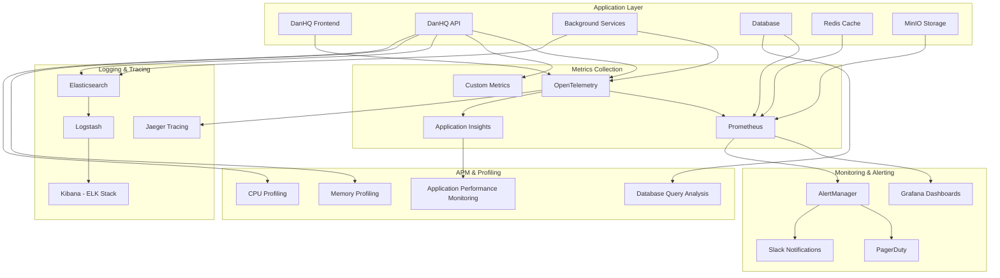

# 10. Performance Monitoring

## 10.1 Monitoring Architecture

DanHQ implements comprehensive monitoring and observability to ensure optimal performance, early problem detection, and data-driven optimization decisions.

### 10.1.1 Observability Stack



### 10.1.2 Monitoring Layers

| Layer | Tools | Metrics | Frequency |
|-------|-------|---------|-----------|
| **Infrastructure** | Prometheus, Node Exporter | CPU, Memory, Disk, Network | 15s |
| **Application** | Application Insights, Custom Metrics | Response time, Throughput, Errors | 30s |
| **Database** | PostgreSQL Exporter, pgAdmin | Query performance, Connections, Locks | 30s |
| **User Experience** | Real User Monitoring (RUM) | Page load, User interactions | Real-time |
| **Business** | Custom KPIs | Test execution rate, User activity | 5m |

## 10.2 Application Performance Monitoring

### 10.2.1 .NET Core Metrics Implementation

```csharp
// Infrastructure/Monitoring/ApplicationMetrics.cs
public class ApplicationMetrics
{
    private readonly ILogger<ApplicationMetrics> _logger;
    private readonly Counter _testCaseCreationCounter;
    private readonly Counter _testExecutionCounter;
    private readonly Histogram _apiRequestDuration;
    private readonly Histogram _databaseQueryDuration;
    private readonly Gauge _activeUsersGauge;
    private readonly Counter _aiGenerationCounter;

    public ApplicationMetrics(ILogger<ApplicationMetrics> logger)
    {
        _logger = logger;
        
        // Initialize Prometheus metrics
        _testCaseCreationCounter = Metrics
            .CreateCounter("danhq_test_cases_created_total", "Total number of test cases created",
                new[] { "project_id", "user_id", "priority", "type" });

        _testExecutionCounter = Metrics
            .CreateCounter("danhq_test_executions_total", "Total number of test executions",
                new[] { "project_id", "status", "type", "environment" });

        _apiRequestDuration = Metrics
            .CreateHistogram("danhq_api_request_duration_seconds", "API request duration in seconds",
                new[] { "method", "endpoint", "status_code" });

        _databaseQueryDuration = Metrics
            .CreateHistogram("danhq_database_query_duration_seconds", "Database query duration in seconds",
                new[] { "query_type", "table_name" });

        _activeUsersGauge = Metrics
            .CreateGauge("danhq_active_users", "Number of active users",
                new[] { "time_window" });

        _aiGenerationCounter = Metrics
            .CreateCounter("danhq_ai_generations_total", "Total AI test case generations",
                new[] { "status", "model", "project_id" });
    }

    public void RecordTestCaseCreation(int projectId, int userId, string priority, string type)
    {
        _testCaseCreationCounter
            .WithLabels(projectId.ToString(), userId.ToString(), priority, type)
            .Inc();

        _logger.LogInformation("Test case created - Project: {ProjectId}, User: {UserId}, Priority: {Priority}, Type: {Type}",
            projectId, userId, priority, type);
    }

    public void RecordTestExecution(int projectId, string status, string type, string environment)
    {
        _testExecutionCounter
            .WithLabels(projectId.ToString(), status, type, environment)
            .Inc();
    }

    public IDisposable MeasureApiRequest(string method, string endpoint)
    {
        return _apiRequestDuration
            .WithLabels(method, endpoint, "")
            .NewTimer();
    }

    public void RecordApiRequest(string method, string endpoint, int statusCode, double durationSeconds)
    {
        _apiRequestDuration
            .WithLabels(method, endpoint, statusCode.ToString())
            .Observe(durationSeconds);
    }

    public IDisposable MeasureDatabaseQuery(string queryType, string tableName)
    {
        return _databaseQueryDuration
            .WithLabels(queryType, tableName)
            .NewTimer();
    }

    public void UpdateActiveUsers(int count, string timeWindow)
    {
        _activeUsersGauge
            .WithLabels(timeWindow)
            .Set(count);
    }

    public void RecordAIGeneration(string status, string model, int projectId)
    {
        _aiGenerationCounter
            .WithLabels(status, model, projectId.ToString())
            .Inc();
    }
}

// Middleware for automatic API metrics collection
public class MetricsMiddleware
{
    private readonly RequestDelegate _next;
    private readonly ApplicationMetrics _metrics;
    private readonly ILogger<MetricsMiddleware> _logger;

    public MetricsMiddleware(RequestDelegate next, ApplicationMetrics metrics, ILogger<MetricsMiddleware> logger)
    {
        _next = next;
        _metrics = metrics;
        _logger = logger;
    }

    public async Task InvokeAsync(HttpContext context)
    {
        var stopwatch = Stopwatch.StartNew();
        var method = context.Request.Method;
        var path = context.Request.Path.Value;
        var endpoint = NormalizeEndpoint(path);

        try
        {
            await _next(context);
        }
        finally
        {
            stopwatch.Stop();
            var duration = stopwatch.Elapsed.TotalSeconds;
            var statusCode = context.Response.StatusCode;

            _metrics.RecordApiRequest(method, endpoint, statusCode, duration);

            // Log slow requests
            if (duration > 2.0) // More than 2 seconds
            {
                _logger.LogWarning("Slow API request detected - {Method} {Endpoint} took {Duration:F2}s (Status: {StatusCode})",
                    method, endpoint, duration, statusCode);
            }
        }
    }

    private string NormalizeEndpoint(string path)
    {
        // Normalize paths to reduce cardinality
        // /api/v1/projects/123/testcases -> /api/v1/projects/{id}/testcases
        return Regex.Replace(path, @"\d+", "{id}");
    }
}
```

### 10.2.2 Database Performance Monitoring

```csharp
// Infrastructure/Monitoring/DatabaseMetrics.cs
public class DatabaseMetricsInterceptor : DbCommandInterceptor
{
    private readonly ApplicationMetrics _metrics;
    private readonly ILogger<DatabaseMetricsInterceptor> _logger;

    public DatabaseMetricsInterceptor(ApplicationMetrics metrics, ILogger<DatabaseMetricsInterceptor> logger)
    {
        _metrics = metrics;
        _logger = logger;
    }

    public override async ValueTask<DbDataReader> ReaderExecutedAsync(
        DbCommand command,
        CommandExecutedEventData eventData,
        DbDataReader result,
        CancellationToken cancellationToken = default)
    {
        var duration = eventData.Duration.TotalSeconds;
        var queryType = GetQueryType(command.CommandText);
        var tableName = ExtractTableName(command.CommandText);

        _metrics.RecordDatabaseQuery(queryType, tableName, duration);

        // Log slow queries
        if (duration > 1.0) // More than 1 second
        {
            _logger.LogWarning("Slow database query detected - {QueryType} on {TableName} took {Duration:F2}s\nQuery: {Query}",
                queryType, tableName, duration, command.CommandText);
        }

        return await base.ReaderExecutedAsync(command, eventData, result, cancellationToken);
    }

    private string GetQueryType(string sql)
    {
        var trimmed = sql.TrimStart().ToUpper();
        if (trimmed.StartsWith("SELECT")) return "SELECT";
        if (trimmed.StartsWith("INSERT")) return "INSERT";
        if (trimmed.StartsWith("UPDATE")) return "UPDATE";
        if (trimmed.StartsWith("DELETE")) return "DELETE";
        return "OTHER";
    }

    private string ExtractTableName(string sql)
    {
        // Simple table name extraction - could be enhanced
        var patterns = new[]
        {
            @"FROM\s+""?(\w+)""?",
            @"INTO\s+""?(\w+)""?",
            @"UPDATE\s+""?(\w+)""?",
            @"DELETE\s+FROM\s+""?(\w+)""?"
        };

        foreach (var pattern in patterns)
        {
            var match = Regex.Match(sql, pattern, RegexOptions.IgnoreCase);
            if (match.Success)
            {
                return match.Groups[1].Value;
            }
        }

        return "unknown";
    }
}

// Background service for database health monitoring
public class DatabaseHealthMonitorService : BackgroundService
{
    private readonly IServiceProvider _serviceProvider;
    private readonly ApplicationMetrics _metrics;
    private readonly ILogger<DatabaseHealthMonitorService> _logger;
    private readonly Timer _timer;

    public DatabaseHealthMonitorService(
        IServiceProvider serviceProvider,
        ApplicationMetrics metrics,
        ILogger<DatabaseHealthMonitorService> logger)
    {
        _serviceProvider = serviceProvider;
        _metrics = metrics;
        _logger = logger;
    }

    protected override async Task ExecuteAsync(CancellationToken stoppingToken)
    {
        while (!stoppingToken.IsCancellationRequested)
        {
            try
            {
                await MonitorDatabaseHealthAsync();
                await Task.Delay(TimeSpan.FromMinutes(1), stoppingToken);
            }
            catch (Exception ex)
            {
                _logger.LogError(ex, "Error monitoring database health");
                await Task.Delay(TimeSpan.FromMinutes(1), stoppingToken);
            }
        }
    }

    private async Task MonitorDatabaseHealthAsync()
    {
        using var scope = _serviceProvider.CreateScope();
        var context = scope.ServiceProvider.GetRequiredService<DanHQDbContext>();

        try
        {
            // Monitor connection count
            var connectionCount = await GetActiveConnectionsAsync(context);
            _metrics.RecordDatabaseConnections(connectionCount);

            // Monitor database size
            var databaseSize = await GetDatabaseSizeAsync(context);
            _metrics.RecordDatabaseSize(databaseSize);

            // Monitor table statistics
            await MonitorTableStatisticsAsync(context);

        }
        catch (Exception ex)
        {
            _logger.LogError(ex, "Failed to collect database health metrics");
        }
    }

    private async Task<int> GetActiveConnectionsAsync(DanHQDbContext context)
    {
        var sql = @"
            SELECT count(*) 
            FROM pg_stat_activity 
            WHERE state = 'active' AND datname = current_database()";

        return await context.Database.ExecuteSqlRawAsync(sql);
    }

    private async Task<long> GetDatabaseSizeAsync(DanHQDbContext context)
    {
        var sql = "SELECT pg_database_size(current_database())";
        return await context.Database.ExecuteSqlRawAsync(sql);
    }

    private async Task MonitorTableStatisticsAsync(DanHQDbContext context)
    {
        var sql = @"
            SELECT 
                schemaname,
                tablename,
                n_tup_ins as inserts,
                n_tup_upd as updates,
                n_tup_del as deletes,
                seq_scan as sequential_scans,
                idx_scan as index_scans
            FROM pg_stat_user_tables";

        var statistics = await context.Database.ExecuteSqlRawAsync(sql);
        // Process and record table-specific metrics
    }
}
```

## 10.3 Frontend Performance Monitoring

### 10.3.1 Angular Performance Metrics

```typescript
// Frontend/src/app/core/services/performance-monitoring.service.ts
@Injectable({
  providedIn: 'root'
})
export class PerformanceMonitoringService {
  private readonly metrics = new Map<string, PerformanceEntry[]>();

  constructor(
    @Inject(DOCUMENT) private document: Document,
    private http: HttpClient
  ) {
    this.initializePerformanceObserver();
    this.monitorUserInteractions();
    this.monitorPageLoad();
  }

  private initializePerformanceObserver(): void {
    if ('PerformanceObserver' in window) {
      // Monitor Long Tasks (> 50ms)
      const longTaskObserver = new PerformanceObserver((entries) => {
        for (const entry of entries.getEntries()) {
          this.reportLongTask(entry as PerformanceLongTaskTiming);
        }
      });
      longTaskObserver.observe({ entryTypes: ['longtask'] });

      // Monitor Layout Shifts
      const clsObserver = new PerformanceObserver((entries) => {
        for (const entry of entries.getEntries()) {
          this.reportLayoutShift(entry as LayoutShift);
        }
      });
      clsObserver.observe({ entryTypes: ['layout-shift'] });

      // Monitor Largest Contentful Paint
      const lcpObserver = new PerformanceObserver((entries) => {
        for (const entry of entries.getEntries()) {
          this.reportLCP(entry as LargestContentfulPaint);
        }
      });
      lcpObserver.observe({ entryTypes: ['largest-contentful-paint'] });
    }
  }

  private monitorUserInteractions(): void {
    // Monitor click responsiveness
    this.document.addEventListener('click', (event) => {
      const startTime = performance.now();
      
      // Use requestIdleCallback to measure when the UI becomes responsive again
      requestIdleCallback(() => {
        const duration = performance.now() - startTime;
        if (duration > 100) { // Longer than 100ms is considered slow
          this.reportSlowInteraction('click', duration, event.target);
        }
      });
    });

    // Monitor input responsiveness
    this.document.addEventListener('input', (event) => {
      const startTime = performance.now();
      
      requestAnimationFrame(() => {
        const duration = performance.now() - startTime;
        if (duration > 16) { // Longer than one frame (16ms at 60fps)
          this.reportSlowInteraction('input', duration, event.target);
        }
      });
    });
  }

  private monitorPageLoad(): void {
    window.addEventListener('load', () => {
      // Wait for all resources to load
      setTimeout(() => {
        const navigation = performance.getEntriesByType('navigation')[0] as PerformanceNavigationTiming;
        
        const metrics = {
          dns: navigation.domainLookupEnd - navigation.domainLookupStart,
          connection: navigation.connectEnd - navigation.connectStart,
          request: navigation.responseStart - navigation.requestStart,
          response: navigation.responseEnd - navigation.responseStart,
          domProcessing: navigation.domContentLoadedEventStart - navigation.responseEnd,
          domComplete: navigation.domComplete - navigation.domContentLoadedEventStart,
          totalLoadTime: navigation.loadEventEnd - navigation.navigationStart
        };

        this.reportPageLoadMetrics(metrics);
        this.reportWebVitals();
      }, 1000);
    });
  }

  private reportLongTask(entry: PerformanceLongTaskTiming): void {
    const metric = {
      type: 'longtask',
      name: entry.name,
      duration: entry.duration,
      startTime: entry.startTime,
      url: window.location.pathname,
      userAgent: navigator.userAgent,
      timestamp: new Date().toISOString()
    };

    this.sendMetricToBackend(metric);
    console.warn('Long task detected:', metric);
  }

  private reportLayoutShift(entry: LayoutShift): void {
    if (!entry.hadRecentInput) {
      const metric = {
        type: 'layout-shift',
        value: entry.value,
        sources: entry.sources?.map(source => ({
          element: source.node?.tagName,
          currentRect: source.currentRect,
          previousRect: source.previousRect
        })),
        url: window.location.pathname,
        timestamp: new Date().toISOString()
      };

      this.sendMetricToBackend(metric);
    }
  }

  private reportLCP(entry: LargestContentfulPaint): void {
    const metric = {
      type: 'largest-contentful-paint',
      value: entry.startTime,
      element: entry.element?.tagName,
      url: window.location.pathname,
      timestamp: new Date().toISOString()
    };

    this.sendMetricToBackend(metric);
  }

  private reportSlowInteraction(type: string, duration: number, target: EventTarget | null): void {
    const metric = {
      type: 'slow-interaction',
      interactionType: type,
      duration,
      element: (target as Element)?.tagName,
      elementId: (target as Element)?.id,
      elementClass: (target as Element)?.className,
      url: window.location.pathname,
      timestamp: new Date().toISOString()
    };

    this.sendMetricToBackend(metric);
  }

  private reportPageLoadMetrics(metrics: any): void {
    const pageLoadMetric = {
      type: 'page-load',
      metrics,
      url: window.location.pathname,
      timestamp: new Date().toISOString()
    };

    this.sendMetricToBackend(pageLoadMetric);
  }

  private reportWebVitals(): void {
    // Report Core Web Vitals
    getCLS((metric) => {
      this.sendMetricToBackend({
        type: 'web-vital',
        name: 'CLS',
        value: metric.value,
        url: window.location.pathname,
        timestamp: new Date().toISOString()
      });
    });

    getFID((metric) => {
      this.sendMetricToBackend({
        type: 'web-vital',
        name: 'FID',
        value: metric.value,
        url: window.location.pathname,
        timestamp: new Date().toISOString()
      });
    });

    getFCP((metric) => {
      this.sendMetricToBackend({
        type: 'web-vital',
        name: 'FCP',
        value: metric.value,
        url: window.location.pathname,
        timestamp: new Date().toISOString()
      });
    });
  }

  private sendMetricToBackend(metric: any): void {
    // Batch metrics to reduce network calls
    this.batchMetric(metric);
  }

  private batchedMetrics: any[] = [];
  private batchTimeout: any;

  private batchMetric(metric: any): void {
    this.batchedMetrics.push(metric);

    // Clear existing timeout
    if (this.batchTimeout) {
      clearTimeout(this.batchTimeout);
    }

    // Send batch after 5 seconds or when 10 metrics accumulated
    this.batchTimeout = setTimeout(() => {
      this.sendBatchedMetrics();
    }, 5000);

    if (this.batchedMetrics.length >= 10) {
      this.sendBatchedMetrics();
    }
  }

  private sendBatchedMetrics(): void {
    if (this.batchedMetrics.length === 0) return;

    const payload = {
      metrics: [...this.batchedMetrics],
      session: this.getSessionId(),
      userId: this.getCurrentUserId(),
      timestamp: new Date().toISOString()
    };

    this.http.post('/api/v1/metrics/frontend', payload)
      .subscribe({
        next: () => {
          // Metrics sent successfully
        },
        error: (error) => {
          console.warn('Failed to send metrics:', error);
        }
      });

    this.batchedMetrics = [];
    if (this.batchTimeout) {
      clearTimeout(this.batchTimeout);
      this.batchTimeout = null;
    }
  }

  public measureAngularComponentRender(componentName: string): () => void {
    const startTime = performance.now();
    
    return () => {
      const duration = performance.now() - startTime;
      
      const metric = {
        type: 'component-render',
        componentName,
        duration,
        url: window.location.pathname,
        timestamp: new Date().toISOString()
      };

      if (duration > 16) { // Longer than one frame
        this.sendMetricToBackend(metric);
      }
    };
  }

  public measureApiCall(endpoint: string, method: string): () => void {
    const startTime = performance.now();
    
    return () => {
      const duration = performance.now() - startTime;
      
      const metric = {
        type: 'api-call',
        endpoint,
        method,
        duration,
        url: window.location.pathname,
        timestamp: new Date().toISOString()
      };

      this.sendMetricToBackend(metric);
    };
  }

  private getSessionId(): string {
    return sessionStorage.getItem('sessionId') || 'anonymous';
  }

  private getCurrentUserId(): string | null {
    return localStorage.getItem('userId');
  }
}

// Performance directive for measuring component render times
@Directive({
  selector: '[appPerformanceMonitor]'
})
export class PerformanceMonitorDirective implements OnInit, OnDestroy {
  @Input() componentName!: string;
  private endMeasurement?: () => void;

  constructor(private performanceService: PerformanceMonitoringService) {}

  ngOnInit(): void {
    this.endMeasurement = this.performanceService.measureAngularComponentRender(this.componentName);
  }

  ngOnDestroy(): void {
    if (this.endMeasurement) {
      this.endMeasurement();
    }
  }
}
```

### 10.3.2 Error Tracking and Reporting

```typescript
// Frontend/src/app/core/services/error-tracking.service.ts
@Injectable({
  providedIn: 'root'
})
export class ErrorTrackingService {
  private errorQueue: ErrorReport[] = [];
  private readonly maxQueueSize = 50;

  constructor(private http: HttpClient) {
    this.setupGlobalErrorHandlers();
  }

  private setupGlobalErrorHandlers(): void {
    // Capture unhandled JavaScript errors
    window.addEventListener('error', (event) => {
      this.reportError({
        type: 'javascript-error',
        message: event.message,
        filename: event.filename,
        lineno: event.lineno,
        colno: event.colno,
        stack: event.error?.stack,
        url: window.location.href,
        userAgent: navigator.userAgent,
        timestamp: new Date().toISOString()
      });
    });

    // Capture unhandled promise rejections
    window.addEventListener('unhandledrejection', (event) => {
      this.reportError({
        type: 'unhandled-promise-rejection',
        message: event.reason?.message || 'Unhandled promise rejection',
        stack: event.reason?.stack,
        url: window.location.href,
        userAgent: navigator.userAgent,
        timestamp: new Date().toISOString()
      });
    });

    // Capture resource loading errors
    window.addEventListener('error', (event) => {
      if (event.target !== window) {
        this.reportError({
          type: 'resource-error',
          message: `Failed to load resource: ${(event.target as any)?.src || (event.target as any)?.href}`,
          element: (event.target as Element)?.tagName,
          url: window.location.href,
          timestamp: new Date().toISOString()
        });
      }
    }, true);
  }

  public reportError(error: ErrorReport): void {
    // Add context information
    error.context = {
      ...error.context,
      userId: this.getCurrentUserId(),
      sessionId: this.getSessionId(),
      buildVersion: environment.version,
      environment: environment.production ? 'production' : 'development'
    };

    // Add to queue
    this.errorQueue.push(error);

    // Limit queue size
    if (this.errorQueue.length > this.maxQueueSize) {
      this.errorQueue.shift();
    }

    // Send immediately for critical errors, batch for others
    if (this.isCriticalError(error)) {
      this.sendErrorReport(error);
    } else {
      this.scheduleErrorBatch();
    }

    // Log to console in development
    if (!environment.production) {
      console.error('Error reported:', error);
    }
  }

  public reportAngularError(error: Error, context?: any): void {
    this.reportError({
      type: 'angular-error',
      message: error.message,
      stack: error.stack,
      context,
      url: window.location.href,
      timestamp: new Date().toISOString()
    });
  }

  public reportHttpError(error: HttpErrorResponse, context?: any): void {
    this.reportError({
      type: 'http-error',
      message: error.message,
      status: error.status,
      statusText: error.statusText,
      url: error.url,
      context,
      timestamp: new Date().toISOString()
    });
  }

  private isCriticalError(error: ErrorReport): boolean {
    return error.type === 'javascript-error' || 
           (error.type === 'http-error' && error.status >= 500);
  }

  private sendErrorReport(error: ErrorReport): void {
    this.http.post('/api/v1/errors', { errors: [error] })
      .subscribe({
        error: (httpError) => {
          // Fallback: try to send to alternative endpoint or log locally
          console.warn('Failed to send error report:', httpError);
        }
      });
  }

  private batchTimeout: any;

  private scheduleErrorBatch(): void {
    if (this.batchTimeout) {
      clearTimeout(this.batchTimeout);
    }

    this.batchTimeout = setTimeout(() => {
      this.sendErrorBatch();
    }, 10000); // Send batch every 10 seconds
  }

  private sendErrorBatch(): void {
    if (this.errorQueue.length === 0) return;

    const errors = [...this.errorQueue];
    this.errorQueue = [];

    this.http.post('/api/v1/errors', { errors })
      .subscribe({
        error: (httpError) => {
          // Re-queue errors if sending failed
          this.errorQueue.unshift(...errors);
          console.warn('Failed to send error batch:', httpError);
        }
      });
  }

  private getCurrentUserId(): string | null {
    return localStorage.getItem('userId');
  }

  private getSessionId(): string {
    return sessionStorage.getItem('sessionId') || 'anonymous';
  }
}

interface ErrorReport {
  type: string;
  message: string;
  filename?: string;
  lineno?: number;
  colno?: number;
  stack?: string;
  status?: number;
  statusText?: string;
  element?: string;
  url?: string;
  userAgent?: string;
  context?: any;
  timestamp: string;
}

// Global error handler for Angular
@Injectable()
export class GlobalErrorHandler implements ErrorHandler {
  constructor(private errorTracking: ErrorTrackingService) {}

  handleError(error: any): void {
    this.errorTracking.reportAngularError(error);
    
    // Still log to console
    console.error('Global error caught:', error);
  }
}
```

## 10.4 Infrastructure Monitoring

### 10.4.1 Kubernetes Monitoring

```yaml
# k8s/monitoring/prometheus.yaml
apiVersion: v1
kind: ConfigMap
metadata:
  name: prometheus-config
  namespace: monitoring
data:
  prometheus.yml: |
    global:
      scrape_interval: 15s
      evaluation_interval: 15s

    rule_files:
      - "/etc/prometheus/rules/*.yml"

    alerting:
      alertmanagers:
        - static_configs:
            - targets:
              - alertmanager:9093

    scrape_configs:
      # Prometheus itself
      - job_name: 'prometheus'
        static_configs:
          - targets: ['localhost:9090']

      # Kubernetes API server
      - job_name: 'kubernetes-apiservers'
        kubernetes_sd_configs:
          - role: endpoints
        scheme: https
        tls_config:
          ca_file: /var/run/secrets/kubernetes.io/serviceaccount/ca.crt
        bearer_token_file: /var/run/secrets/kubernetes.io/serviceaccount/token
        relabel_configs:
          - source_labels: [__meta_kubernetes_namespace, __meta_kubernetes_service_name, __meta_kubernetes_endpoint_port_name]
            action: keep
            regex: default;kubernetes;https

      # Kubernetes nodes
      - job_name: 'kubernetes-nodes'
        kubernetes_sd_configs:
          - role: node
        scheme: https
        tls_config:
          ca_file: /var/run/secrets/kubernetes.io/serviceaccount/ca.crt
        bearer_token_file: /var/run/secrets/kubernetes.io/serviceaccount/token

      # DanHQ Application
      - job_name: 'danhq-api'
        kubernetes_sd_configs:
          - role: endpoints
            namespaces:
              names:
                - danhq-prod
                - danhq-staging
        relabel_configs:
          - source_labels: [__meta_kubernetes_service_annotation_prometheus_io_scrape]
            action: keep
            regex: true
          - source_labels: [__meta_kubernetes_service_annotation_prometheus_io_path]
            action: replace
            target_label: __metrics_path__
            regex: (.+)

      # PostgreSQL
      - job_name: 'postgresql'
        static_configs:
          - targets: ['postgres-exporter:9187']

      # Redis
      - job_name: 'redis'
        static_configs:
          - targets: ['redis-exporter:9121']

      # Node Exporter
      - job_name: 'node-exporter'
        kubernetes_sd_configs:
          - role: endpoints
        relabel_configs:
          - source_labels: [__meta_kubernetes_endpoints_name]
            regex: 'node-exporter'
            action: keep

---
apiVersion: apps/v1
kind: Deployment
metadata:
  name: prometheus
  namespace: monitoring
spec:
  replicas: 1
  selector:
    matchLabels:
      app: prometheus
  template:
    metadata:
      labels:
        app: prometheus
    spec:
      serviceAccountName: prometheus
      containers:
      - name: prometheus
        image: prom/prometheus:v2.45.0
        ports:
        - containerPort: 9090
        args:
          - '--config.file=/etc/prometheus/prometheus.yml'
          - '--storage.tsdb.path=/prometheus/'
          - '--web.console.libraries=/etc/prometheus/console_libraries'
          - '--web.console.templates=/etc/prometheus/consoles'
          - '--storage.tsdb.retention.time=15d'
          - '--web.enable-lifecycle'
        volumeMounts:
        - name: prometheus-config
          mountPath: /etc/prometheus/
        - name: prometheus-storage
          mountPath: /prometheus/
        resources:
          requests:
            memory: "512Mi"
            cpu: "500m"
          limits:
            memory: "1Gi"
            cpu: "1000m"
      volumes:
      - name: prometheus-config
        configMap:
          name: prometheus-config
      - name: prometheus-storage
        persistentVolumeClaim:
          claimName: prometheus-storage
```

### 10.4.2 Grafana Dashboards

```json
// monitoring/grafana-dashboards/danhq-overview.json
{
  "dashboard": {
    "id": null,
    "title": "DanHQ Overview",
    "tags": ["danhq"],
    "timezone": "browser",
    "panels": [
      {
        "id": 1,
        "title": "API Request Rate",
        "type": "stat",
        "targets": [
          {
            "expr": "rate(danhq_api_requests_total[5m])",
            "legendFormat": "Requests/sec"
          }
        ],
        "fieldConfig": {
          "defaults": {
            "color": {
              "mode": "thresholds"
            },
            "thresholds": {
              "steps": [
                {"color": "green", "value": null},
                {"color": "yellow", "value": 10},
                {"color": "red", "value": 50}
              ]
            }
          }
        },
        "gridPos": {"h": 8, "w": 6, "x": 0, "y": 0}
      },
      {
        "id": 2,
        "title": "API Response Time",
        "type": "timeseries",
        "targets": [
          {
            "expr": "histogram_quantile(0.95, rate(danhq_api_request_duration_seconds_bucket[5m]))",
            "legendFormat": "95th percentile"
          },
          {
            "expr": "histogram_quantile(0.50, rate(danhq_api_request_duration_seconds_bucket[5m]))",
            "legendFormat": "50th percentile"
          }
        ],
        "fieldConfig": {
          "defaults": {
            "unit": "s",
            "color": {"mode": "palette-classic"}
          }
        },
        "gridPos": {"h": 8, "w": 12, "x": 6, "y": 0}
      },
      {
        "id": 3,
        "title": "Error Rate",
        "type": "stat",
        "targets": [
          {
            "expr": "rate(danhq_api_requests_total{status_code=~\"5..\"}[5m]) / rate(danhq_api_requests_total[5m]) * 100",
            "legendFormat": "Error Rate %"
          }
        ],
        "fieldConfig": {
          "defaults": {
            "unit": "percent",
            "color": {"mode": "thresholds"},
            "thresholds": {
              "steps": [
                {"color": "green", "value": null},
                {"color": "yellow", "value": 1},
                {"color": "red", "value": 5}
              ]
            }
          }
        },
        "gridPos": {"h": 8, "w": 6, "x": 18, "y": 0}
      },
      {
        "id": 4,
        "title": "Active Users",
        "type": "timeseries",
        "targets": [
          {
            "expr": "danhq_active_users{time_window=\"5m\"}",
            "legendFormat": "5 minutes"
          },
          {
            "expr": "danhq_active_users{time_window=\"1h\"}",
            "legendFormat": "1 hour"
          }
        ],
        "gridPos": {"h": 8, "w": 12, "x": 0, "y": 8}
      },
      {
        "id": 5,
        "title": "Test Execution Rate",
        "type": "timeseries",
        "targets": [
          {
            "expr": "rate(danhq_test_executions_total[5m])",
            "legendFormat": "{{status}}"
          }
        ],
        "gridPos": {"h": 8, "w": 12, "x": 12, "y": 8}
      },
      {
        "id": 6,
        "title": "Database Query Performance",
        "type": "timeseries",
        "targets": [
          {
            "expr": "histogram_quantile(0.95, rate(danhq_database_query_duration_seconds_bucket[5m]))",
            "legendFormat": "95th percentile"
          }
        ],
        "gridPos": {"h": 8, "w": 12, "x": 0, "y": 16}
      },
      {
        "id": 7,
        "title": "AI Generation Success Rate",
        "type": "stat",
        "targets": [
          {
            "expr": "rate(danhq_ai_generations_total{status=\"success\"}[5m]) / rate(danhq_ai_generations_total[5m]) * 100",
            "legendFormat": "Success Rate %"
          }
        ],
        "fieldConfig": {
          "defaults": {
            "unit": "percent",
            "color": {"mode": "thresholds"},
            "thresholds": {
              "steps": [
                {"color": "red", "value": null},
                {"color": "yellow", "value": 80},
                {"color": "green", "value": 95}
              ]
            }
          }
        },
        "gridPos": {"h": 8, "w": 12, "x": 12, "y": 16}
      }
    ],
    "time": {
      "from": "now-1h",
      "to": "now"
    },
    "refresh": "5s"
  }
}
```

## 10.5 Alerting & Incident Response

### 10.5.1 AlertManager Configuration

```yaml
# monitoring/alertmanager/alertmanager.yml
global:
  smtp_smarthost: 'smtp.gmail.com:587'
  smtp_from: 'alerts@danhq.com'
  smtp_auth_username: 'alerts@danhq.com'
  smtp_auth_password: 'app-password'

templates:
  - '/etc/alertmanager/templates/*.tmpl'

route:
  group_by: ['alertname', 'cluster', 'service']
  group_wait: 10s
  group_interval: 10s
  repeat_interval: 1h
  receiver: 'default'
  routes:
    - match:
        severity: critical
      receiver: 'critical-alerts'
      continue: true
    - match:
        severity: warning
      receiver: 'warning-alerts'
    - match:
        alertname: 'HighErrorRate'
      receiver: 'high-error-rate'
    - match:
        alertname: 'DatabaseDown'
      receiver: 'database-alerts'

receivers:
  - name: 'default'
    slack_configs:
      - api_url: 'https://hooks.slack.com/services/...'
        channel: '#danhq-alerts'
        title: 'DanHQ Alert'
        text: '{{ range .Alerts }}{{ .Annotations.summary }}{{ end }}'

  - name: 'critical-alerts'
    pagerduty_configs:
      - service_key: 'your-pagerduty-service-key'
        description: '{{ .CommonAnnotations.summary }}'
    slack_configs:
      - api_url: 'https://hooks.slack.com/services/...'
        channel: '#danhq-critical'
        title: '🚨 CRITICAL ALERT'
        text: '{{ range .Alerts }}{{ .Annotations.summary }}{{ end }}'
    email_configs:
      - to: 'oncall@danhq.com'
        subject: '🚨 Critical Alert - {{ .CommonAnnotations.summary }}'
        body: |
          Alert: {{ .CommonAnnotations.summary }}
          
          Details:
          {{ range .Alerts }}
          - {{ .Annotations.description }}
          {{ end }}

  - name: 'warning-alerts'
    slack_configs:
      - api_url: 'https://hooks.slack.com/services/...'
        channel: '#danhq-warnings'
        title: '⚠️ Warning'
        text: '{{ range .Alerts }}{{ .Annotations.summary }}{{ end }}'

  - name: 'high-error-rate'
    slack_configs:
      - api_url: 'https://hooks.slack.com/services/...'
        channel: '#danhq-errors'
        title: '📈 High Error Rate Detected'
        text: 'Error rate has exceeded threshold. Check dashboard for details.'

  - name: 'database-alerts'
    slack_configs:
      - api_url: 'https://hooks.slack.com/services/...'
        channel: '#danhq-database'
        title: '🗄️ Database Alert'
        text: '{{ range .Alerts }}{{ .Annotations.summary }}{{ end }}'

inhibit_rules:
  - source_match:
      severity: 'critical'
    target_match:
      severity: 'warning'
    equal: ['alertname', 'cluster', 'service']
```

### 10.5.2 Prometheus Alert Rules

```yaml
# monitoring/prometheus/alert-rules.yml
groups:
  - name: danhq.rules
    rules:
      # High error rate
      - alert: HighErrorRate
        expr: rate(danhq_api_requests_total{status_code=~"5.."}[5m]) / rate(danhq_api_requests_total[5m]) * 100 > 5
        for: 2m
        labels:
          severity: critical
        annotations:
          summary: "High error rate detected"
          description: "Error rate is {{ $value }}% for the last 5 minutes"

      # Slow API responses
      - alert: SlowAPIResponses
        expr: histogram_quantile(0.95, rate(danhq_api_request_duration_seconds_bucket[5m])) > 2
        for: 5m
        labels:
          severity: warning
        annotations:
          summary: "API responses are slow"
          description: "95th percentile response time is {{ $value }}s"

      # Database connection issues
      - alert: DatabaseConnectionHigh
        expr: danhq_database_connections > 80
        for: 2m
        labels:
          severity: warning
        annotations:
          summary: "High database connection count"
          description: "Database has {{ $value }} active connections"

      # Database down
      - alert: DatabaseDown
        expr: up{job="postgresql"} == 0
        for: 1m
        labels:
          severity: critical
        annotations:
          summary: "Database is down"
          description: "PostgreSQL database is not responding"

      # High memory usage
      - alert: HighMemoryUsage
        expr: (1 - (node_memory_MemAvailable_bytes / node_memory_MemTotal_bytes)) * 100 > 85
        for: 5m
        labels:
          severity: warning
        annotations:
          summary: "High memory usage"
          description: "Memory usage is {{ $value }}%"

      # High CPU usage
      - alert: HighCPUUsage
        expr: 100 - (avg by(instance) (irate(node_cpu_seconds_total{mode="idle"}[5m])) * 100) > 80
        for: 5m
        labels:
          severity: warning
        annotations:
          summary: "High CPU usage"
          description: "CPU usage is {{ $value }}%"

      # Low disk space
      - alert: LowDiskSpace
        expr: (1 - (node_filesystem_avail_bytes{mountpoint="/"} / node_filesystem_size_bytes{mountpoint="/"})) * 100 > 85
        for: 5m
        labels:
          severity: warning
        annotations:
          summary: "Low disk space"
          description: "Disk usage is {{ $value }}%"

      # AI generation failures
      - alert: AIGenerationFailureRate
        expr: rate(danhq_ai_generations_total{status="failed"}[10m]) / rate(danhq_ai_generations_total[10m]) * 100 > 20
        for: 5m
        labels:
          severity: warning
        annotations:
          summary: "High AI generation failure rate"
          description: "AI generation failure rate is {{ $value }}%"

      # No test executions
      - alert: NoTestExecutions
        expr: rate(danhq_test_executions_total[1h]) == 0
        for: 2h
        labels:
          severity: warning
        annotations:
          summary: "No test executions in the last hour"
          description: "No test executions have been recorded for 2 hours"

      # Pod restarts
      - alert: PodRestartingTooMuch
        expr: increase(kube_pod_container_status_restarts_total[1h]) > 3
        for: 5m
        labels:
          severity: warning
        annotations:
          summary: "Pod restarting too much"
          description: "Pod {{ $labels.pod }} in namespace {{ $labels.namespace }} has restarted {{ $value }} times in the last hour"

      # Certificate expiry
      - alert: CertificateExpiringSoon
        expr: probe_ssl_earliest_cert_expiry - time() < 7 * 24 * 3600
        for: 1h
        labels:
          severity: warning
        annotations:
          summary: "SSL certificate expiring soon"
          description: "SSL certificate for {{ $labels.instance }} expires in {{ $value | humanizeDuration }}"
```

## 10.6 Performance Optimization

### 10.6.1 Automated Performance Analysis

```csharp
// Infrastructure/Services/PerformanceAnalysisService.cs
public class PerformanceAnalysisService : BackgroundService
{
    private readonly ILogger<PerformanceAnalysisService> _logger;
    private readonly IServiceProvider _serviceProvider;
    private readonly PerformanceMetricsCollector _metricsCollector;

    public PerformanceAnalysisService(
        ILogger<PerformanceAnalysisService> logger,
        IServiceProvider serviceProvider,
        PerformanceMetricsCollector metricsCollector)
    {
        _logger = logger;
        _serviceProvider = serviceProvider;
        _metricsCollector = metricsCollector;
    }

    protected override async Task ExecuteAsync(CancellationToken stoppingToken)
    {
        while (!stoppingToken.IsCancellationRequested)
        {
            try
            {
                await AnalyzePerformanceAsync();
                await Task.Delay(TimeSpan.FromMinutes(30), stoppingToken);
            }
            catch (Exception ex)
            {
                _logger.LogError(ex, "Error during performance analysis");
                await Task.Delay(TimeSpan.FromMinutes(5), stoppingToken);
            }
        }
    }

    private async Task AnalyzePerformanceAsync()
    {
        _logger.LogInformation("Starting performance analysis");

        var analysis = new PerformanceAnalysis
        {
            Timestamp = DateTime.UtcNow,
            ApiPerformance = await AnalyzeApiPerformanceAsync(),
            DatabasePerformance = await AnalyzeDatabasePerformanceAsync(),
            UserExperience = await AnalyzeUserExperienceAsync(),
            Recommendations = new List<PerformanceRecommendation>()
        };

        // Generate recommendations
        GenerateRecommendations(analysis);

        // Store analysis results
        await StoreAnalysisAsync(analysis);

        // Send alerts for critical issues
        await CheckForCriticalIssuesAsync(analysis);

        _logger.LogInformation("Performance analysis completed");
    }

    private async Task<ApiPerformanceMetrics> AnalyzeApiPerformanceAsync()
    {
        var metrics = await _metricsCollector.GetApiMetricsAsync(TimeSpan.FromHours(1));
        
        return new ApiPerformanceMetrics
        {
            AverageResponseTime = metrics.AverageResponseTime,
            P95ResponseTime = metrics.P95ResponseTime,
            ErrorRate = metrics.ErrorRate,
            RequestsPerSecond = metrics.RequestsPerSecond,
            SlowestEndpoints = metrics.SlowestEndpoints.Take(10).ToList(),
            ErrorProneEndpoints = metrics.ErrorProneEndpoints.Take(10).ToList()
        };
    }

    private async Task<DatabasePerformanceMetrics> AnalyzeDatabasePerformanceAsync()
    {
        var metrics = await _metricsCollector.GetDatabaseMetricsAsync(TimeSpan.FromHours(1));
        
        return new DatabasePerformanceMetrics
        {
            AverageQueryTime = metrics.AverageQueryTime,
            SlowQueries = metrics.SlowQueries.Take(10).ToList(),
            ConnectionPoolUsage = metrics.ConnectionPoolUsage,
            CacheHitRatio = metrics.CacheHitRatio,
            BlockingQueries = metrics.BlockingQueries.Count,
            IndexUsage = metrics.IndexUsage
        };
    }

    private void GenerateRecommendations(PerformanceAnalysis analysis)
    {
        // API Performance Recommendations
        if (analysis.ApiPerformance.P95ResponseTime > 2000) // 2 seconds
        {
            analysis.Recommendations.Add(new PerformanceRecommendation
            {
                Type = "API_PERFORMANCE",
                Priority = "High",
                Title = "High API Response Times",
                Description = "95th percentile response time exceeds 2 seconds",
                Recommendation = "Consider implementing caching, optimizing database queries, or scaling horizontally",
                AffectedEndpoints = analysis.ApiPerformance.SlowestEndpoints.Select(e => e.Endpoint).ToList()
            });
        }

        // Database Performance Recommendations
        if (analysis.DatabasePerformance.SlowQueries.Any())
        {
            analysis.Recommendations.Add(new PerformanceRecommendation
            {
                Type = "DATABASE_PERFORMANCE",
                Priority = "Medium",
                Title = "Slow Database Queries",
                Description = $"Found {analysis.DatabasePerformance.SlowQueries.Count} slow queries",
                Recommendation = "Review and optimize slow queries, consider adding indexes",
                AffectedQueries = analysis.DatabasePerformance.SlowQueries.Select(q => q.Query).ToList()
            });
        }

        // Cache Performance Recommendations
        if (analysis.DatabasePerformance.CacheHitRatio < 0.8) // 80%
        {
            analysis.Recommendations.Add(new PerformanceRecommendation
            {
                Type = "CACHE_PERFORMANCE",
                Priority = "Medium",
                Title = "Low Cache Hit Ratio",
                Description = $"Cache hit ratio is {analysis.DatabasePerformance.CacheHitRatio:P2}",
                Recommendation = "Review caching strategy, increase cache TTL for appropriate data, or expand cache capacity"
            });
        }
    }

    private async Task CheckForCriticalIssuesAsync(PerformanceAnalysis analysis)
    {
        var criticalIssues = analysis.Recommendations
            .Where(r => r.Priority == "High")
            .ToList();

        if (criticalIssues.Any())
        {
            using var scope = _serviceProvider.CreateScope();
            var alertService = scope.ServiceProvider.GetRequiredService<AlertService>();
            
            await alertService.SendPerformanceAlertAsync(new PerformanceAlert
            {
                Severity = "High",
                Title = "Critical Performance Issues Detected",
                Issues = criticalIssues,
                Timestamp = DateTime.UtcNow
            });
        }
    }
}

public class PerformanceOptimizationRecommender
{
    public static List<OptimizationSuggestion> AnalyzeAndRecommend(PerformanceData data)
    {
        var suggestions = new List<OptimizationSuggestion>();

        // Analyze patterns in the data
        if (data.DatabaseQueries.Any(q => q.Duration > 1000 && q.FrequencyPerHour > 100))
        {
            suggestions.Add(new OptimizationSuggestion
            {
                Type = "Database",
                Priority = "High",
                Action = "Add Index",
                Description = "Frequent slow query detected - consider adding database index",
                ExpectedImprovement = "50-80% query time reduction",
                ImplementationEffort = "Low"
            });
        }

        if (data.ApiEndpoints.Any(e => e.ResponseTime > 2000 && !e.HasCaching))
        {
            suggestions.Add(new OptimizationSuggestion
            {
                Type = "API",
                Priority = "Medium",
                Action = "Implement Caching",
                Description = "Slow endpoint without caching - implement response caching",
                ExpectedImprovement = "60-90% response time reduction",
                ImplementationEffort = "Medium"
            });
        }

        return suggestions;
    }
}
```

---

*This comprehensive performance monitoring implementation provides real-time insights, proactive alerting, and automated optimization recommendations to ensure DanHQ maintains optimal performance and reliability.*